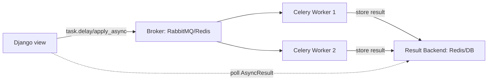

# Background Tasks, Celery & Queues

> **Type:** Study notes

## Why interviewers ask this

Any candidate who has shipped a real product has hit the same wall: some operation (sending an
email, generating a PDF, running OCR on an uploaded document, calling a slow third-party API)
takes too long to run inside an HTTP request. Interviewers ask about background jobs to see
whether you understand *why* the request/response cycle can't hold that work, and whether you've
actually operated a task queue in production — not just imported `celery` and hoped for the best.
If you've built an OCR/PDF pipeline, this is one of the most natural places to show real depth.

## Why background jobs exist

- HTTP requests have a client waiting synchronously. A web server thread/worker tied up for 30
  seconds on an OCR job can't serve other requests — you exhaust your worker pool under load.
- Load balancers and clients have timeouts (typically 30-60s). A slow synchronous request just
  becomes a 504.
- Some work is naturally decoupled from "does the user need this right now" — a webhook fan-out,
  a nightly reconciliation job, a thumbnail generation.

The fix: the request handler does the minimum to accept the work (validate, persist, enqueue) and
returns immediately (`202 Accepted` is the honest status code here). A separate worker process
picks the job up and does the slow part.

## Celery architecture



- **Broker** — the queue itself (RabbitMQ or Redis are the common choices). The Django process
  publishes a task message and moves on; it doesn't talk to workers directly.
- **Worker** — a separate long-running process (`celery -A myproj worker`) that pulls messages off
  the broker and executes the corresponding Python function. Workers scale horizontally —
  add more processes/pods to increase throughput.
- **Result backend** — where task return values / state (`PENDING`, `STARTED`, `SUCCESS`,
  `FAILURE`) are stored, if you need to check on a task later. Optional — many fire-and-forget
  tasks (send an email) don't need one. Polling a result backend from the web tier for
  synchronous-feeling UX is a legitimate pattern (see
  [`08_file_upload_and_async_processing.md`](08_file_upload_and_async_processing.md)).
- **Beat** — a separate scheduler process for periodic tasks (cron-like), e.g. "reconcile stale
  jobs every 5 minutes." Talk about this if asked about scheduled/recurring work.

## Task idempotency — the requirement people forget

Celery (and every real broker) gives you **at-least-once delivery**, not exactly-once. A task can
run more than once because:

- The worker crashes *after* completing the work but *before* acknowledging the message —
  broker redelivers it.
- You explicitly retry on a transient failure (`self.retry()`), and the first attempt actually
  succeeded partway through.
- A visibility timeout expires under load and the same message gets picked up twice.

If your task isn't safe to run twice, you will eventually double-charge a customer, send a
duplicate email, or double-increment a counter. Design for it:

```python
from celery import shared_task
from django.db import transaction
from myapp.models import Document, OCRResult

@shared_task(bind=True, max_retries=5, default_retry_delay=10)
def run_ocr_on_document(self, document_id: int):
    try:
        document = Document.objects.get(id=document_id)
    except Document.DoesNotExist:
        # Non-retryable — the record is gone, retrying won't help.
        return

    # Idempotency guard: skip work that's already done instead of redoing it.
    if OCRResult.objects.filter(document=document, status="completed").exists():
        return

    try:
        text = extract_text_via_ocr(document.file.path)
    except TransientOCRServiceError as exc:
        # Retryable — external service hiccup, back off and try again.
        raise self.retry(exc=exc)

    with transaction.atomic():
        OCRResult.objects.update_or_create(
            document=document,
            defaults={"text": text, "status": "completed"},
        )
```

Key moves: `update_or_create` instead of `create` (safe on replay), a status check before doing
expensive work, and separating retryable errors (raise `self.retry`) from non-retryable ones
(just return/log). See also
[`09_idempotency_and_retries.md`](09_idempotency_and_retries.md) for the general pattern.

## RabbitMQ vs Kafka — conceptually

Interviewers use this to check you understand *categories* of messaging systems, not just brand
names.

| | RabbitMQ (message queue) | Kafka (distributed log) |
|---|---|---|
| Model | Message is consumed and removed (or acked/dequeued) | Message is appended to a log and retained; consumers track their own offset |
| Use case | Work distribution — "do this job exactly once across a worker pool" | Event streaming — "many consumers replay/re-read the same event stream" |
| Ordering | Per-queue, simpler | Per-partition |
| Replay | No — once consumed, it's gone (unless you build that yourself) | Yes — consumers can rewind and reprocess |
| Fits | Celery task queues, RPC-style work | Event sourcing, analytics pipelines, audit logs, multiple independent consumers of the same event |

**When you'd pick each in an interview answer:** "If I need to fan a single event out to multiple
independent systems that each need to read it at their own pace and potentially replay it — audit
log, search index update, analytics — that's Kafka's model. If I need a pool of workers to pick up
discrete jobs and each job should be handled once — that's RabbitMQ/Celery's model." Redis as a
Celery broker is a common lightweight substitute for RabbitMQ in smaller deployments, but it
lacks RabbitMQ's delivery guarantees and routing features (exchanges, dead-letter queues).

## Interview Q&A

**Q: A Celery task processes a payment and sometimes runs twice. How do you fix it without
redesigning the whole system?**
A: Add an idempotency key (e.g. the order ID) and check-before-act inside the task, wrapped in a
DB transaction/unique constraint so two concurrent executions can't both pass the check. Don't
rely on "Celery won't redeliver" — it will, eventually.

**Q: How do you handle a task that keeps failing?**
A: Bounded retries with exponential backoff (`max_retries`, `retry_backoff=True`), then route to
a dead-letter queue or a `status=failed` DB record with the exception, and alert on it. Silent
infinite retries or silent drops are both wrong — see the "silently failing background job"
scenario in
[`real_backend_interview_scenarios.md`](real_backend_interview_scenarios.md).

**Q: Why not just use `threading.Thread` or Django signals for background work?**
A: Threads die with the request process, don't survive a deploy/restart, don't give you retries,
monitoring, or horizontal scaling, and compete with the GIL for the same process's resources. A
separate worker pool that outlives any single request is the whole point.

**Q: How would you monitor Celery in production?**
A: Task success/failure counts and duration as metrics, queue depth (a growing queue means
workers can't keep up — scale them or find the slow task), and `Flower` or equivalent for
ad-hoc inspection. Ties to
[`16_monitoring_logging_metrics_tracing.md`](16_monitoring_logging_metrics_tracing.md).

## Hands-on exercise

1. Write a Celery task `resize_image(self, image_id)` that is safe to run twice: it should check
   whether a resized version already exists before doing the work, and use `self.retry()` only
   for a simulated transient `IOError`, not for a `DoesNotExist`.
2. Sketch (in comments, no need to run it) how you'd add a dead-letter path: after
   `max_retries` is exhausted, write a row to a `FailedJob` model instead of losing the exception
   silently.
