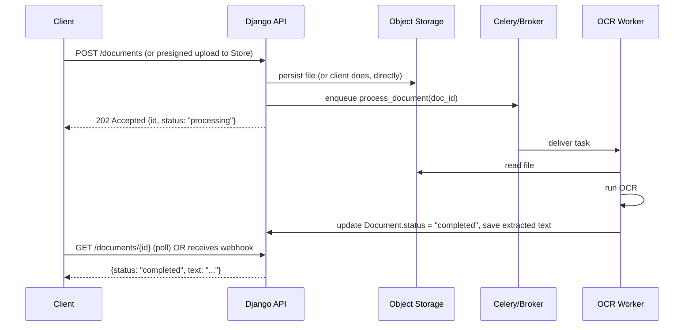

# File Upload & Async Processing

> **Type:** Study notes

## Why interviewers ask this

"Design an upload pipeline for user-submitted PDFs/images that need OCR" is a near-perfect
interview question for this candidate's background: it touches API design, file handling at
scale, async processing, and status communication back to the client, all in one flow.
Interviewers want to see you reason about where the file actually goes, who does the slow work,
and how the client finds out when it's done — not just "call `request.FILES`."

## Direct-to-server vs. presigned-URL upload

**Direct-to-server upload**: client sends the file to your Django app (`multipart/form-data`),
your app streams it to disk/object storage.

```python
# views.py — simple direct upload
class DocumentUploadView(APIView):
    def post(self, request):
        serializer = DocumentUploadSerializer(data=request.data)
        serializer.is_valid(raise_exception=True)
        document = serializer.save(uploaded_by=request.user, status="uploaded")
        process_document.delay(document.id)  # hand off, don't block
        return Response({"id": document.id, "status": "processing"}, status=202)
```

Pros: simple, one hop, you control validation before storage. Cons: your app server's
bandwidth/memory is the bottleneck for every upload, large files tie up a web worker process for
the whole transfer.

**Presigned-URL direct-to-object-storage**: your API issues a short-lived signed URL (S3
`generate_presigned_url`, GCS signed URL); the client uploads *directly* to S3/GCS, bypassing your
app server entirely, then notifies your API (or S3 triggers an event) once it's there.

```python
import boto3

def get_presigned_upload_url(request):
    s3 = boto3.client("s3")
    key = f"uploads/{request.user.id}/{uuid.uuid4()}.pdf"
    url = s3.generate_presigned_url(
        "put_object",
        Params={"Bucket": "my-uploads", "Key": key, "ContentType": "application/pdf"},
        ExpiresIn=300,
    )
    Document.objects.create(owner=request.user, storage_key=key, status="pending_upload")
    return Response({"upload_url": url, "key": key})
```

Pros: scales independently of your app servers, no large payloads through your web tier, cheaper.
Cons: you lose the chance to validate content *before* it lands in storage (validate after, or use
storage-side constraints like content-type/size on the presigned policy), and you now need a
separate signal (webhook from storage, or client callback) that the upload actually finished —
which introduces its own trust/verification problem.

**Trade-off to say out loud in an interview:** "For a system with meaningful upload volume or
large files, I'd go presigned URL — it keeps my app tier stateless and cheap. For something
low-volume where I need to validate/scan the file synchronously before accepting it, direct upload
is simpler and gives me a validation choke point."

## Handling large uploads: streaming, not buffering

Never read an entire large file into memory in a Django view. DRF/Django will buffer small
uploads in memory and spill large ones to a temp file automatically
(`FILE_UPLOAD_MAX_MEMORY_SIZE`), but for genuinely large files (multi-GB), prefer:

- **Client-side chunking / multipart upload** — S3 multipart upload API lets the client upload in
  parts (5MB-5GB each) in parallel and resume a failed part instead of restarting the whole file.
- **Streaming reads server-side** if you must process on your own server:

```python
def handle_uploaded_file(uploaded_file):
    with open(destination_path, "wb+") as dest:
        for chunk in uploaded_file.chunks():  # Django streams in ~2.5MB chunks by default
            dest.write(chunk)
```

- Set a hard `MAX_UPLOAD_SIZE` and reject early (check `Content-Length` before reading the body)
  rather than discovering you're out of disk/memory mid-stream.

## The "upload triggers async processing" pattern

This is the shape of most real OCR/document pipelines:



Two ways the client learns the result is ready:

1. **Polling** — client hits `GET /documents/{id}` every few seconds, checks `status`. Simple, no
   infra needed, but wastes requests and adds latency (bounded by poll interval). Fine for
   internal tools / low volume.
2. **Webhook / push** — your service calls a client-registered URL (or, if it's your own frontend,
   pushes over WebSocket/SSE) when the job finishes. Better UX, more moving parts. See
   [`10_webhooks.md`](10_webhooks.md) for the design details, including why the receiving side
   must itself be idempotent.

A hybrid that shows up a lot in practice: return `202` with a `status` field immediately, let the
client poll a lightweight status endpoint, and *also* fire a webhook for integrations that don't
want to poll.

## Interview Q&A

**Q: A user uploads a 500MB PDF and your OCR pipeline times out. Walk me through your fix.**
A: First, the upload itself shouldn't block a web worker — verify it's presigned/streamed, not
buffered synchronously in the view. Second, OCR should already be async (Celery task, not inline
in the request). If OCR itself times out, that's a worker-side problem: split into per-page tasks
processed in parallel, add a task-level timeout with a clear failure state rather than an
infinite hang, and consider a `max_pages` or async chunk pipeline for huge documents.

**Q: How do you prevent someone uploading a malicious file (fake extension, embedded script, huge
zip bomb)?**
A: Validate actual content-type via magic-byte sniffing, not just the filename/extension; enforce
size limits before and during upload; if you preview/render files, sandbox that step; scan with
an antivirus/malware service for public-facing upload endpoints if the threat model calls for it.

**Q: Client uploaded via presigned URL — how does your API know it succeeded?**
A: Either the client calls back your API after a successful S3 PUT (client-reported, needs
verification — you can `HEAD` the object to confirm it actually exists and matches expected size),
or you configure an S3 event notification (Lambda/SNS/SQS) that fires when the object lands,
which is more trustworthy since it doesn't depend on the client behaving honestly.

## Hands-on exercise

1. Write a DRF view + serializer for a direct upload endpoint that validates file size and
   content-type before saving, then enqueues a Celery task and returns `202` with a polling URL.
2. Sketch the presigned-URL variant: an endpoint that returns an upload URL + document ID, and a
   second endpoint the client calls after upload completes that verifies the object exists in
   storage before marking `status="uploaded"` and enqueuing processing.
