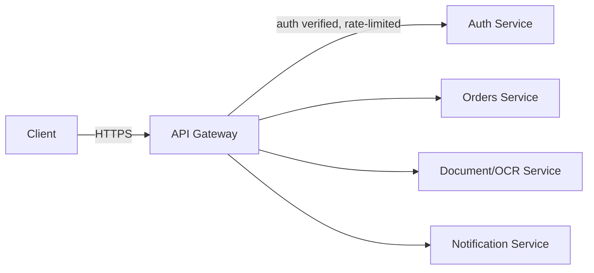

# API Gateways

> **Type:** Study notes

## Why interviewers ask this

If your resume says "API gateway," expect a follow-up that separates people who deployed one from
people who configured `nginx.conf` once and called it a gateway. Interviewers want to hear you
draw a clean line between what belongs in the gateway layer and what belongs in each backend
service — and to hear you talk about the operational reality of putting one piece of
infrastructure in front of everything. Treat this file as a script for describing the gateway you
already operated, not a from-scratch tutorial.

## What an API gateway actually does

A single entry point that sits between clients and your backend services, so clients don't talk
to N services directly.

Core responsibilities:

- **Routing** — map `/orders/*` to the orders service, `/documents/*` to the document service,
  etc. Path-based, host-based, or header-based routing. This is what lets you evolve service
  boundaries without clients caring.
- **Auth termination** — validate the JWT/API key/session once, at the edge, and forward a
  trusted identity (e.g. a verified user ID header) downstream, instead of every service
  re-implementing token validation. See
  [`03_auth_jwt_oauth_rbac.md`](03_auth_jwt_oauth_rbac.md) for the token mechanics.
- **Rate limiting** — enforce per-client/per-key limits centrally instead of duplicating the logic
  in every service. See [`05_rate_limiting.md`](05_rate_limiting.md).
- **Request/response transformation** — header injection/stripping, response shape
  normalization, sometimes protocol translation (REST-in, gRPC-out to an internal service).
- Often also: TLS termination, request logging/tracing injection (correlation IDs), and
  circuit-breaking to a failing backend.

## What belongs in each backend service instead

Business logic, domain validation, data access, and anything specific to *that* service's
resource model does **not** belong in the gateway. A gateway that starts accumulating
service-specific business rules becomes a second, harder-to-test copy of your application logic,
and every team ends up needing to deploy through the gateway team to ship a feature — that's an
anti-pattern to name explicitly if asked. Keep the gateway's logic generic and cross-cutting;
keep anything that changes because *one* service's domain changed inside that service.

| Gateway | Backend service |
|---|---|
| "Is this token valid at all?" | "Is this user allowed to edit *this specific* document?" (object-level permission) |
| "Has this API key exceeded its rate limit?" | "Is this order in a state where it can be cancelled?" |
| Route `/v2/orders` to the v2 orders deployment | Actual v1→v2 response shape logic for orders |
| Strip internal headers before responding to the client | Validate the request body against the domain model |

## Single point of failure — the trade-off to name unprompted

Putting one component in front of every request means a gateway outage takes down everything
behind it, even if every backend service is healthy. This is the honest cost of the pattern, and
a strong answer addresses it rather than pretending the gateway is free:

- Run the gateway itself redundantly (multiple instances behind a load balancer, not a single
  process/pod).
- Keep the gateway thin and stateless so instances are trivially interchangeable and fast to
  restart/scale.
- Have a plan for gateway-level failure modes: timeouts to backends should fail fast with
  circuit breakers rather than piling up connections; degrade gracefully (serve cached/stale
  responses, or return a clear `503`) rather than cascading a slow backend into a gateway-wide
  outage.
- Separate the *control plane* (config changes, deploys) from the *data plane* (the actual
  request-forwarding path) — a bad config push shouldn't be able to take down live traffic
  instantly without a rollback path.

## Interview Q&A

**Q: Walk me through how a request for `GET /api/documents/42` flows through your gateway to the
backend, in a system you operated.**
A: Client hits the gateway over HTTPS; gateway terminates TLS, validates the JWT and extracts the
user ID/claims, checks rate limit for that client, matches the path to the documents service
route, forwards the request with the verified identity in a trusted header (e.g.
`X-User-Id`), the documents service does its own object-level permission check (does *this* user
own *this* document) and returns the response, which the gateway may transform (strip internal
fields) before sending it back.

**Q: Why not let every service validate its own JWT independently?**
A: You can — it's a legitimate design (each service just needs the public key/JWKS endpoint) — but
centralizing it at the gateway means one place to rotate keys, one place to change auth logic,
and consistent enforcement instead of N slightly-different implementations drifting over time.
The trade-off is the gateway becoming a dependency every request needs.

**Q: What happens if the gateway goes down?**
A: Everything behind it becomes unreachable from outside, even if backends are fine — that's the
real cost of centralizing the entry point. Mitigate with redundant gateway instances behind a
load balancer, health checks, and keeping the gateway logic simple enough that it rarely needs a
risky deploy.

**Q: Would you put business logic like "can this user cancel this order" in the gateway?**
A: No — that's domain logic specific to the orders service and its data model. The gateway
shouldn't need to know about order states. If it did, every domain change would require a gateway
deploy, and you'd have coupled a cross-cutting infra layer to a single service's business rules.

## Hands-on exercise

1. Draw (mermaid or on paper) the request path for an authenticated `POST /documents/{id}/process`
   call through a gateway to an OCR service, labeling exactly what the gateway checks/does vs.
   what the service does.
2. List three things you would move *out* of a gateway config if you found them accidentally
   implemented there (e.g. "only allow document processing during business hours" — that's a
   product rule, not routing/auth/rate-limiting) and explain where each belongs instead.
