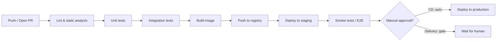

# CI/CD Basics

> **Type:** Study notes

## Why interviewers ask this

Almost every backend role touches "how does code get from a laptop to production safely." This
isn't usually a deep-dive topic at 3 YOE, but interviewers expect you to distinguish CI from CD
cleanly, describe a real pipeline you've worked with (not a generic list), and reason about
deployment-strategy trade-offs when something goes wrong in production — which is where this
connects to actual on-call experience.

## CI vs. CD — the distinction people blur

- **Continuous Integration (CI)**: every push (or PR) automatically triggers build, lint, and
  test. The goal is catching problems *before* merge — a broken build or failing test blocks the
  PR rather than surfacing after it's already in `main`.
- **Continuous Delivery/Deployment (CD)**: automatically taking code that passed CI and getting it
  running somewhere — staging, and (for *deployment* specifically, vs. just *delivery*)
  production, without a human manually SSHing in or running deploy scripts by hand.
  - *Delivery*: automated up to a manual "click to deploy" gate.
  - *Deployment*: fully automated, no human gate — every merge to `main` that passes CI goes live.

Say the distinction explicitly if asked — a lot of candidates use "CI/CD" as one word without
being able to separate what each half actually guarantees.

## A typical pipeline, stage by stage

- **Lint/static analysis** — `ruff`/`flake8`, `mypy`, fast, fails loud on obvious issues before
  spending time on slower stages.
- **Unit tests** — fast, isolated, no DB/network; the bulk of your test suite should live here so
  CI stays fast.
- **Integration tests** — spin up a real (containerized) Postgres/Redis, hit actual DRF endpoints,
  slower, fewer of them.
- **Build & push image** — produce the versioned artifact (Docker image tagged with the commit
  SHA) that will actually be deployed — the same artifact that passes every later stage, not
  rebuilt from source again at deploy time.
- **Deploy to staging, smoke test** — catch environment-specific issues (config, migrations) in a
  prod-like environment before real traffic sees it.
- **Deploy to production** — via one of the deployment strategies below.

## Deployment strategies — trade-offs

| Strategy | How it works | Trade-off |
|---|---|---|
| **Rolling** | Replace old instances with new ones a few at a time, health-checking each before continuing | Simple, default in most orchestrators (k8s rolling update); brief window where old and new versions both serve traffic — needs backward-compatible changes (esp. DB migrations) |
| **Blue-green** | Run a full second environment ("green") alongside the current one ("blue"), switch traffic all at once (load balancer/DNS flip) once green is verified | Fast, near-instant rollback (flip back to blue); doubles infrastructure cost while both environments exist; all-at-once cutover means any bug hits 100% of traffic at once |
| **Canary** | Route a small percentage of real traffic (e.g. 5%) to the new version, watch error rates/latency, gradually increase | Limits blast radius of a bad deploy to a small slice of users; needs good metrics/monitoring to actually detect a problem at 5% traffic, and more operational complexity to manage the gradual rollout |

**Interview framing:** "Rolling is the sane default for most services. Canary is what I'd want for
a high-traffic, high-risk change — it caps how many users see a bug before you catch it in
metrics and roll back. Blue-green is nice when you need an instant, clean rollback path and can
afford to run double infrastructure briefly, e.g. around a risky schema migration." A theme that
comes up regardless of strategy: **database migrations need to be backward-compatible** during
any rolling/canary window, since old and new code run against the same DB simultaneously —
additive changes first (add column, deploy code that writes to both, backfill, then remove the
old column in a later deploy), not a single breaking migration.

## Why fast CI feedback loops matter

A CI pipeline that takes 25 minutes means a developer context-switches away, comes back to a red
build, and has lost the mental state to fix it quickly — or worse, batches several changes
together before checking, making the eventual failure harder to bisect. Fast feedback (aim for
single-digit minutes for the PR-blocking path) keeps developers in flow and catches bugs while
the change is still fresh in their head, which is dramatically cheaper than catching the same bug
in staging or production. Practical levers: parallelize independent test suites, run the fast
unit-test tier before the slow integration tier (fail fast), cache dependency installs, and keep
truly slow tests (full E2E) out of the PR-blocking path — run them post-merge or on a schedule
instead if they can't be sped up.

## Interview Q&A

**Q: A deploy went out and broke production for 10% of users. Your CD pipeline was fully
automated with no manual gate. What would you change?**
A: I'd want canary deployment with automated rollback tied to error-rate/latency metrics, so a bad
deploy gets caught and reverted automatically after affecting a small slice of traffic instead of
riding a rolling deploy to 100%. I'd also check whether the failing case was covered by CI at
all — if 10% of users hit a code path integration tests didn't cover, that's a test-suite gap,
not just a deployment-strategy gap.

**Q: What's in your PR-blocking CI vs. what runs later?**
A: Lint, unit tests, and fast integration tests block the PR — anything a developer needs
immediate feedback on to merge confidently. Slow E2E suites, full load tests, or nightly security
scans run post-merge or on a schedule; blocking every PR on them would kill the feedback loop
without proportionate benefit for most changes.

**Q: How do you handle a DB migration in a rolling deployment where old and new code run
simultaneously?**
A: Split it into backward-compatible steps: add the new column (nullable or with a default) in
one deploy, ship code that writes to both old and new fields, backfill existing rows, switch reads
to the new field, and only drop the old column in a later deploy once nothing references it. A
single deploy that both changes the schema and requires the new code can break the old code
that's still running during the rollout window.

## Hands-on exercise

1. Sketch a GitHub Actions-style YAML (pseudocode is fine) for a Django project: lint → unit
   tests (no services) → integration tests (Postgres + Redis service containers) → build/push
   Docker image tagged with the commit SHA.
2. Pick one endpoint in a hypothetical app and describe, step by step, how you'd safely roll out a
   breaking-looking DB migration for it using the expand/contract pattern above.
