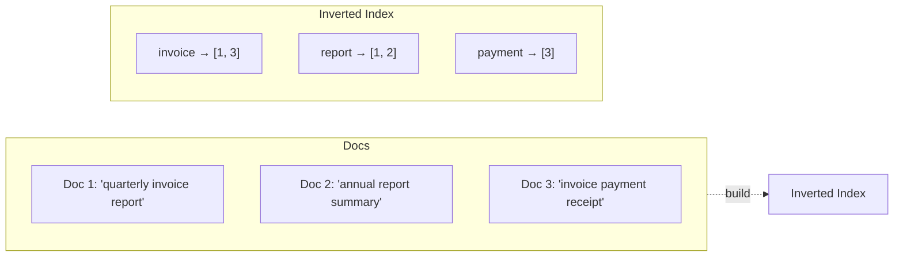

# Elasticsearch & Search Basics

> **Type:** Study notes

## Why interviewers ask this

If your background includes Elasticsearch, expect interviewers to push past "I used ES for
search" into *why* it's fast, how relevance scoring actually works, and — the question that
separates real production experience from a tutorial — how you kept it in sync with your source
of truth. That last part is where most candidates go quiet, and where this file spends the most
weight.

## The inverted index — why ES beats a DB `LIKE` query

A relational DB stores rows and, for text, typically supports `LIKE '%term%'` — which can't use a
standard B-tree index for a leading wildcard, so it becomes a full table scan of every row's text,
checking each one for a substring match. That's O(n) in the number of rows, every time.

An **inverted index** flips the direction: instead of "row → words it contains," ES builds "word →
list of rows/documents that contain it." Searching for "invoice" is then a direct lookup of the
word "invoice" in the index, returning the matching document IDs immediately — no scanning
every document. This is the same idea as a book's index (the pages listed under "photosynthesis"
vs. reading the whole book to find every mention).



This is *why* ES scales for full-text search where Postgres `LIKE` doesn't — but note Postgres has
its own answer to this exact problem (below), so "ES is just always faster" is the wrong
takeaway.

## Mapping, analyzers, tokenizers

A **mapping** is the schema for an index — which fields exist and how each is indexed
(`text`, `keyword`, `integer`, `date`, etc.). Getting this right up front matters because
reindexing a large corpus with a changed mapping is expensive.

An **analyzer** is the pipeline that turns raw text into the terms that go into the inverted
index: a **tokenizer** splits text into tokens (usually on whitespace/punctuation), then
**token filters** transform them — lowercase, remove stopwords ("the", "a"), stem ("running" →
"run"). This is what makes a search for "run" match a document containing "running."

```json
PUT /documents
{
  "mappings": {
    "properties": {
      "title": { "type": "text", "analyzer": "standard" },
      "status": { "type": "keyword" },
      "uploaded_at": { "type": "date" }
    }
  }
}
```

## `text` (full-text) vs. `keyword` (exact-match)

This distinction is the single most common ES mistake candidates make, and a good one to bring up
proactively:

- **`text`** fields are analyzed (tokenized, lowercased, stemmed) — good for full-text search
  ("find documents mentioning invoice"), but you cannot sort or do exact-match/aggregation on them
  reliably, because the field is stored as tokens, not the original string.
- **`keyword`** fields are stored as-is, unanalyzed — good for exact match, filtering, sorting,
  and aggregations (`status = "completed"`, `category = "invoice"`, faceted counts by category).

A common pattern is mapping the same field both ways (`title` as `text` for search, `title.raw`
as `keyword` for exact filtering/sorting) via a multi-field mapping.

## Relevance scoring — TF-IDF / BM25 conceptually

When a full-text query matches multiple documents, ES ranks them by a relevance score, not just
"matched or didn't." Modern ES defaults to **BM25**, an evolution of **TF-IDF**:

- **TF (term frequency)** — a document mentioning "invoice" 5 times is probably more relevant to
  an "invoice" search than one mentioning it once.
- **IDF (inverse document frequency)** — a rare term ("photosynthesis") appearing in a document is
  a stronger relevance signal than a common term ("the," "report") appearing, since common terms
  don't discriminate between documents well.
- **BM25** refines TF-IDF with saturation (the 10th occurrence of a word matters much less than
  the 2nd — diminishing returns) and length normalization (a match in a short doc counts for more
  than the same match diluted across a huge doc).

You don't need the formula memorized — the conceptual explanation above ("rare + frequent within
the doc + not diluted by document length = more relevant") is what interviewers are checking for.

## When to use ES vs. Postgres full-text search vs. pgvector

| | Elasticsearch | Postgres full-text search (`tsvector`/`GIN`) | pgvector |
|---|---|---|---|
| Best for | Complex full-text search at scale, faceted search/aggregations, log/event search | Full-text search on data that already lives in Postgres, moderate scale, no new infra | Semantic/similarity search over embeddings (RAG, "find similar documents by meaning") |
| Query model | Rich DSL: fuzzy match, boosting, highlighting, aggregations, filters combined with relevance | `to_tsvector`/`to_tsquery`, ranked with `ts_rank`, decent for "search this table's text column" | Vector distance (cosine/L2) over embeddings, usually combined with a `text`/keyword filter |
| Operational cost | A whole separate system to run, sync, monitor | None — it's already your DB | None — extension on your existing Postgres |
| When it's overkill | Small dataset, simple "does this column contain X" search | N/A | When you just need keyword search, not semantic similarity |

**Honest framing for an interview**: "If the search need is straightforward — filter/search a
column that already lives in Postgres, moderate scale — I'd lean Postgres full-text first and
avoid standing up a second system. I'd reach for Elasticsearch once I need things Postgres FTS
doesn't do well: complex relevance tuning, faceted aggregations across large volumes, fuzzy/typo
tolerance, or search-as-a-primary-workload at a scale where it's competing with transactional
queries on the same DB. pgvector is a different axis entirely — semantic similarity, not lexical
match — and the two are often combined (hybrid search: keyword/BM25 + vector similarity)."

## Keeping ES in sync with the source-of-truth DB

This is the part of ES experience that's genuinely hard, and interviewers know it. Postgres is the
source of truth; ES is a derived, denormalized read index. They will drift unless you actively
manage it.

**Dual-write** (simplest, riskiest): your Django code writes to Postgres and ES in the same
request/service call.

```python
def update_document_status(document, status):
    document.status = status
    document.save(update_fields=["status"])
    es_client.update(index="documents", id=document.id, body={"doc": {"status": status}})
```

Problem: these two writes aren't transactional together. If the ES write fails after the Postgres
write commits (or vice versa if ordered the other way), the two stores silently disagree, and
nothing tells you it happened.

**Event-driven / CDC sync** (more robust): the Postgres write is the only synchronous write. A
separate mechanism propagates the change to ES asynchronously:

- **Outbox + Celery task**: after committing the DB change (`transaction.on_commit(...)`), enqueue
  a task that reindexes that document in ES. Retries handle transient ES failures without losing
  the update, and it's idempotent by design (reindexing the same doc twice is harmless — see
  [`09_idempotency_and_retries.md`](09_idempotency_and_retries.md)).
- **CDC (change data capture)**, e.g. Debezium reading Postgres's WAL: ES gets updated based on
  the actual committed DB changes, not on your application code remembering to also call ES —
  this closes the gap where a raw SQL update, a data migration, or an admin action bypasses your
  service layer and silently skips the ES write.
- Either way, run a periodic **reconciliation job** that diffs a sample (or all) of Postgres
  against ES and re-syncs mismatches — treat eventual consistency as the honest model rather than
  assuming sync is perfect.

## Interview Q&A

**Q: Why is a full-text search on a `VARCHAR` column with `LIKE '%term%'` slow at scale, and how
does ES avoid that?**
A: A leading-wildcard `LIKE` can't use a standard B-tree index, so Postgres scans every row. ES's
inverted index maps each term directly to the documents containing it, so a search is a direct
lookup instead of a scan.

**Q: You need to filter documents by exact `status` and also full-text search their `title`. How do
you map that?**
A: `status` as a `keyword` field (exact match, filterable, aggregatable), `title` as `text` with
an analyzer for full-text relevance search — possibly `title.raw` as a `keyword` sub-field too if
you also need exact-match/sort on the title.

**Q: How do you keep Elasticsearch from drifting out of sync with Postgres in production?**
A: Avoid a naive synchronous dual-write with no failure handling. Use `transaction.on_commit` +
an idempotent Celery reindex task (or CDC off the WAL for the strongest guarantee), and run a
periodic reconciliation job that catches drift from anything that bypassed the normal write path
— raw SQL, a migration, a bug.

**Q: When would you *not* reach for Elasticsearch?**
A: When Postgres full-text search already covers the actual requirement — moderate scale, no need
for complex relevance tuning or faceted aggregation. Standing up and operating a second stateful
system (cluster management, sync pipeline, another thing to monitor) is a real cost that should be
justified by a real need, not defaulted to because ES is the "search tool."

## Hands-on exercise

1. Design the mapping for a `documents` index (title, body text, status, category, uploaded_at,
   owner_id) with the correct `text` vs. `keyword` choice for each field, and write one query that
   does full-text search on `body` filtered by exact `status="completed"`.
2. Sketch the sync path: a Django `Document` model save, a `transaction.on_commit` hook that
   enqueues a Celery `reindex_document(document_id)` task, and note where you'd add a
   reconciliation job to catch documents that drifted out of sync.
