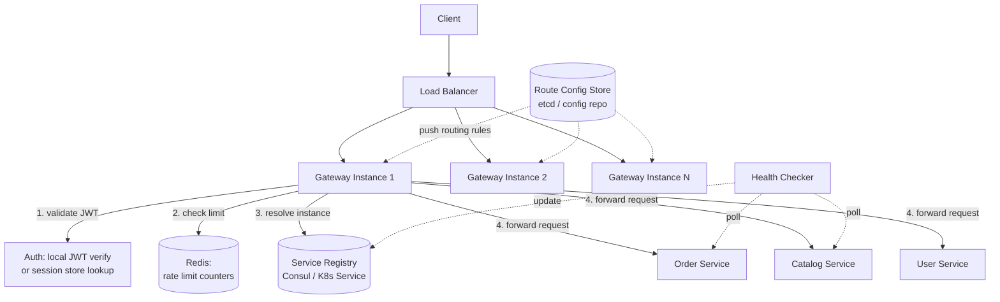

# API Gateway Design

> **Type:** Study notes

## Requirements

This exercise designs **the gateway itself** as a system you'd build — routing engine, auth
termination, rate limiting logic — as distinct from
[API Gateways](../../05_backend_engineering/11_api_gateways.md), which covers *using* an existing
gateway (Kong/NGINX/AWS API Gateway) in front of a microservice architecture. Think of this as "your
company is evaluating building a lightweight internal gateway instead of buying one."

**Functional**
1. Route incoming requests to the correct backend service based on path/host.
2. Authenticate requests once at the gateway (validate a JWT/session) instead of every backend
   service re-implementing auth.
3. Enforce per-client rate limits before a request reaches backend services.
4. Transform requests/responses when needed (e.g. strip internal headers, aggregate two backend
   calls into one client-facing response for a legacy client).
5. Discover which backend instances are healthy and available to route to.

**Out of scope**: full service mesh (mTLS between every service, sidecar proxies — that solves
service-to-service traffic, not client-to-edge traffic), GraphQL federation, complex request
aggregation/orchestration (BFF-pattern composition of many calls).

**Non-functional**
- The gateway sits on every request to every service — it must add minimal latency (single-digit ms
  overhead) and must not become the system's throughput ceiling.
- **The gateway is a single point of failure by construction** — every client request passes
  through it — so availability design is a first-class concern, not an afterthought.
- Scale: assume the platform behind it serves 50K RPS in aggregate across all services; the gateway
  must handle that plus its own overhead.

## Capacity Estimation

- 50K RPS aggregate across all backend services means the gateway tier must sustain 50K+ RPS with
  headroom for spikes (~150K RPS provisioned, 3x).
- Gateway request handling should be sub-5ms of its own overhead (auth check + route lookup + rate
  limit check) — anything more and the gateway itself becomes the latency bottleneck for every
  single request in the system.
- Auth validation: if JWT-based, this is a local signature check (fast, no DB round-trip); if
  session-based, requires a fast shared session store (Redis) lookup on every request — this choice
  materially affects gateway throughput (see Deep Dive).
- Rate-limit state: per-client counters, likely millions of active clients -> needs a fast shared
  store (Redis) with TTL-based windows, not per-instance in-memory counters (see Deep Dive).

## API Design

The gateway's own "API" is really its routing configuration plus the pass-through contract:

```
# Routing config (declarative, not a runtime endpoint)
routes:
  - path_prefix: /api/orders/*
    service: order-service
    auth_required: true
    rate_limit: { requests: 100, window: "1m", scope: "per_user" }
  - path_prefix: /api/public/products/*
    service: catalog-service
    auth_required: false
    rate_limit: { requests: 1000, window: "1m", scope: "per_ip" }

# Runtime behavior (any incoming request)
ANY /api/{service_path}
  Header: Authorization: Bearer <jwt>
  -> Gateway validates JWT signature + expiry
  -> Gateway checks rate limit for (client_id, route)
  -> Gateway resolves healthy backend instance via service discovery
  -> Gateway forwards request, injecting X-User-Id, X-Request-Id headers
  -> Backend responds -> Gateway may transform response -> returned to client

# Gateway admin/observability endpoints
GET /gateway/health
GET /gateway/routes            # current routing table, for debugging
```

## Data Model

The gateway is mostly config-driven and stateless per-request, but has a few pieces of shared state:

```
RouteConfig (loaded from a config store — etcd/Consul/a config file pushed via CI):
  { path_prefix, target_service, auth_required, rate_limit_policy, timeout_ms }

ServiceRegistry (in Consul/etcd/Kubernetes Service, not owned by the gateway itself):
  { service_name, instance_id, host, port, health_status, last_heartbeat }

RateLimitCounter (Redis, ephemeral):
  key: "ratelimit:{client_id}:{route}:{window_bucket}" -> count, TTL = window duration

# The gateway does NOT own a primary datastore of business data —
# it is stateless with respect to application data by design.
```

## High-Level Architecture



## Deep Dive

**1. Auth termination: JWT local validation vs. session-store round-trip.** Terminating auth at the
gateway means backend services trust the gateway and skip re-implementing auth themselves — the
gateway forwards a verified identity (e.g. `X-User-Id` header) instead of the raw token. The design
decision that matters most for throughput: if using JWTs, the gateway validates the signature
locally (fast, CPU-only, no network hop) and can reject invalid/expired tokens without touching any
datastore — this scales linearly with gateway instances. If using opaque session tokens (common when
sessions need server-side revocation), every request needs a Redis lookup, adding a network
round-trip to every single request in the system and making the session store's availability a
hard dependency for the entire platform's uptime. JWTs trade instant revocation (you can't force-
invalidate a JWT before its expiry without extra machinery — a deny-list) for that avoided
round-trip; short JWT expiry (minutes) plus a refresh-token flow is the common middle ground.

**2. Rate limiting at the edge, and why it must use shared, not per-instance, state.** If each
gateway instance kept its own in-memory counter, a client could get 3x the intended rate limit
simply by having requests round-robin across 3 gateway instances behind the load balancer — each
instance thinks the client has made zero requests. The fix is a shared counter store (Redis) that
all gateway instances read/write, typically using a sliding-window or fixed-window-with-TTL
algorithm (`INCR` + `EXPIRE` on a key like `ratelimit:{client_id}:{minute_bucket}`). This makes
Redis latency part of every rate-limited request's critical path — worth calling out as a trade-off,
and why the rate-limit check should happen as early as possible in the gateway's request pipeline
(reject before doing any more expensive work, like resolving service discovery).

**3. The gateway as a single point of failure — mitigated by redundancy, not eliminated.** Because
literally every client request passes through the gateway layer, a gateway outage is a total
platform outage — this is inherent to the pattern, not a bug to design away entirely. The mitigation
is standard horizontal redundancy: multiple stateless gateway instances behind a load balancer (the
gateway instances themselves hold no request-specific state, so any instance can handle any
request), health-checked so the LB stops routing to an unhealthy instance, deployed across multiple
availability zones so a single AZ failure doesn't take down the whole gateway tier. The gateway's
*dependencies* (Redis for rate limiting, the service registry) become the next layer of SPOFs to
harden — a gateway that's up but can't reach Redis needs a defined fallback (e.g. fail open on rate
limiting rather than rejecting all traffic, if availability matters more than strict limit
enforcement for that route).

## Trade-offs

| Decision | Chosen | Alternative | Why |
|---|---|---|---|
| Auth validation | Local JWT signature check | Session store lookup per request | Avoids a network round-trip on every request; trades instant revocation for speed |
| Rate limit state | Shared Redis counters | Per-instance in-memory counters | Per-instance counters let clients bypass limits by hitting different instances |
| Gateway redundancy | Multiple stateless instances behind an LB, multi-AZ | Single gateway instance (simpler ops) | A single instance makes the gateway's own uptime the platform's uptime ceiling |
| Config propagation | Push-based (config store notifies gateways) | Poll-based (gateways poll config store periodically) | Push gives faster propagation of routing/rate-limit changes; poll is simpler but adds staleness |
| Rate-limit failure mode | Fail open (allow traffic) if Redis is unreachable | Fail closed (reject all traffic) | For most products, an outage of the limiter shouldn't take down the whole platform; security-sensitive routes may choose fail-closed instead |

## What a 3-YOE candidate is expected to cover vs. out of scope

**Expected at this level:**
- Explain why centralizing auth at the gateway is valuable (backends don't reimplement it) and the
  JWT-vs-session trade-off at a conceptual level.
- Know that rate limiting needs shared state across gateway instances, not per-instance counters.
- Recognize the gateway as a SPOF and propose the standard fix: redundant instances behind a load
  balancer, health checks, multi-AZ.
- Basic routing logic (path-prefix or host-based routing to backend services).
- Mention service discovery conceptually (a registry the gateway consults, even if not implementing
  Consul/etcd internals).

**Out of scope / senior-level territory:**
- Building a custom load balancing algorithm (weighted round-robin, least-connections with health
  scoring) inside the gateway itself.
- Full service mesh design (sidecar proxies, mTLS everywhere, traffic shifting for canary
  deployments) — that's a distinct, larger system.
- Multi-region active-active gateway deployment with global traffic steering (GeoDNS/Anycast).
- Complex request aggregation/orchestration (BFF pattern: gateway calls 3 backends and composes one
  response) — a sentence acknowledging the pattern exists is enough.
- Exact rate-limiting algorithm implementation details (token bucket vs. sliding-window-log math) —
  knowing they exist and picking one is enough; deriving the math live is not expected.

## Follow-up questions an interviewer might ask

1. "The service registry is temporarily unreachable. What does the gateway do — reject all traffic,
   or serve from a stale cached routing table?"
2. "How would you roll out a new rate limit policy to all gateway instances without a deploy and
   without a moment where instances disagree on the limit?"
3. "A backend service is healthy but slow (not down, just degraded). How does the gateway protect
   the rest of the system from that one slow service (circuit breaking, timeouts)?"
4. "Why terminate auth at the gateway instead of at each backend service? What do you lose by
   centralizing it?"
5. "How do you handle a client that needs to call two backend services and get one combined
   response — does that belong in the gateway or somewhere else?"
