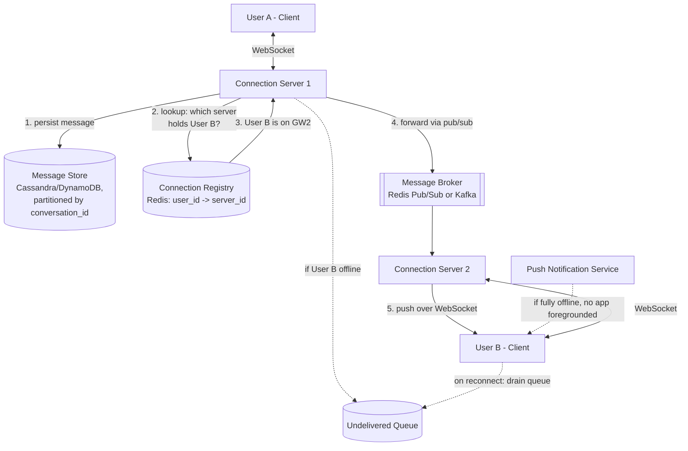

# Chat / Messaging System Design

> **Type:** Study notes

## Requirements

**Functional**
1. Two users can send/receive direct messages in near real-time.
2. Group chats (up to ~200 members) fan out a message to all members.
3. Messages persist — a user who opens the app hours later sees everything they missed, in order.
4. Online/offline presence and a typing indicator (best-effort, not guaranteed-accurate).
5. A message sent while the recipient is offline is delivered when they reconnect.

**Out of scope**: end-to-end encryption key exchange, media/file transfer pipeline (separate
upload-then-reference design), message search/full-text indexing, read receipts at per-member
granularity for large groups.

**Non-functional**
- Real-time feel: message delivery to an online recipient in under ~500ms.
- **At-least-once delivery** — a message must never silently disappear; duplicates are acceptable
  if the client can dedup them.
- Ordering: messages within a single conversation appear in a consistent order to all participants
  (doesn't need to be globally linearizable across conversations).
- Scale: assume 20M daily active users, each sending ~40 messages/day -> 800M messages/day
  (~9,300 QPS average, 5-10x burst at peak hours).
- Each user holds a long-lived connection (WebSocket) while the app is foregrounded — this is a
  stateful-connection problem, not a stateless-request problem.

## Capacity Estimation

- 20M DAU, assume ~30% concurrently connected at peak -> ~6M concurrent WebSocket connections.
- A single well-tuned server can hold ~50K-100K idle WebSocket connections -> ~60-120 connection
  servers needed at peak, purely for holding sockets (not counting message-processing load).
- 800M messages/day, average message ~200 bytes -> ~160GB/day raw message data; with group fan-out
  (avg group size assume 5 effective recipients) message *deliveries* are higher than messages
  *sent*, but storage stores the message once and fans out delivery, not storage.
- Message history: keep indefinitely in a scalable store (Cassandra/DynamoDB-style, partitioned by
  conversation_id) — a relational DB is the wrong tool for this write volume and access pattern.

## API Design

```
WS  /ws/connect                              # persistent connection, authenticated via token on handshake
  Client -> Server: { "type": "message", "conversation_id": "...", "client_msg_id": "uuid", "text": "..." }
  Server -> Client: { "type": "message", "message_id": "...", "conversation_id": "...",
                       "sender_id": "...", "text": "...", "sent_at": "..." }
  Server -> Client: { "type": "ack", "client_msg_id": "uuid", "message_id": "..." }
  Server -> Client: { "type": "typing", "conversation_id": "...", "user_id": "..." }
  Server -> Client: { "type": "presence", "user_id": "...", "status": "online|offline" }

GET /api/v1/conversations/{id}/messages?before=<message_id>&limit=50
  -> 200 { "messages": [...] }               # history/backfill, REST not WS

POST /api/v1/conversations/{id}/messages     # HTTP fallback if WS unavailable (e.g. push notif tap)
  Body: { "client_msg_id": "uuid", "text": "..." }
```

`client_msg_id` is generated once on the client and reused on retry — this is what makes delivery
idempotent on the client-dedup side (see Deep Dive).

## Data Model

```
Conversation(id, type ENUM(direct, group), created_at)
ConversationMember(conversation_id FK, user_id FK, joined_at, last_read_message_id)

Message(
  id, conversation_id FK, sender_id FK, client_msg_id,
  text, sent_at, sequence_no      -- monotonic per-conversation, used for ordering
)
-- partitioned/sharded by conversation_id; UNIQUE(conversation_id, client_msg_id) for idempotent writes

UserConnection(user_id PK, server_id, connected_at)   -- lives in Redis, not primary DB, see Deep Dive

UndeliveredQueue(user_id, message_id, conversation_id)  -- per-user inbox for offline delivery,
                                                          -- drained on reconnect
```

## High-Level Architecture



## Deep Dive

**1. Connection state management: "which server holds this user's socket" is a real distributed
problem.** Unlike a stateless REST API where any server can handle any request, a WebSocket
connection is pinned to one specific server process for its lifetime. When User A's server (GW1)
needs to deliver a message to User B, it doesn't know which of the N connection servers holds User
B's socket. The fix: a **connection registry** (Redis, `user_id -> server_id`, with a TTL/heartbeat
so dead entries expire) that every connection server updates on connect/disconnect. Message delivery
becomes: look up the recipient's server in the registry, then forward the message to that specific
server via a pub/sub layer (Redis Pub/Sub for smaller scale, Kafka for higher durability/throughput)
so the message reaches the correct server even though the sender's server has no direct link to it.
This registry is itself a scaling bottleneck and single point of failure if not replicated — worth
naming explicitly in an interview.

**2. At-least-once delivery + client-side dedup, not exactly-once.** Guaranteeing exactly-once
delivery across a network is famously hard (the two-generals problem) and not worth the engineering
cost here. Instead: the server persists the message *before* attempting delivery, retries delivery
on failure/reconnect, and accepts that the same message might occasionally be delivered twice (e.g.
if an ack is lost after the client already received it, or a message from the undelivered queue
races a live push). The client tolerates this cheaply: `client_msg_id` (generated once, sent by the
client) lets the client discard a message it's already rendered. This shifts the hard problem from
"never duplicate, ever" (expensive, coordination-heavy) to "duplicates are fine, just filter them"
(cheap, client-local). Combined with `sequence_no` per conversation, the client can also detect gaps
and re-fetch history via the REST backfill endpoint rather than trusting the WS stream blindly.

**3. Group chat fan-out.** For a group of N members, one incoming message becomes N delivery
attempts. At small-to-medium group sizes (up to a few hundred) this is done synchronously/eagerly:
the server persists the message once, then looks up each member's connection-server via the
registry and pushes to each. At very large "group" scale (broadcast channels with thousands of
members) this eager fan-out doesn't scale and systems switch to a **pull model** — the message is
written once, and each client's connection server independently reads it from a shared feed/log the
next time that user is online, rather than the server pushing to thousands of sockets at once. For
this exercise's stated scale (~200-member groups), eager push fan-out through the registry/pub-sub
path above is the right answer — call out the pull-model alternative only if asked to scale further.

## Trade-offs

| Decision | Chosen | Alternative | Why |
|---|---|---|---|
| Delivery guarantee | At-least-once + client dedup via `client_msg_id` | Exactly-once | Exactly-once across a network requires expensive coordination for marginal benefit when client dedup is nearly free |
| Connection routing | Redis registry (user_id -> server_id) + pub/sub forwarding | Sticky-session load balancer only | A single LB can't route a message from a *different* user's server; you need a shared lookup |
| Message store | Wide-column store (Cassandra/DynamoDB) partitioned by conversation_id | Relational DB (Postgres) | Write-heavy, append-mostly, naturally partitionable by conversation — a poor fit for relational joins anyway |
| Group fan-out | Eager push (server delivers to each online member) | Pull-based feed read | Eager push is simpler and fine at ~200-member scale; pull model only pays off at broadcast scale |
| Presence/typing | Best-effort, ephemeral (Redis TTL, not persisted) | Durable, guaranteed-accurate presence | Presence is inherently stale the moment it's computed (network delay); persisting it durably adds cost for no real benefit |

## What a 3-YOE candidate is expected to cover vs. out of scope

**Expected at this level:**
- Recognize that WebSocket connections are stateful and stuck to one server — this is the single
  most important insight distinguishing this from a stateless API design.
- Propose some form of registry/lookup (user -> server) to route cross-server delivery.
- Know at-least-once + client dedup as the practical delivery guarantee, and why exactly-once is
  the wrong target.
- Basic message persistence and ordering (per-conversation sequence numbers or timestamps).
- Mention offline delivery (queue + push notification fallback) even at a high level.

**Out of scope / senior-level territory:**
- Building a custom pub/sub/broker from scratch instead of using Kafka/Redis.
- Exact conflict resolution for out-of-order delivery across multiple data centers.
- End-to-end encryption key management (Signal protocol-style ratcheting).
- Precise presence-accuracy guarantees under flaky mobile networks (debounce/heartbeat tuning is a
  deep rabbit hole — a sentence acknowledging it is enough).
- Fan-out architecture for broadcast-scale channels (thousands+ of members) — pull-model feeds,
  read-time fan-out, celebrity-account problem.

## Follow-up questions an interviewer might ask

1. "User B's connection server crashes mid-session. Walk me through what happens to a message sent
   to them at that exact moment, and how they recover."
2. "How do you keep the connection registry from becoming a single point of failure?"
3. "How would 'read receipts' change this design, especially for large groups?"
4. "The client reconnects after being offline for 3 days. How do you avoid replaying an enormous
   backlog inefficiently?"
5. "How does typing-indicator traffic avoid overwhelming the system, given it fires on nearly every
   keystroke?"
