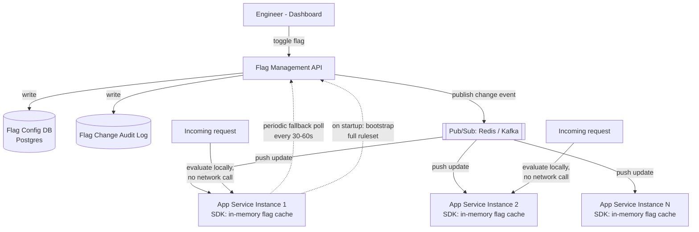

# Feature Flag System Design

> **Type:** Study notes

## Requirements

**Functional**
1. Engineers define a flag (`new_checkout_flow`) and targeting rules: on/off globally, on for a
   specific user segment, or on for a percentage rollout (e.g. 10% of users).
2. Application services evaluate "is this flag on for this user?" on every relevant request.
3. Flag state changes (toggled by an engineer in a dashboard) propagate to all running service
   instances without a deploy.
4. A flag can be used as a **kill switch** — instantly disable a misbehaving feature in production
   during an incident, without a code rollback/redeploy.
5. Targeting can combine rules (e.g. "on for internal staff OR 5% of all users").

**Out of scope**: full A/B testing statistical analysis (significance testing, experiment
reporting — flags are the delivery mechanism, experimentation analytics is a separate system),
multivariate flags returning complex config objects (assume boolean/simple-value flags), flag
dependency graphs (flag B requires flag A).

**Non-functional**
- **Flag evaluation latency must be near-zero** — it's checked on the hot path of ordinary requests
  (sometimes multiple times per request), so it cannot add a network round-trip per check.
- Kill-switch propagation must be fast — an engineer disabling a flag during an incident needs it to
  take effect in seconds, not minutes, across every running instance.
- Availability: if the flag service is down, application services must fail safe (keep running with
  the last-known flag state), never fail the request.
- Scale: assume 500 services, each with tens of instances, each evaluating flags on most requests —
  potentially millions of evaluations/second in aggregate, but each evaluation must be effectively
  free.

## Capacity Estimation

- Flag *definitions* are small in number (hundreds to low thousands of flags per company) and change
  infrequently (a handful of toggles per day) — this is a low-write system.
- Flag *evaluations* are the opposite: extremely high frequency (every request, sometimes several
  flags per request), so evaluation must not touch the network — it must be a local, in-memory
  operation (see Deep Dive).
- Full flag ruleset size: hundreds of flags × a few targeting rules each ≈ low hundreds of KB —
  trivially small to hold entirely in memory on every service instance.
- Propagation fan-out: a toggle needs to reach potentially thousands of service instances; this is a
  broadcast problem, not a per-instance-polling-at-scale problem if done via push (see Deep Dive).

## API Design

```
# Management API (engineer-facing, low traffic)
POST /api/v1/flags
  Body: { "key": "new_checkout_flow", "description": "...",
          "rules": [
            { "type": "user_segment", "segment": "internal_staff", "value": true },
            { "type": "percentage_rollout", "percentage": 10, "value": true }
          ],
          "default": false }

PATCH /api/v1/flags/{key}
  Body: { "enabled": false }        # the kill-switch action: overrides all rules, forces off

# Evaluation API — NOT called per-request by app servers in production (see Deep Dive);
# used for the initial bootstrap / SDK debugging / server-side one-off checks
GET /api/v1/flags/evaluate?key=new_checkout_flow&user_id=u_123
  -> { "key": "new_checkout_flow", "enabled": true, "reason": "percentage_rollout_match" }

# Streaming/push channel — how running services get updates
SSE/WS /api/v1/flags/stream
  -> pushes { "key": "new_checkout_flow", "rules": [...], "updated_at": "..." } on every change
```

Application code calls a local SDK function, not this API, on the hot path:
```python
if flag_client.is_enabled("new_checkout_flow", user=request.user):
    ...
```

## Data Model

```
Flag(
  key PK, description, default_value, enabled_override NULLABLE,  -- kill switch sets this
  created_at, updated_at, updated_by
)

TargetingRule(
  id, flag_key FK, rule_type ENUM(user_segment, percentage_rollout, user_id_list, all_users),
  segment_id NULLABLE, percentage NULLABLE, user_ids JSONB NULLABLE,
  value, priority_order          -- rules evaluated in order, first match wins
)

FlagChangeAudit(id, flag_key, changed_by, old_value JSONB, new_value JSONB, changed_at)
  -- append-only; "who turned off checkout at 2am" must be answerable during an incident post-mortem

Segment(id, name, definition JSONB)   -- e.g. {"attribute": "is_internal_staff", "equals": true}
```

## High-Level Architecture



## Deep Dive

**1. Client-side caching with periodic refresh, not a round-trip per check.** The core constraint
is that flag evaluation happens on the hot path of ordinary application requests — often multiple
times per request — so it absolutely cannot make a network call to a central service each time; that
would add latency and load proportional to total application traffic, defeating the purpose of a
lightweight flag check. The standard solution: the entire flag ruleset (small — hundreds of KB) is
held in memory in every service instance via an SDK, refreshed either by (a) a push channel
(SSE/WebSocket/pub-sub subscription) that streams changes as they happen, or (b) a periodic poll
(every 30-60s) as a simpler fallback or belt-and-suspenders alongside push. Evaluation itself —
hashing a user ID into a percentage bucket, matching segment rules — is then a pure in-memory, CPU-
only operation with no I/O, making it effectively free per call. This trades perfect real-time
consistency (a flag change might take a few seconds, or up to the poll interval, to reach every
instance) for near-zero evaluation cost — the right trade for something checked millions of times a
second.

**2. The kill-switch use case demands fast propagation and a fail-safe default.** During an
incident, an engineer disabling a flag needs that to take effect everywhere within seconds — the
push-based pub/sub path (not the periodic poll fallback) is what makes this workable; relying on a
60-second poll interval during an active incident is too slow. Equally important is the failure
mode when the flag service itself is unreachable (e.g. the pub/sub broker is down): application
instances must keep running with their last-known-good in-memory ruleset rather than failing the
request or defaulting all flags to some fixed value — the flag system going down should never cause
an application outage on top of whatever incident is already happening. This asymmetry (push for
speed, but graceful degradation to "last known state" on service unavailability) is the single
most-tested design point in this exercise.

**3. Percentage rollout must be sticky per user, not re-randomized on every request.** A 10%
rollout means the *same* 10% of users see the feature consistently across requests — not a fresh
random 10% every time a user hits the check (which would flicker the feature on/off across a single
session, a confusing and bug-triggering experience). The standard technique: deterministically hash
`(user_id + flag_key)` into a bucket (e.g. `hash(user_id + key) % 100`), and compare against the
rollout percentage. This is both stateless (no need to store "which users are in the 10%" anywhere)
and stable (the same user always lands in the same bucket for a given flag, and rollout percentage
can be dialed up from 10% to 20% and the original 10% stays included, since it's the same hash space
being thresholded further).

## Trade-offs

| Decision | Chosen | Alternative | Why |
|---|---|---|---|
| Evaluation path | Local in-memory SDK check, ruleset synced ahead of time | Remote API call per evaluation | Evaluation happens too often (millions/sec aggregate) to tolerate network latency or central-service load |
| Propagation | Push (pub/sub) with periodic poll as fallback | Poll-only | Push gives near-instant kill-switch propagation; poll alone is too slow for incident response |
| Rollout bucketing | Deterministic hash of (user_id + flag_key) | Random assignment stored per user | Deterministic hashing needs no storage and guarantees stickiness automatically |
| Flag service outage behavior | Fail safe: keep last-known ruleset in memory | Fail closed: disable all flags / fail the request | The flag system's own downtime should never cascade into an application outage |
| Rule evaluation order | Ordered rules, first match wins | Combine all matching rules with some precedence algebra | Ordered/first-match is simple to reason about and simple to debug ("which rule fired") |

## What a 3-YOE candidate is expected to cover vs. out of scope

**Expected at this level:**
- Identify that flag evaluation must be local/in-memory, not a network call per check, and explain
  why (hot-path latency).
- Explain the push-vs-poll propagation trade-off and why a kill switch specifically needs the fast
  path.
- Know the deterministic-hashing technique for sticky percentage rollouts.
- Design the fail-safe behavior explicitly: what happens to running services if the flag service is
  unreachable.
- Basic audit logging for who-changed-what — flag changes are operationally significant events.

**Out of scope / senior-level territory:**
- Full experimentation platform statistics (sample size calculation, significance testing,
  Bayesian vs. frequentist experiment analysis).
- Complex rule-combination algebra (weighted overlapping segments, rule conflict resolution beyond
  simple ordering).
- Multi-region flag consistency guarantees (does a flag change in one region need to be
  simultaneously consistent globally, or is eventual propagation acceptable everywhere — usually
  the latter, but worth naming as a design choice).
- Building the pub/sub broadcast infrastructure itself from scratch (assume Kafka/Redis Pub-Sub
  exists as a building block).
- Flag dependency graphs and safe ordering of dependent flag rollouts.

## Follow-up questions an interviewer might ask

1. "An engineer flips a kill switch during an incident. Walk me through exactly what happens from
   the click to every service instance reflecting the change."
2. "How would you roll a percentage rollout from 10% to 50% without any user who was already in the
   10% flipping back out?"
3. "The flag service's database is down but the pub/sub layer is fine. What's the actual blast
   radius, and what still works?"
4. "How would you support targeting by a custom user attribute (e.g. 'users on the Enterprise
   plan') rather than a predefined segment?"
5. "Two engineers change the same flag's rules within seconds of each other. How do you avoid a lost
   update, and how would you debug 'who changed this and when' afterward?"
