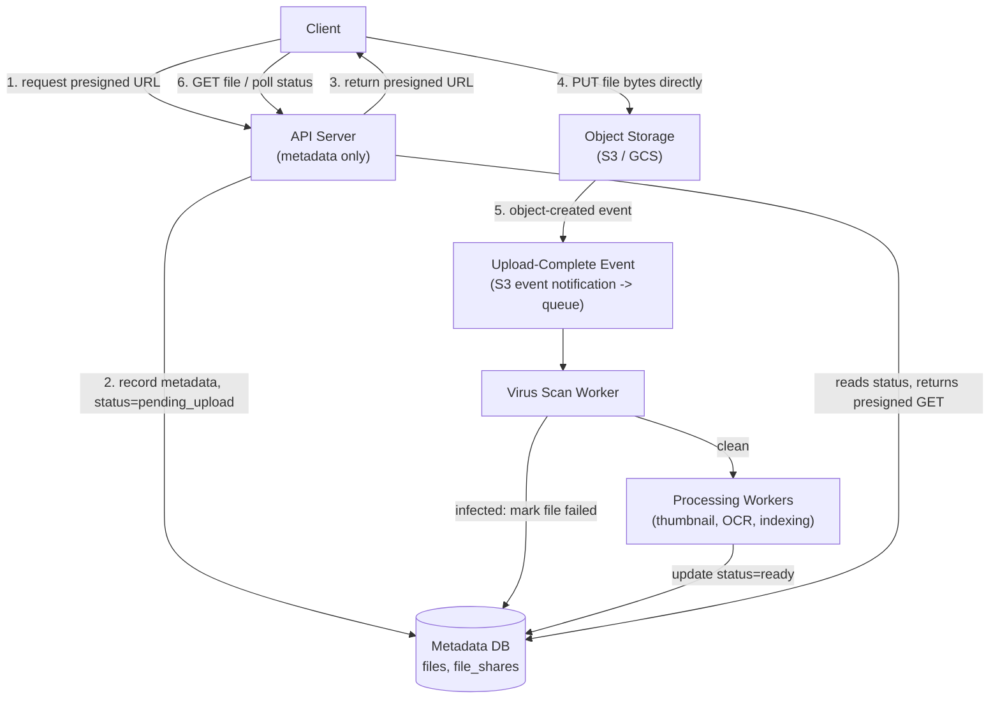

# File Storage and Upload Service Design

> **Type:** Study notes

"Design a file upload service" (think: a Dropbox/Google-Drive-lite, or the upload layer behind any
product that accepts user files) tests whether a candidate knows to get large binary data *off*
their own API servers as early as possible, and how to keep metadata and blob storage cleanly
separated. See [File Upload & Async Processing](../../05_backend_engineering/08_file_upload_and_async_processing.md)
for the Django/DRF-level implementation patterns this design sits on top of.

## Requirements

**Functional**
- Users upload files (documents, images, video) up to some large size cap (e.g. 5 GB).
- Users can download/view their files, list files, delete files.
- Large files support **resumable/chunked upload** (a dropped connection at 90% shouldn't mean
  starting over).
- Uploaded files trigger downstream processing (virus scan, thumbnail generation, OCR — see
  [PDF OCR pipeline](pdf_ocr_processing_pipeline.md) — indexing) once the upload completes.
- Access control: a file is only downloadable by its owner (and anyone explicitly shared with).

**Non-functional**
- **API servers must not be a bottleneck or a single point of failure for upload bandwidth** — if
  every byte of every file streams through your app server, your app server's network I/O caps the
  whole system's throughput regardless of how many app servers you add, and a 5GB upload ties up an
  app server thread/worker for as long as the transfer takes.
- Durability: files must not be lost — object storage (S3-class) provides this via built-in
  replication, which is exactly why you use it instead of storing blobs on local/EBS disk.
- Uploads must be resumable across network interruption for large files.
- Newly uploaded files should be scanned/processed before being made available to other users
  (sharing), even if the owner can see it as "processing" immediately.

## Capacity Estimation

- Assume 500K daily active users, 20% upload at least one file/day, avg file size 8 MB (mixed
  documents/images, some large video outliers) → 100K uploads/day × 8 MB ≈ **800 GB/day** ingested,
  ≈ 290 TB/year — this is squarely why you use object storage (S3/GCS) rather than attempting to
  run your own replicated block storage; nobody builds this from scratch at this scale.
- Upload throughput: 100K/day ≈ 1.15/sec average, but uploads cluster around usage hours — plan for
  10x peak ≈ 12/sec concurrent large-file uploads, each potentially open for minutes (chunked), so
  the relevant number isn't requests/sec but **concurrent open upload sessions**, maybe a few
  thousand at peak.
- Metadata DB: 100K rows/day × 365 × ~1KB/row (filename, owner, size, storage key, status,
  timestamps) ≈ **~36 GB/year** — trivially small compared to the blob volume, reinforcing why
  metadata and blobs belong in fundamentally different stores with different scaling
  characteristics.

## API Design

```
POST /api/v1/files/upload-init
Body: { "filename": "report.pdf", "size_bytes": 52428800, "content_type": "application/pdf" }
Response: {
  "file_id": "uuid",
  "upload_url": "https://s3.../bucket/uuid?X-Amz-Signature=...",   -- presigned PUT URL
  "expires_in": 900
}

-- for large files: multipart/chunked variant
POST /api/v1/files/upload-init  { ..., "chunked": true }
Response: { "file_id": "uuid", "upload_id": "s3-multipart-id", "chunk_size": 8388608 }
POST /api/v1/files/{file_id}/chunks/{part_number}
Response: { "presigned_chunk_url": "..." }   -- client PUTs each chunk directly to this URL
POST /api/v1/files/{file_id}/complete
Body: { "parts": [{"part_number": 1, "etag": "..."}, ...] }
Response: 200  -- server calls S3 CompleteMultipartUpload, marks file 'processing'

GET /api/v1/files/{file_id}
Response: { "status": "processing" | "ready" | "failed", "download_url": "<presigned GET>", ... }

DELETE /api/v1/files/{file_id}
```

The client **never sends file bytes to your API server** in this design — `upload-init` returns a
presigned URL, and the actual `PUT` of file bytes goes straight from the client to S3/GCS. Your
server's only job is issuing the presigned URL, recording metadata, and reacting to completion.

## Data Model

```
files
  file_id          uuid PK
  owner_id         bigint FK -> users.id
  filename         varchar
  size_bytes        bigint
  content_type     varchar
  storage_key      varchar        -- e.g. "uploads/{owner_id}/{file_id}/report.pdf" in the bucket
  status           varchar        -- 'pending_upload' | 'uploaded' | 'scanning' | 'processing' | 'ready' | 'failed' | 'infected'
  checksum_sha256  varchar nullable  -- verified post-upload for integrity
  created_at       timestamptz
  updated_at       timestamptz

file_shares                       -- access control beyond the owner
  file_id          uuid FK -> files
  shared_with_user_id bigint FK -> users.id
  permission       varchar        -- 'view' | 'edit'
  PRIMARY KEY (file_id, shared_with_user_id)
```

`storage_key` is the join between the metadata DB and the blob store — the DB never holds file
bytes, only a pointer. `status` is the field that gates whether `download_url` is even returned:
a file mid-scan or mid-processing shouldn't be downloadable/shareable yet, which is the mechanism
that enforces "scan before it's usable" without needing a separate lock/queue check on every read.

## High-Level Architecture



Steps 1-3 never touch file bytes at all — pure metadata. Step 4 is the only step where bytes move,
and they go client → S3 directly, bypassing the API server entirely. Step 5 onward is exactly the
same "queue decouples the trigger from the processing" pattern as the
[notification system](notification_system.md) and the [OCR pipeline](pdf_ocr_processing_pipeline.md)
— an S3 event notification (not a client callback, which can't be trusted or guaranteed to fire) is
what reliably kicks off server-side processing once the upload is actually durable in the bucket.

## Deep Dive

**1. Why presigned URLs instead of proxying uploads through the API server.**
If every upload streamed through your Django app, each concurrent upload holds an app server
worker/thread (and its memory/connection) for the entire transfer duration — a few thousand
concurrent 5GB uploads would exhaust worker capacity fast, and your API's request-handling capacity
for *everything else* (unrelated reads/writes) degrades in lockstep with upload traffic, which
shouldn't be coupled at all. A presigned URL (S3's `generate_presigned_url` with a PUT method, a
short expiry like 15 minutes, and a content-type/size constraint baked into the signature) lets S3
handle the actual transfer, validate the signature itself, and enforce the constraints you set —
your server's involvement is a single cheap API call to generate the URL, decoupled entirely from
transfer time or file size.

```python
import boto3

s3 = boto3.client("s3")

def generate_upload_url(bucket, key, content_type, expires_in=900):
    return s3.generate_presigned_url(
        "put_object",
        Params={"Bucket": bucket, "Key": key, "ContentType": content_type},
        ExpiresIn=expires_in,
    )
```

**2. Chunked/resumable uploads for large files.**
S3's native **multipart upload** API is the mechanism: the file is split into parts (e.g. 8-16 MB
each, S3's minimum part size is 5 MB except the last part), each part gets its own presigned URL and
is uploaded independently, and the client tracks which parts succeeded. If the connection drops
mid-transfer, only the *in-flight part* needs retrying — not the whole file — and parts can even
upload in parallel for speed. The server's role is three calls: `CreateMultipartUpload` (get an
`upload_id`), issue a presigned URL per part on request, and `CompleteMultipartUpload` once the
client reports all part ETags. If a client abandons the upload entirely, an S3 lifecycle rule
auto-aborts and cleans up incomplete multipart uploads after N days — otherwise you silently
accumulate storage cost for uploads nobody finished, a real and easy-to-miss cost leak.

**3. Metadata DB vs. blob storage — why not just store everything in one system.**
A relational DB is built for small, structured, transactional records with rich querying
(`WHERE owner_id = ? AND status = 'ready' ORDER BY created_at`) — exactly what file metadata needs.
It's a poor fit for multi-GB binary blobs: DB backups/replication become enormous and slow, and most
relational engines have hard or impractical row-size limits for that use case anyway. Object storage
(S3/GCS) is built for exactly the opposite: cheap, durable, massively scalable blob storage with a
simple key-value access pattern, but weak/no query capability over blob *content* or metadata.
Splitting them means each store does only what it's good at — the DB answers "which files does this
user have, in what state," S3 answers "give me the bytes for this key" — and it's what makes the
presigned-URL pattern possible at all, since S3 can serve/accept bytes without your API in the loop.

## Trade-offs

| Decision | Choice | Cost |
|---|---|---|
| Upload path | Direct-to-S3 via presigned URL | Client-side upload logic is more complex than a single `POST` (must handle multipart, retries) |
| Processing trigger | S3 event notification, not client callback | Slight lag between upload completion and processing start (event propagation delay, usually seconds) |
| Large file handling | S3 multipart upload | Server must track `upload_id`/part state until completion; abandoned uploads need a lifecycle cleanup rule |
| Access control | Presigned GET URLs, short expiry | Every download requires a fresh signed URL — can't use a single long-lived public link |

## What a 3-YOE candidate is expected to cover vs. what's out of scope

**Expected at this level:**
- The core insight: bytes go client → object storage directly, never through the API server.
  This is the single most important idea in the whole design — an interviewer is mainly listening
  for whether you reach for this instead of proxying uploads.
- Presigned URL mechanics (know roughly how `generate_presigned_url` works and why it has an
  expiry).
- Metadata/blob separation and why (query needs vs. storage needs are fundamentally different).
- Recognizing multipart upload as the resumability mechanism, even without perfect API detail.
- Using a queue/event (not a client-reported "I'm done") to trigger server-side processing
  reliably.

**Out of scope at this level:**
- Building actual virus-scanning infrastructure (ClamAV integration details) — naming "a scan
  worker consumes the upload-complete event before marking the file shareable" is enough.
- Cross-region replication strategy for the object store itself (S3 already handles this;
  designing a custom multi-region blob replication scheme is staff-level territory).
- Client-side chunking/retry algorithm implementation detail (exponential backoff per chunk,
  parallel chunk upload scheduling) — naming that the client manages this is sufficient.
- Deduplication of identical file content across users (content-addressable storage via checksum)
  — a reasonable stretch mention, not expected to design in depth.

## Follow-up questions an interviewer might ask

- "A client uploads directly to S3 — what stops them from uploading a 50GB file when your limit is
  5GB, or uploading with the wrong content-type?" (expects: presigned URL signatures can constrain
  `Content-Length` range and `Content-Type` as signed conditions, rejected by S3 itself if
  violated — not something your app server needs to police after the fact.)
- "The virus scan takes 30 seconds — what does the user see in that window?" (expects: `status:
  scanning` returned from `GET /files/{id}`, client polls or the same webhook/polling discussion as
  the [OCR pipeline](pdf_ocr_processing_pipeline.md).)
- "How do you handle a user deleting a file that's still mid-processing?" (expects: soft-delete or
  a status check the processing worker respects before writing `ready`, avoiding a race where a
  deleted file gets resurrected by a late-finishing worker.)
- "How would you support versioning (keep old versions when a file is re-uploaded)?" (expects:
  recognizing S3 bucket versioning as the storage-layer mechanism, plus a `file_versions` metadata
  table mirroring the `files` table's pattern.)
