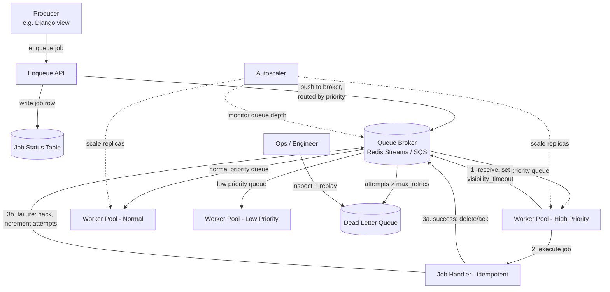

# Job Queue System Design

> **Type:** Study notes

## Requirements

This exercise designs the **queue infrastructure itself** — the broker, worker pool, and delivery
semantics — as distinct from *using* an existing system like Celery to run background tasks, which
is covered operationally in
[Background Tasks & Celery/Queues](../../05_backend_engineering/07_background_tasks_celery_queues.md).
Think of this as "you're asked to build the thing Celery's broker layer does."

**Functional**
1. Producers enqueue jobs with a payload, a priority, and optional scheduling delay ("run in 10
   minutes").
2. Workers pull jobs and execute them; a job that fails is retried with backoff.
3. A job that fails repeatedly beyond a retry limit is moved to a dead-letter queue (DLQ) for manual
   inspection instead of retrying forever.
4. Higher-priority jobs are processed before lower-priority ones when the system is under load.
5. The worker pool scales horizontally with queue depth.

**Out of scope**: workflow/DAG orchestration (job A must finish before job B starts — that's a
higher-level orchestrator built on top of this), exactly-once execution guarantees, cross-region
queue replication.

**Non-functional**
- **At-least-once delivery** — a job must never be silently lost, even if a worker crashes
  mid-execution.
- Job handlers must be idempotent — the queue *will* redeliver a job more than once under failure,
  by design (this is a requirement on the job author, not just the infra).
- Scale: assume 5M jobs/day (~58 QPS average, 500+ QPS burst — e.g. a batch of emails triggered by
  a marketing campaign).
- Job execution time varies wildly: some jobs (send email) take <1s, others (generate a large
  report) take minutes — the design must not let long jobs block short ones.

## Capacity Estimation

- 5M jobs/day ≈ 58 QPS average; provision for 10x burst (580 QPS) for batch-triggered spikes.
- Assume average job payload ~2KB, average processing time 3s -> at 58 QPS sustained, need roughly
  58 × 3 ≈ 175 concurrent worker slots just to keep up in steady state; scale workers up during
  bursts.
- Queue depth as the primary autoscaling signal: if depth grows faster than drain rate, add workers;
  if a queue sits empty, scale down.
- Retention: completed jobs can be deleted/archived after a short window (hours-days) — the queue is
  transient by design, unlike the payment ledger's permanent audit trail.

## API Design

```
POST /internal/v1/jobs
  Body: { "queue": "emails", "priority": "high|normal|low",
          "payload": {...}, "run_after": "2026-08-24T12:00:00Z" (optional),
          "max_retries": 5, "idempotency_key": "job-specific-key" }
  -> 201 { "job_id": "job_abc", "status": "queued" }

GET  /internal/v1/jobs/{job_id}
  -> { "job_id", "status": "queued|processing|succeeded|failed|dead_lettered",
       "attempts": 2, "last_error": "..." }

POST /internal/v1/dlq/{job_id}/replay      # ops action: retry a dead-lettered job manually
  -> 200 { "job_id": "job_abc", "status": "queued" }
```

Worker-facing contract is not HTTP — workers long-poll or subscribe to the broker directly
(SQS-style `ReceiveMessage`/`DeleteMessage`, or Redis `BRPOPLPUSH`-style reliable pop).

## Data Model

```
Job(
  id, queue_name, priority ENUM(high, normal, low), payload JSONB,
  status ENUM(queued, in_flight, succeeded, failed, dead_lettered),
  attempts INT, max_retries INT, idempotency_key,
  run_after TIMESTAMP, visibility_timeout_expires_at TIMESTAMP NULLABLE,
  created_at, last_attempted_at, last_error TEXT
)
-- UNIQUE(queue_name, idempotency_key) where provided, to dedupe producer-side double-enqueues

DeadLetterJob(id, original_job_id, queue_name, payload, failure_history JSONB, moved_at)

QueuePartition (conceptual, not a table): each priority tier is effectively a separate
sub-queue/topic that workers poll in priority order (see Deep Dive).
```

Backing store: a durable queue broker (Redis Streams / SQS / RabbitMQ) for the hot enqueue-dequeue
path, with a relational table (as above) as the system-of-record for job status/observability —
mirroring how SQS pairs with a status table in real designs, since the broker itself is often not
great at answering "show me all failed jobs from the last hour."

## High-Level Architecture



## Deep Dive

**1. Visibility timeout is what makes at-least-once delivery work without losing jobs.** When a
worker pulls a job, the broker doesn't delete it immediately — it becomes invisible to other
workers for a configured window (the visibility timeout, e.g. 60s), but stays in the queue. If the
worker finishes and explicitly acks (deletes) the job before the timeout expires, it's done. If the
worker crashes, hangs, or never acks, the job becomes visible again after the timeout and another
worker picks it up. This is *why* handlers must be idempotent: a job can legitimately be delivered
twice — once to a worker that crashed right after completing the real-world side effect (e.g. it
sent the email, then crashed before acking) and once to the worker that picks it up on redelivery.
The queue cannot distinguish "crashed before doing the work" from "crashed after doing the work but
before acking" — so it must assume the pessimistic case and redeliver. Setting the visibility
timeout correctly is itself a design decision: too short and a slow-but-healthy job gets falsely
redelivered (double execution); too long and a genuinely crashed job sits invisible, undelivered,
for a long time before recovery.

**2. Priority without starvation.** The naive approach — one queue, sort by priority — doesn't scale
well under a single broker's semantics (most brokers are FIFO-per-partition, not globally sortable
cheaply). The practical pattern is **separate sub-queues per priority tier**, with workers polling
high before normal before low (weighted polling, e.g. "check high 3x for every 1x check of low," to
avoid completely starving low-priority work during sustained high-priority load). This is the same
trade-off as OS process scheduling: strict priority order risks starvation of low-priority work
indefinitely; weighted/aging schemes trade a little throughput on high-priority work for fairness.
For most product use cases (e.g. "password reset email" = high, "weekly digest" = low), simple
strict ordering across a small number of tiers (2-3) is good enough — flag starvation as a known
risk rather than over-engineering a fair scheduler unprompted.

**3. Dead-letter queue: separating "will succeed on retry" from "needs a human."** Not every failure
is equal — a job failing because a downstream API returned a transient 503 should retry (with
exponential backoff to avoid hammering a struggling downstream service); a job failing because the
payload is malformed will fail identically on every retry and just wastes worker cycles until
`max_retries` is exhausted. The DLQ exists so infinite-retry loops don't silently consume worker
capacity forever and so failures become visible for a human to inspect, rather than disappearing.
Moving a job to the DLQ should preserve its full failure history (each attempt's error), since
that's the primary debugging input an engineer has when triaging DLQ contents.

## Trade-offs

| Decision | Chosen | Alternative | Why |
|---|---|---|---|
| Delivery guarantee | At-least-once, visibility timeout + idempotent handlers | Exactly-once | Exactly-once needs distributed transactions between broker and handler side-effects — far more complex for marginal gain |
| Priority handling | Separate sub-queues per tier, weighted polling | Single queue sorted by priority score | Most brokers don't support cheap global priority sort at scale; sub-queues are simpler and battle-tested |
| Job status visibility | Relational status table alongside the broker | Query the broker directly for status | Brokers are optimized for enqueue/dequeue throughput, not for "show me all failed jobs from queue X in the last hour" queries |
| Retry backoff | Exponential with jitter | Fixed retry interval | Fixed intervals across many workers cause retry storms that hit a recovering downstream service simultaneously |
| Long-running vs. short jobs | Route to separate queues/worker pools by expected duration | Single worker pool for everything | A pool of workers stuck on slow report-generation jobs starves fast email jobs behind them in the same pool |

## What a 3-YOE candidate is expected to cover vs. out of scope

**Expected at this level:**
- Explain visibility timeout / lease-based delivery and why it necessitates idempotent handlers —
  this is the single most important mechanism in the whole design.
- Propose a DLQ and explain why repeated failures shouldn't retry forever.
- Basic priority handling via separate queues, and awareness that strict priority can starve
  low-priority work.
- Connect worker pool scaling to queue depth as the driving metric.
- Distinguish transient failures (retry) from permanent/poison-pill failures (DLQ faster or
  immediately).

**Out of scope / senior-level territory:**
- Building a custom broker's storage engine (log-structured storage, replication protocol) from
  scratch — assume you're using or wrapping an existing broker (SQS/Redis Streams/RabbitMQ).
- Exactly-once semantics via distributed transactions or transactional outbox patterns across
  multiple systems.
- Global fair-scheduling algorithms (weighted fair queuing math) beyond "poll high before low."
- Cross-region queue replication and failover.
- DAG/workflow orchestration on top of the queue (that's a separate system — e.g. Airflow/Temporal
  — layered above this one).

## Follow-up questions an interviewer might ask

1. "A job handler is not idempotent — it charges a customer's card. How does that change your
   design, or does it become the handler author's problem entirely?"
2. "How do you pick the visibility timeout value for a job whose execution time varies from 1s to
   5 minutes?"
3. "How would you implement the `run_after` (delayed job) feature efficiently without polling the
   full table every second?"
4. "Queue depth for the 'low priority' queue is growing unbounded while 'high priority' stays empty.
   What's happening and how do you fix it?"
5. "How do you prevent a producer from accidentally enqueueing the same job twice (e.g. a double
   form submission)?"
