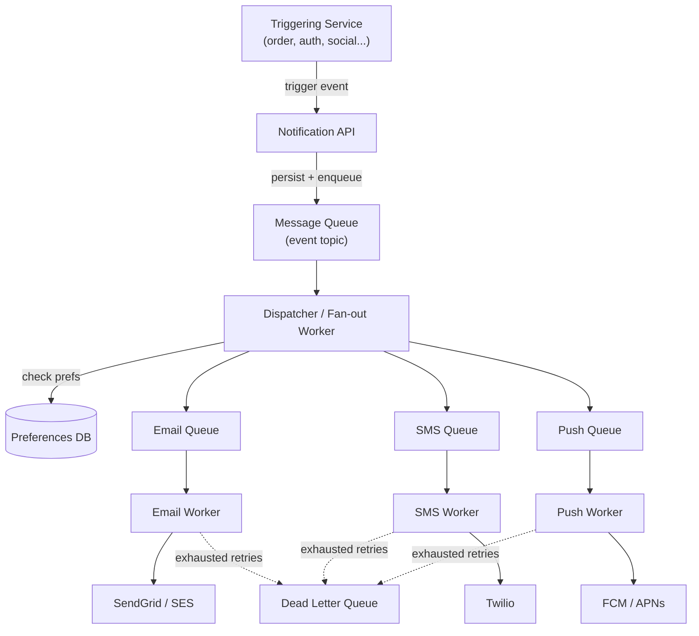

# Notification System Design

> **Type:** Study notes

"Design a notification system" tests fan-out under load, decoupling via queues, and handling
unreliable third parties (email/SMS/push providers) — a good proxy for how a candidate thinks about
any system that has to reliably talk to flaky external services at scale. See
[Background Tasks & Queues](../../05_backend_engineering/07_background_tasks_celery_queues.md) and
[Webhooks](../../05_backend_engineering/10_webhooks.md) for the underlying primitives this design
composes.

## Requirements

**Functional**
- Any internal service can trigger a notification ("order shipped", "password reset", "friend
  request") to be delivered via one or more channels: email, SMS, push (mobile), and optionally
  in-app.
- Users manage per-channel, per-notification-type preferences (e.g. "email me for security alerts,
  never SMS me for marketing").
- A notification triggered once must be **delivered at most once per channel per user** — no
  duplicate emails/pushes for the same event.
- Failed deliveries retry with backoff; permanently-failed ones are visible for debugging.

**Non-functional**
- **Decoupled from the triggering service** — the order service shouldn't block on (or fail because
  of) a slow email provider; it fires an event and moves on.
- **At-least-once delivery** to the notification system itself (better to risk a duplicate trigger
  than silently drop an event), combined with **idempotent processing** downstream so duplicates
  don't become duplicate sends to the user (see [Idempotency & Retries](../../05_backend_engineering/09_idempotency_and_retries.md)).
- Scales independently per channel — a push-notification spike (e.g. a breaking-news alert to
  millions of users) shouldn't back up email delivery.
- Provider failure (SendGrid/Twilio/FCM down or rate-limiting you) degrades gracefully, not silently
  drops notifications.

## Capacity Estimation

- Assume 5M daily active users, each generating on average 3 notification-worthy events/day (order
  updates, social activity, security alerts) → **15M notification events/day** ≈ 175/sec average,
  bursty around peak hours (e.g. a marketing campaign or incident alert can spike to 10-50x for a
  short window — this is the number that actually drives capacity planning, not the average).
- Fan-out multiplies this: one event can produce up to 3 channel deliveries (email + push + in-app)
  if the user opted into all → up to 45M delivery attempts/day.
- Per-provider throughput limits matter more than your own capacity: SMS providers (Twilio) and
  email providers (SendGrid/SES) impose their own rate limits (e.g. a few hundred to a few thousand
  req/sec depending on plan) — your queue must be able to **absorb bursts and drain at the
  provider's sustainable rate**, not the rate events arrive.
- Storage: notification history for user-facing "notification center" — 15M/day × 365 days × ~500
  bytes/row ≈ **~2.7 TB/year**, easily partitioned by date and archived/cold-storaged after a
  retention window (e.g. 90 days hot, older archived).

## API Design

Internal, service-to-service (not typically public-facing):

```
POST /internal/notifications
Body: {
  "event_id": "uuid",              -- caller-generated, used for dedup (idempotency key)
  "user_id": "123",
  "type": "order_shipped",
  "template_data": { "order_id": "999", "carrier": "UPS" },
  "channels": ["email", "push"]    -- optional hint; preference service can override
}
Response: 202 Accepted { "notification_id": "..." }   -- accepted for async processing, not "sent"

GET /internal/notifications/{notification_id}/status
Response: { "status": "delivered" | "pending" | "failed", "channel_results": [...] }

GET/PUT /api/v1/users/{id}/notification-preferences
Body: { "order_updates": {"email": true, "sms": false, "push": true}, "marketing": {...} }
```

`202 Accepted` on trigger is deliberate — this API's whole point is not making the caller wait for
actual delivery.

## Data Model

```
notification_events                    -- the trigger, one row per POST
  event_id        uuid PK              -- caller-supplied, unique constraint enforces dedup at ingest
  user_id         bigint
  type            varchar
  template_data   jsonb
  created_at      timestamptz

notification_deliveries                -- one row per (event, channel) — this is what fans out
  id              bigint PK
  event_id        uuid FK -> notification_events
  channel         varchar              -- 'email' | 'sms' | 'push'
  status          varchar              -- 'queued' | 'sent' | 'delivered' | 'failed' | 'skipped_by_preference'
  attempts        int default 0
  last_attempt_at timestamptz
  provider_message_id varchar nullable -- for tracing/webhook correlation with provider

user_notification_preferences
  user_id         bigint
  notification_type varchar
  channel         varchar
  enabled         boolean
  PRIMARY KEY (user_id, notification_type, channel)
```

Splitting `notification_events` (the trigger, one row) from `notification_deliveries` (one row per
channel fan-out) is the key modeling decision — it's what makes per-channel retry, per-channel
status, and the dedup story all fall out cleanly instead of needing awkward multi-column status
tracking on a single row.

## High-Level Architecture



The **dispatcher is the fan-out point**: one event comes in, it checks user preferences, and pushes
0-3 channel-specific messages onto per-channel queues. Per-channel queues (not one shared queue)
are what let email backlogs and push backlogs scale and drain independently — a push spike doesn't
starve email workers of processing capacity, since they're pulling from entirely separate queues.

## Deep Dive

**1. Deduplication — avoiding double-sends.**
Two layers, because failures can happen at two different points:
- **Ingest-level dedup**: `event_id` is caller-generated and unique-constrained on
  `notification_events`. If the triggering service retries its `POST` (e.g. because the first
  response timed out even though it actually succeeded), the duplicate insert fails on the unique
  constraint and is treated as a no-op — the caller's retry is now safe (idempotent).
- **Delivery-level dedup**: a worker can crash *after* calling the email provider but *before*
  marking the delivery row `sent` — on retry/redelivery from the queue, it would call the provider
  again. Fix: check `notification_deliveries.status` before sending (skip if already `sent` or
  `delivered`), and prefer providers that support an idempotency key on their own API (SendGrid/
  Twilio both do) so even a genuine double-call from your side doesn't produce a genuine double-send
  on theirs. This is the same idempotent-consumer pattern as any queue worker — see
  [Idempotency & Retries](../../05_backend_engineering/09_idempotency_and_retries.md).

**2. Handling third-party provider failures — retry, backoff, and circuit breaking.**
- Transient failures (provider 5xx, timeout, temporary rate-limit 429): retry with **exponential
  backoff + jitter** (jitter prevents synchronized retry storms across many workers hitting the
  provider at the same moment), capped at a small number of attempts (e.g. 5) before moving to a
  **dead-letter queue** for manual/automated follow-up rather than retrying forever.
- Permanent failures (invalid email address, unregistered device token, user unsubscribed at the
  provider): don't retry at all — mark the delivery `failed` immediately and surface it, since
  retrying a permanently-bad address just wastes provider quota and can hurt your sender reputation
  (repeated bounces to SendGrid/SES actively damage deliverability for *all* your email, a concrete
  production consequence worth naming).
- **Circuit breaker per provider**: if a provider is returning errors above some threshold (say
  >50% failure rate over a rolling window), stop calling it for a cooldown period instead of
  continuing to hammer a service that's clearly down — this protects your own worker throughput
  (workers aren't stuck waiting on timeouts) as much as it protects the provider.
- Multi-provider failover for critical channels (e.g. security alerts) is a reasonable stretch
  mention: if SendGrid is circuit-broken, route to a backup provider (SES) rather than queuing
  indefinitely — worth naming, not expected to design in full.

**3. Queue-based decoupling — why not call providers synchronously from the trigger?**
If the order service called SendGrid directly and synchronously when an order ships, an email
provider outage or slowdown would make *order placement itself* slow or fail — an unrelated
system's reliability now gates a completely different critical path. The queue is what breaks that
coupling: the triggering service's only obligation is "successfully enqueue the event," which is
fast and nearly always available (queue systems are built for high write availability), and
everything provider-related happens asynchronously, downstream, isolated from the trigger. This is
the single most important architectural idea in the whole design — an interviewer pushing on "why
a queue" wants exactly this answer.

## Trade-offs

| Decision | Choice | Cost |
|---|---|---|
| Delivery guarantee | At-least-once + idempotent workers | More complex worker logic (must check-before-send) vs. simpler at-most-once that can silently drop |
| Queue topology | Per-channel queues | More infrastructure to manage than one shared queue |
| Retry policy | Exponential backoff + DLQ, capped attempts | Permanently-failing notifications need a human/automated follow-up process on the DLQ, not "fire and forget" |
| Preference check | At dispatch time (not at API layer) | Preferences must be read on the hot fan-out path; caching them avoids a DB hit per event |

## What a 3-YOE candidate is expected to cover vs. what's out of scope

**Expected at this level:**
- Recognizing the queue as the decoupling mechanism and explaining why (the order-service-blocked-
  on-SendGrid failure mode is the concrete story to tell).
- Splitting event vs. per-channel-delivery in the data model.
- Idempotency key / unique constraint as the dedup mechanism at ingest, and "check status before
  sending" at the worker level.
- Retry with backoff, distinguishing transient vs. permanent failures, and knowing what a DLQ is for.
- Basic preference-checking flow (user opted out of a channel → skip, don't error).

**Out of scope at this level:**
- Designing a full multi-provider failover/routing layer with real-time provider health scoring.
- Exactly-once delivery semantics (this is a well-known distributed-systems near-impossibility;
  the expected answer is "at-least-once + idempotent consumer," not attempting true exactly-once).
- Building a templating/localization engine for notification content — naming that templates are
  rendered with `template_data` is enough, the rendering pipeline itself isn't the point of this
  exercise.
- Fine-grained per-provider rate-limit coordination across many worker instances (would need its
  own [distributed rate limiter](rate_limiter.md) in front of each provider at very high scale —
  worth name-dropping, not designing here).

## Follow-up questions an interviewer might ask

- "A user unsubscribes from marketing emails but you still send one — walk me through where in the
  system that bug could be." (expects: stale preference cache not invalidated on update, or a race
  between the preference write and an in-flight dispatch reading old data.)
- "How do you avoid sending the *same* password-reset email twice if the user double-clicks
  'resend' quickly?" (expects: client-generated idempotency key per logical action, or a short
  server-side debounce window keyed on user+type.)
- "SendGrid is completely down for an hour — what does the user experience, and how do you catch up
  afterward?" (expects: emails queue up in the DLQ/retry queue rather than being lost, circuit
  breaker stops wasting calls during the outage, and a backlog-drain concern once it recovers —
  worth mentioning rate-limiting the recovery drain so you don't slam the provider the instant it's
  back.)
- "How would you add a new channel (e.g. WhatsApp) without redesigning the system?" (expects:
  recognizing the per-channel-queue + worker pattern is already extensible — add a queue, a worker,
  a provider adapter, no changes to the dispatcher's core logic.)
