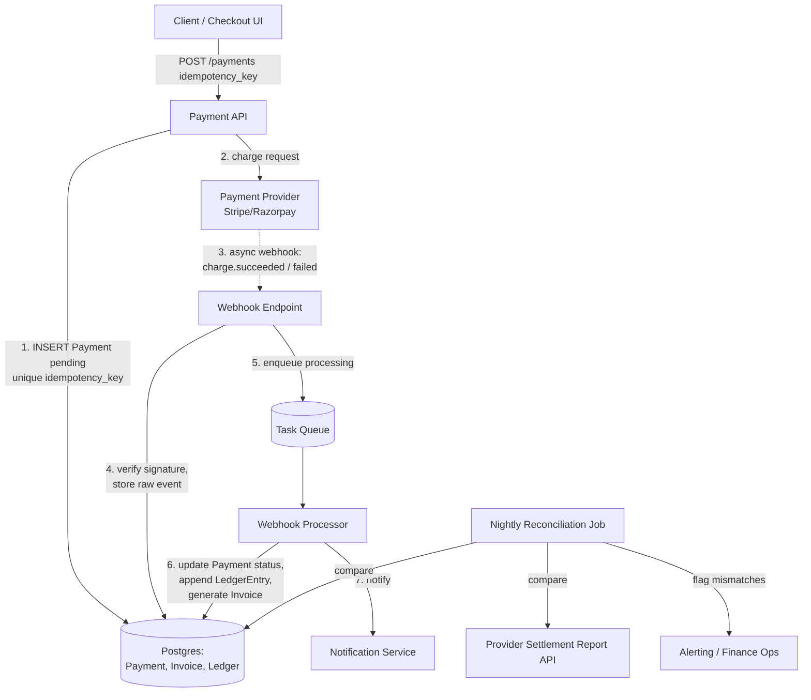

# Payment & Invoice System Design

> **Type:** Study notes

## Requirements

**Functional**
1. A client (web/mobile checkout) initiates a payment for an order against an external payment
   provider (Stripe/Razorpay-style gateway).
2. The system generates an invoice once a payment succeeds, and lets the customer/admin fetch it.
3. The provider notifies us asynchronously (webhook) when a payment settles, fails, or is disputed.
4. Refunds can be issued against a completed payment.
5. Finance can reconcile our records against the provider's records (did every charge we think
   succeeded actually settle, and vice versa?).

**Out of scope for this exercise**: tax calculation, multi-currency FX, subscription/recurring
billing logic (different state machine), PCI-scope card storage (we never touch raw card data —
that's the provider's SDK/hosted form).

**Non-functional**
- **Correctness over latency.** A slow but correct charge beats a fast double-charge. This is the
  single NFR that should dominate every design decision below.
- No duplicate charges even under client retries, network timeouts, or provider webhook redelivery.
- Every money-affecting event is auditable after the fact — who/what changed a balance, when, why.
- Payment writes must survive a crash between "we told the provider to charge" and "we recorded the
  result" — no lost updates.
- Scale: assume 500K orders/day (~6 payments/sec average, 10x burst at sale peaks) — this is a
  correctness-heavy, not throughput-heavy, system.

## Capacity Estimation

- 500K payments/day ≈ 6 QPS average, ~60 QPS at peak (10x burst headroom for flash sales).
- Each payment record + ~3-5 audit-log rows (created → provider-pending → settled) + 1 invoice row.
  At 500K/day that's ~2-3M audit rows/day — trivial for Postgres with monthly partitioning.
- Webhook volume ≈ payment volume × 1.2 (some events like `charge.succeeded` +
  `charge.dispute.created` arrive for the same payment) ≈ 600K/day, negligible load.
- Retention: audit/ledger rows kept indefinitely (financial/compliance requirement, not a cache);
  archive to cold storage after 2-3 years but never delete.

## API Design

```
POST /api/v1/payments/
  Body: { "order_id": "ord_123", "amount": "499.00", "currency": "INR",
          "idempotency_key": "client-generated-uuid" }
  Header: Idempotency-Key: client-generated-uuid   # belt-and-suspenders, see Deep Dive
  -> 201 { "payment_id": "pay_abc", "status": "pending", "provider_redirect_url": "..." }
  -> 200 (same body) if idempotency_key was already seen -> returns the ORIGINAL result, not a new charge

GET  /api/v1/payments/{payment_id}/
  -> { "payment_id", "status": "pending|succeeded|failed|refunded", "invoice_id", ... }

POST /api/v1/payments/{payment_id}/refund/
  Body: { "amount": "499.00", "reason": "customer_request", "idempotency_key": "..." }

GET  /api/v1/invoices/{invoice_id}/
  -> { "invoice_id", "payment_id", "line_items": [...], "pdf_url" }

POST /webhooks/payment-provider/          # provider -> us, not client-facing
  Header: X-Provider-Signature: <hmac>
  Body: provider's event payload
  -> 200 immediately after durably enqueuing; provider retries on non-2xx
```

## Data Model

```
Order(id, customer_id, amount, currency, status, created_at)

Payment(
  id, order_id FK, idempotency_key UNIQUE, provider, provider_payment_id NULLABLE,
  amount, currency, status ENUM(pending, processing, succeeded, failed, refunded),
  created_at, updated_at
)
-- idempotency_key has a UNIQUE constraint: the DB itself is the last line of defense
-- against a double-insert race, not just application logic.

Invoice(
  id, payment_id FK UNIQUE, invoice_number, line_items JSONB,
  total, status ENUM(draft, issued, void), pdf_url, issued_at
)

LedgerEntry(                       -- append-only, NEVER updated or deleted
  id, payment_id FK, entry_type ENUM(charge, refund, chargeback, adjustment),
  amount, currency, balance_after, created_at, source ENUM(api, webhook, manual_reconciliation)
)

WebhookEvent(                      -- raw inbox, append-only
  id, provider_event_id UNIQUE, event_type, payload JSONB,
  received_at, processed_at NULLABLE, processing_status ENUM(pending, processed, failed)
)
```

The `Payment` row is the mutable "current state" projection; `LedgerEntry` is the immutable
source-of-truth history. This split is deliberate — see Deep Dive.

## High-Level Architecture



## Deep Dive

**1. Idempotency keys prevent double-charging.** The failure mode: a client submits a payment,
the request reaches our server and the provider successfully charges the card, but the response
times out before reaching the client. The client's retry logic fires a second identical request.
Without protection, this creates a second real charge. The fix: the client generates a UUID once
per checkout attempt and sends it as `idempotency_key`. The server has a UNIQUE constraint on that
column — the second INSERT fails at the DB level with a constraint violation, which the API layer
catches and turns into "return the original payment's current state" instead of creating a new one.
Critically, the key must be generated once client-side (e.g., when the checkout page loads) and
reused across retries of the *same* logical attempt — a fresh UUID per retry defeats the purpose.
Full pattern detail: [Idempotency and Retries](../../05_backend_engineering/09_idempotency_and_retries.md).

**2. Webhooks are the source of truth, not the synchronous API response.** A payment provider
processes a charge asynchronously on their side — 3DS challenges, bank auth delays, fraud checks
can take seconds to minutes. Our synchronous `POST /payments` response can only ever say "pending,
we've submitted it." The webhook (`charge.succeeded`, `charge.failed`, `charge.dispute.created`) is
the only durable signal of final state. This means: (a) never mark an order as paid/fulfilled off
the synchronous response, (b) webhook handlers must verify the provider's signature (HMAC) to avoid
forged "your payment succeeded" callbacks, (c) webhooks can arrive out of order or be redelivered —
store `provider_event_id` with a UNIQUE constraint and treat processing as idempotent, (d) return
`200` fast (just persist the raw event) and process asynchronously via a queue, because providers
retry aggressively on non-2xx and a slow synchronous handler risks duplicate delivery under
provider-side timeout. Detail: [Webhooks](../../05_backend_engineering/10_webhooks.md).

**3. The ledger is append-only by design, never mutated.** `Payment.status` is a convenience
projection — fine to UPDATE for fast lookups ("is this order paid?"). But `LedgerEntry` rows are
never updated or deleted, only inserted. Why: if a bug corrupts `Payment.status`, you can always
recompute the true state by replaying `LedgerEntry` rows in order — you cannot recover from an
UPDATE that overwrote the only record of what happened. This is standard practice at any company
handling money (audit, tax, dispute resolution, "why does this customer's balance say $40" all
require a full history, not just current state). A refund is a *new* `LedgerEntry` with
`entry_type=refund`, not an edit to the original charge entry.

## Trade-offs

| Decision | Chosen | Alternative | Why |
|---|---|---|---|
| Idempotency key storage | UNIQUE DB constraint | App-level cache (Redis) check-then-insert | DB constraint is race-proof under concurrent requests; a cache check has a TOCTOU gap |
| Webhook processing | Store raw event, process async via queue | Process inline in the webhook handler | Keeps webhook response fast (<1s) so provider doesn't retry-storm us; decouples our processing bugs from provider delivery |
| State model | Mutable `Payment.status` + immutable `LedgerEntry` | Pure event-sourced (no mutable projection) | Full event sourcing is more "correct" but adds real complexity (replay logic, snapshotting) that isn't justified until much higher scale |
| Reconciliation | Nightly batch diff against provider's settlement report | Real-time comparison | Provider settlement reports themselves are often batch/T+1; real-time reconciliation has nothing authoritative to compare against |

## What a 3-YOE candidate is expected to cover vs. out of scope

**Expected at this level:**
- Recognize the double-charge failure mode unprompted and propose idempotency keys as the fix.
- Know that payment confirmation must come from a webhook, not trusted from the synchronous API
  response, and explain why (async settlement, 3DS, bank delays).
- Design a data model that separates "current status" from "immutable history," even if they don't
  use the term "event sourcing."
- Explain webhook signature verification at a conceptual level (HMAC of payload + shared secret).
- Basic reconciliation concept: periodically diff our records against the provider's.

**Out of scope / senior-level territory:**
- Full event-sourcing with CQRS and projection rebuilding from an event log.
- Distributed transaction protocols (2PC/saga) across multiple payment providers or ledgers.
- Exact-once delivery guarantees at the infrastructure level (Kafka exactly-once semantics) — "at
  least once + idempotent consumer" is the expected answer, not exactly-once messaging.
- PCI-DSS compliance architecture details (tokenization vaults, HSM key management).
- Multi-currency ledger design with FX rate locking at transaction time.

## Follow-up questions an interviewer might ask

1. "The webhook arrives twice for the same event, three days apart. Walk me through what happens."
2. "How do you handle a payment that's been 'pending' for 20 minutes — no webhook has arrived yet?"
   (Answer should mention a reconciliation/polling fallback against the provider's API.)
3. "A customer disputes a charge (chargeback) two months later. How does that flow through your data
   model?"
4. "How would you test idempotency without actually calling the real payment provider twice?"
5. "What happens if the DB write in step 6 (webhook processor) succeeds but the notification in step
   7 fails? Does the customer ever find out their payment succeeded?"
