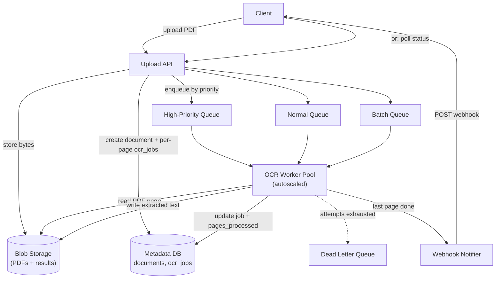

# PDF OCR Processing Pipeline Design

> **Type:** Study notes

This one maps directly onto real production experience (OCR/PDF processing background) — if it
comes up in an interview, it's the exercise to be most concrete and specific in, drawing on actual
operational details (variable processing time, cost, worker scaling) rather than textbook system
design. Treat this as "explain the system you've actually run," not a hypothetical.

## Requirements

**Functional**
- User (or another internal service) uploads a PDF; the system extracts text via OCR and returns
  structured results (text per page, bounding boxes if needed, confidence scores).
- Client can check job status and retrieve results once ready — both **polling** and
  **webhook-on-complete** should be supported (different client needs; see Deep Dive).
- Failed OCR jobs are retried automatically; permanently-failed jobs are visible for
  investigation, not silently dropped.
- Support both single-document (interactive, "process my file") and **batch** (nightly bulk
  reprocessing of thousands of documents) workloads through the same pipeline.

**Non-functional**
- **Processing time varies wildly per document**: a clean single-page scanned form might OCR in
  ~1 second; a 200-page low-quality scanned book can take 1-2+ minutes. The system must not assume
  uniform latency anywhere in the design — a fixed timeout or a synchronous request/response model
  breaks immediately at this variance.
- **Horizontally scalable OCR worker pool** — OCR is CPU/GPU-intensive (Tesseract is CPU-bound;
  modern deep-learning OCR models want GPU), so throughput scales by adding workers, not by making
  one worker faster.
- **Cost-aware**: OCR compute is typically the single most expensive step in a document pipeline
  (far more than storage or the queue) — the design should actively manage this (batching,
  prioritization, right-sizing worker instances), not just throw hardware at it.
- Reliability: a crashed worker mid-job must not silently lose the job — it needs to be picked up
  again, not stuck forever in "processing."

## Capacity Estimation

- Assume 200K PDF pages/day across all documents (mix of single-page forms and large multi-page
  scans), average OCR time **~2 seconds/page** on a standard CPU worker (rough Tesseract-class
  figure; GPU-accelerated deep learning OCR is faster per page but costs more per worker-hour —
  the trade-off is throughput per dollar, not raw speed).
- 200K pages × 2 sec ≈ 400,000 worker-seconds/day ≈ **~4.6 continuously-busy workers** to clear the
  average load; provision for **peak concurrency**, not average — if uploads cluster in business
  hours (say 70% of volume in an 8-hour window), peak worker need is closer to 15-20 concurrent
  workers to keep queue wait time bounded.
- Queue depth as the real signal: rather than sizing workers off a fixed page-count estimate,
  **autoscale on queue depth** (e.g. scale out when jobs-waiting > worker_count × 2, discussed more
  in the Deep Dive) — this is what actually keeps the system responsive under real, bursty traffic
  instead of a static worker count.
- Storage: original PDF (avg 2MB) + extracted text/JSON result (avg 50KB) per document, 200K
  pages/day but fewer *documents* (say 20K documents/day averaging 10 pages) × ~2.5MB total ≈
  **~50GB/day** ≈ 18TB/year of blob storage — genuinely small next to the compute cost, which is
  the point worth making explicit when asked "where's the cost in this system" (compute, not
  storage).

## API Design

```
POST /api/v1/documents
Body: multipart form (file) or { "storage_key": "..." } if uploaded via presigned URL first
      (see file_storage_and_upload_service.md — same direct-to-storage pattern applies here for large PDFs)
Body (optional): { "webhook_url": "https://client.example.com/ocr-callback", "priority": "normal" }
Response: 202 Accepted { "document_id": "uuid", "status": "queued" }

GET /api/v1/documents/{document_id}
Response: {
  "status": "queued" | "processing" | "completed" | "failed",
  "pages_total": 42,
  "pages_processed": 17,     -- lets the client show real progress, not a spinner
  "result_url": "<presigned GET, once completed>",
  "error": null
}

-- webhook, fired by the system when a job finishes (success or terminal failure)
POST {client's webhook_url}
Body: { "document_id": "uuid", "status": "completed", "result_url": "..." }
      (client returns 200 to ack; system retries the webhook call itself with backoff if unacked)
```

`202 Accepted` + `pages_processed` progress field is the key detail — it directly signals "I know
this is a slow async job, and I'm giving the client a way to render meaningful progress instead of
an indefinite spinner."

## Data Model

```
documents
  document_id      uuid PK
  owner_id         bigint
  storage_key      varchar          -- original PDF location in blob storage
  status           varchar          -- 'queued' | 'processing' | 'completed' | 'failed'
  pages_total       int nullable    -- known after a fast page-count pre-check
  pages_processed  int default 0
  priority         varchar default 'normal'   -- 'high' | 'normal' | 'batch'
  webhook_url      varchar nullable
  created_at       timestamptz
  completed_at     timestamptz nullable

ocr_jobs                            -- one row per page (or per chunk of pages) — the actual work unit
  job_id           uuid PK
  document_id      uuid FK -> documents
  page_number      int
  status           varchar          -- 'pending' | 'in_progress' | 'succeeded' | 'failed' | 'dead_lettered'
  attempts         int default 0
  worker_id        varchar nullable
  result_key       varchar nullable -- blob storage location of this page's extracted text/JSON
  last_error       text nullable
  updated_at       timestamptz
```

Splitting `documents` (client-facing job) from `ocr_jobs` (per-page work unit) is the load-bearing
modeling decision: it's what lets a 200-page document be processed **in parallel across many
workers** instead of one worker owning the whole document serially, and it's what makes
`pages_processed` progress tracking possible — increment a counter as each `ocr_jobs` row completes,
which the `GET /documents/{id}` endpoint reads.

## High-Level Architecture



Three priority queues feeding one shared, autoscaled worker pool is the key structural choice —
workers pull from `HighQ` first, then `NormQ`, then `BatchQ` (or workers are weighted/split across
queues), so an interactive "process my document now" request isn't stuck behind a nightly batch
reprocessing job of 50,000 archival documents. See Deep Dive for the full reasoning.

## Deep Dive

**1. Handling wildly variable processing time (1 second to 2+ minutes).**
The core decision this forces is: **never OCR a whole document as one atomic unit of work handled
synchronously**. Two techniques compound here:
- *Per-page fan-out*: as shown in the data model, a document is split into per-page `ocr_jobs` at
  ingest. A 200-page document isn't one 2-minute task blocking one worker — it's 200 independent
  ~2-second tasks that can run on 200 different workers simultaneously (capacity permitting),
  turning "this document takes 2 minutes" into "this document takes as long as the slowest single
  page takes," a massive latency win when parallelism is available. It also means a single
  pathological page (corrupted, huge, adversarial input) can't stall the whole document — the other
  199 pages complete regardless.
- *Always async, never request-blocking*: the API returns `202` immediately with a `document_id`;
  actual OCR happens off the request path entirely. There is no code path in this design where an
  HTTP request handler waits on OCR to finish — that's what makes the 1-second vs 2-minute variance
  a non-issue for API server capacity (a slow document doesn't tie up a web worker for 2 minutes,
  unlike a naive synchronous implementation would).

**2. Progress/status polling vs. webhook-on-complete — offer both, for different clients.**
- **Polling** (`GET /documents/{id}`) is simpler for the client to implement (no public endpoint to
  expose, no signature verification), works behind client-side firewalls/NATs that can't receive
  inbound webhooks, and is a natural fit for an interactive UI that's already rendering a progress
  bar (poll every 2-3 seconds, show `pages_processed / pages_total`). Cost: wasted requests when
  polling faster than the job actually progresses, and added latency between actual completion and
  the client noticing (bounded by poll interval).
- **Webhook** is better for server-to-server integration and batch workloads — a client submitting
  10,000 documents overnight doesn't want to poll 10,000 status endpoints; it wants to be told when
  each is done. Cost: webhook delivery is itself unreliable (client endpoint down, network blip) and
  needs its own retry-with-backoff (same problem as [notification delivery](notification_system.md))
  — and it requires the client to expose a reachable endpoint, which not every consumer can do.
- **Give both**, chosen by the caller (via `webhook_url` presence in the request) — this is the
  correct answer, not a forced choice, because the two access patterns genuinely serve different
  client shapes (interactive UI vs. server-to-server batch integration). Say this explicitly if
  asked "which one would you build" — picking one over the other for *all* clients is the wrong
  answer here.

**3. Retry, dead-letter queue, and priority-aware cost management.**
- *Retry*: a failed `ocr_jobs` row (worker crashed, OCR library threw on malformed input, transient
  timeout) increments `attempts` and is re-enqueued with **exponential backoff** — a page that fails
  because of a transient issue (worker OOM, momentary resource contention) often succeeds on retry;
  hammering it immediately just repeats the same failure. After a capped number of attempts (e.g.
  3-5), the job moves to `dead_lettered` status and onto a dead-letter queue rather than retrying
  forever — this is what prevents one permanently-broken page (e.g. a genuinely corrupted PDF
  stream) from being retried in an infinite loop, silently burning worker capacity that should be
  going to healthy jobs.
- *Worker crash mid-job (not a clean failure, just gone)*: a job claimed by a worker
  (`status='in_progress'`, `worker_id` set) that never reports back needs a **visibility
  timeout/heartbeat** mechanism — if a job has been `in_progress` longer than a generous max
  processing time (e.g. 5 minutes, comfortably above the slowest expected page) without a heartbeat
  update, a reaper process resets it to `pending` for another worker to pick up. Without this, a
  worker OOM-killed mid-OCR silently strands that job forever in `in_progress`.
- *Cost via prioritization, not just scaling*: since OCR compute is the expensive line item, the
  cost lever isn't "add more workers" (that's a cost multiplier, not a cost control) — it's
  **routing work by priority/SLA and batching where latency doesn't matter**. Interactive uploads go
  to `HighQ`, get dedicated worker capacity, and are optimized for latency. Bulk reprocessing jobs
  (re-OCR the whole archive after a model upgrade) go to `BatchQ`, run on cheaper spot/preemptible
  instances during off-peak hours, and are optimized for cost-per-page, not turnaround time — the
  same underlying worker code, radically different infrastructure economics depending on which
  queue is feeding it. This queue-priority split is the single most concrete, interview-differentiating
  point in this whole file — it shows you've thought about OCR as a cost center, not just a
  compute problem.

## Trade-offs

| Decision | Choice | Cost |
|---|---|---|
| Work granularity | Per-page `ocr_jobs`, not per-document | More rows/coordination overhead, but enables parallelism and partial-failure isolation |
| Client notification | Both polling and webhook, caller's choice | Two code paths to maintain instead of one |
| Failure handling | Retry with backoff, cap, then DLQ | Permanently-failed jobs need a human/automated triage process on the DLQ |
| Worker scaling signal | Queue depth (autoscale), not fixed pool size | More complex autoscaling config than a static worker count; must tune scale-out/in thresholds to avoid thrashing |
| Cost management | Priority queues + batch on cheap capacity | Batch jobs have unpredictable, potentially long completion time — must be an acceptable trade for the workload |

## What a 3-YOE candidate is expected to cover vs. what's out of scope

**Expected at this level:**
- Recognizing this must be async end-to-end — no request handler blocks on OCR — and being able to
  justify it concretely with the "1 second vs 2 minutes" variance.
- Per-page (or per-chunk) fan-out as the mechanism for parallelizing a single large document and
  isolating single-page failures.
- Retry-with-backoff + dead-letter queue as the failure-handling pattern, and explaining *why* a
  cap + DLQ beats infinite retry.
- Polling vs. webhook trade-off, and the maturity to say "offer both" rather than forcing a single
  answer.
- At least naming that OCR compute is the dominant cost and that priority/batch separation is a
  lever for managing it — doesn't need a fully worked cost model, but should raise cost as a design
  axis unprompted, since this is a candidate with hands-on background here.

**Out of scope at this level:**
- Designing the actual autoscaling controller (exact scale-out/scale-in algorithm, cooldown tuning,
  predictive scaling based on historical load patterns) — naming "autoscale on queue depth" is
  sufficient; building the controller's control loop is platform/SRE-team territory.
- Choosing/tuning a specific OCR model or engine (Tesseract vs. a deep-learning OCR model vs. a
  hosted API like Textract) in technical depth — reasonable to name options and their rough
  cost/accuracy trade-off, not expected to justify a specific model architecture choice.
- Exact-once processing guarantees across worker crashes (the visibility-timeout/reaper approach
  described is "practically reliable," not a formally exactly-once system) — at-least-once +
  idempotent result writes (a page's result is written to a deterministic `result_key`, so a
  duplicate run overwrites rather than duplicates) is the expected level of rigor.
- Multi-region worker pool placement for latency/compliance reasons — fine to mention exists, not
  expected to design.

## Follow-up questions an interviewer might ask

- "A worker is OOM-killed mid-job with no clean error — how does the system notice and recover?"
  (expects: the visibility-timeout/heartbeat reaper mechanism from the Deep Dive — this is the
  question most likely to expose whether the candidate has actually operated a queue-based worker
  system or is only describing one in the abstract.)
- "How do you prevent a burst of 5,000 uploads at once from starving your interactive users for
  20 minutes?" (expects: the priority-queue split — high-priority interactive jobs get reserved/
  weighted worker capacity so a batch burst doesn't monopolize the whole pool.)
- "The client's webhook endpoint is down for an hour — what happens to the notification?" (expects:
  webhook delivery gets its own retry-with-backoff, same pattern as
  [notification delivery](notification_system.md); the underlying job result isn't lost — it's
  still retrievable via polling/`GET /documents/{id}` regardless of webhook delivery success, which
  is worth stating explicitly as the fallback.)
- "How would you estimate `pages_total` before OCR has even started, for the progress bar?" (expects:
  a fast, cheap PDF page-count pre-check — e.g. reading the PDF's page tree/metadata — run
  synchronously at upload time, distinct from and far cheaper than the actual OCR pass per page.)
- "You need to re-run OCR on your entire historical archive because you upgraded the OCR model —
  how do you do that without disrupting live traffic?" (expects: enqueue the reprocessing job onto
  `BatchQ` specifically, so it draws from separate/lower-priority worker capacity and doesn't
  compete with live interactive uploads on `HighQ`.)
