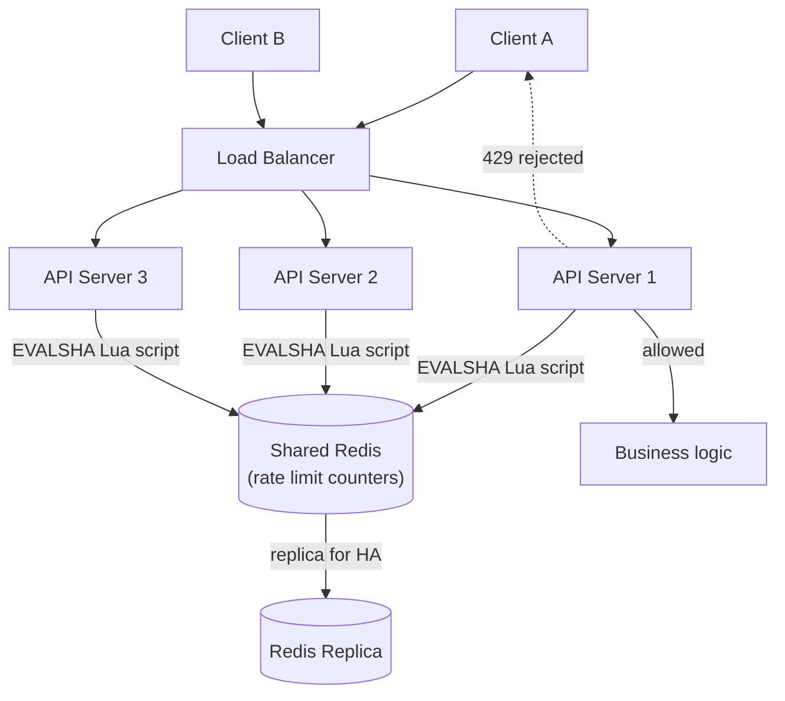

# Rate Limiter Design (Distributed System)

> **Type:** Study notes

This file is about **where a rate limiter lives in a distributed architecture** — the system-design
framing ("design a rate limiter for our API platform"). For the algorithms themselves (token
bucket, leaky bucket, fixed/sliding window) and DRF-level implementation, see
[Rate Limiting](../../05_backend_engineering/05_rate_limiting.md) — read that first if you haven't;
this file assumes you know the algorithm trade-offs and focuses purely on the distributed-systems
problem of sharing limiter state across many servers.

## Requirements

**Functional**
- Given an identity (user ID, API key, or IP) and a limit (e.g. 100 req/min), accept or reject each
  incoming request in near-real-time.
- Support different limits per client tier (free vs. paid plan) and per endpoint.
- Return a clear signal to the rejected client (`429` + `Retry-After`).

**Non-functional**
- The limiter itself must **never become the bottleneck** — it sits in front of every request, so
  its own latency budget is a few milliseconds, and it must be highly available (if the limiter is
  down, the system needs a defined fail-open or fail-closed policy, not an outage).
- **Correctness under concurrency**: many app servers checking/incrementing the same counter at the
  same instant must not allow more requests through than the configured limit (no lost updates).
- Must work across **multiple, horizontally-scaled API servers** — a limiter that only sees traffic
  hitting one server is useless once you're behind a load balancer with N servers.

## Capacity Estimation

- Assume 10,000 API requests/sec platform-wide across all app servers. Every one of those requests
  needs a rate-limit check → the limiter's read/write path must sustain **10K ops/sec minimum**,
  realistically provisioned for 3-5x burst (30-50K ops/sec).
- Each check is a tiny read-modify-write on a small key (`rate_limit:{identity}:{window}` → integer
  counter, a few bytes). This is exactly the workload an in-memory store like Redis is built for —
  a relational DB doing row-level locking at this op rate would fall over or add unacceptable
  latency to every single request.
- State size: if you're tracking, say, 5M distinct API keys/users with one counter key each ≈
  a few hundred MB in Redis — trivial, fits in memory on one modestly-sized instance (though you'd
  still cluster for availability, not for size).

## API Design

The rate limiter is usually **not** a client-facing HTTP API — it's an internal check called by
every app server before processing a request. If exposed as its own internal service (see the
standalone-vs-embedded discussion below), a minimal internal contract looks like:

```
POST /internal/rate-limit/check
Body: { "identity": "user_123", "scope": "orders_api", "limit": 100, "window_seconds": 60 }
Response: { "allowed": true, "remaining": 37, "reset_at": 1735000000 }
200 (allowed=true or false — the check itself always succeeds; whether the request is allowed is in the body)
503 (limiter itself unavailable — caller must apply its fail-open/fail-closed policy)
```

Client-facing, this surfaces as standard headers on every API response regardless of outcome:
`X-RateLimit-Limit`, `X-RateLimit-Remaining`, `X-RateLimit-Reset`, and on rejection, `429` +
`Retry-After`.

## Data Model

No persistent database — this is intentionally **all in fast, ephemeral, in-memory state**, not a
durable data model. The "schema" is a Redis key convention:

```
Key:    rl:{identity}:{scope}:{window_start}      -- fixed window
        rl:{identity}:{scope}                     -- token bucket (bucket state as a hash)
Value:  integer counter (fixed/sliding window) or {tokens: N, last_refill: ts} (token bucket)
TTL:    set to the window length (or bucket idle timeout) so stale keys self-expire — no cleanup job needed
```

Using Redis's own expiry for cleanup instead of a cron/reaper job is a small but real signal of
production experience — it means the data structure that enforces the limit also garbage-collects
itself for free.

## High-Level Architecture



The critical property this diagram is making: **all three API servers check the same shared Redis
instance**, not local in-memory counters. That's the whole point of the distributed version of this
problem — see the Deep Dive on why local counters break.

## Deep Dive

**1. Standalone rate-limiting service vs. embedded in each app server.**
- *Embedded* (a library/middleware in each app server, e.g. DRF throttle classes calling a shared
  Redis cache directly): simplest to build, lowest latency (no extra network hop), and is the right
  default for a single product/team. Downside: every service that wants rate limiting has to
  integrate the library correctly and share config/Redis connection details — policy drift across
  teams is likely.
- *Standalone service* (a dedicated rate-limiter microservice all other services call before
  processing): centralizes policy (one place limits are defined and audited), lets you change
  limiting logic without redeploying every consumer service, and is the right call **once you have
  many services/teams that all need consistent limiting behavior** (e.g. a company-wide API
  gateway). Downside: adds a network hop (latency) and a new single point of failure/scaling
  concern into the hot path of every request.
- **Answer to give**: "embedded, backed by shared Redis" for a single service or small set of
  related services; "standalone service" once you're centralizing policy across many independent
  services — and note that in practice, this logic often lives at the **API gateway** layer (Kong,
  AWS API Gateway) precisely to get the standalone-service benefits without a custom microservice,
  which is worth naming as the pragmatic real-world answer.

**2. The race condition on concurrent increments, and why naive Redis usage doesn't fix it.**
Two API servers handling two concurrent requests from the same client both do `GET counter` →
both see `99` (under the limit of 100) → both do `SET counter 100` → both requests are allowed,
even though together they should have pushed the count to 101 and the second one should have been
rejected. This is a classic **check-then-act race** — the read and the write are two separate
round-trips to Redis with a window for another process to interleave.

Fix: make the check-and-increment **atomic** as a single operation Redis executes without
interleaving.
- Simplest fix for a plain counter: `INCR` is atomic in Redis by itself — increment first, then
  compare the *returned* value to the limit (not a separate read), and if you need to set a TTL on
  first creation, use `SET key 0 NX EX <window>` then `INCR`, or wrap both in a Lua script anyway
  since two commands are still two round-trips that could interleave with TTL-setting.
- General fix (needed for anything more complex than a single `INCR`, like token bucket's
  read-refill-decrement logic): a **Lua script executed via `EVAL`/`EVALSHA`**. Redis guarantees a
  Lua script runs to completion atomically — no other client's command can interleave mid-script.
  This is the standard production answer for "how do you make token bucket check-and-decrement
  atomic across concurrent requests," and is worth being able to sketch:

```lua
-- token_bucket.lua (simplified)
local key = KEYS[1]
local capacity = tonumber(ARGV[1])
local refill_rate = tonumber(ARGV[2])   -- tokens per second
local now = tonumber(ARGV[3])

local bucket = redis.call("HMGET", key, "tokens", "last_refill")
local tokens = tonumber(bucket[1]) or capacity
local last_refill = tonumber(bucket[2]) or now

local elapsed = now - last_refill
tokens = math.min(capacity, tokens + elapsed * refill_rate)

if tokens < 1 then
    redis.call("HMSET", key, "tokens", tokens, "last_refill", now)
    return 0   -- rejected
else
    tokens = tokens - 1
    redis.call("HMSET", key, "tokens", tokens, "last_refill", now)
    redis.call("EXPIRE", key, 3600)
    return 1   -- allowed
end
```

**3. What happens when Redis itself is unavailable — fail-open or fail-closed?**
- **Fail-open** (let requests through when the limiter can't be reached): protects availability of
  the actual product, but during a Redis outage you have effectively no rate limiting — a bad time
  for that to be true if the outage coincides with an attack.
- **Fail-closed** (reject all requests when the limiter can't be reached): protects the backend from
  being overwhelmed, but a Redis blip now takes down the *entire* API, not just abusive traffic —
  the rate limiter becomes a worse single point of failure than the thing it was protecting.
- **Practical answer**: fail-open for a brief Redis outage (a few seconds, likely a failover to
  replica), fail-closed only if the outage is prolonged and rate limiting is a hard compliance/cost
  requirement (e.g. protecting a very expensive downstream, like the [OCR pipeline](pdf_ocr_processing_pipeline.md)
  from being overwhelmed) — state the trade-off and default to fail-open, since availability loss
  for all users is usually worse than a short unprotected window.

## Trade-offs

| Decision | Choice | Cost |
|---|---|---|
| Shared state store | Redis (in-memory) | Not durable — acceptable, since a lost counter just means a brief under-enforcement window, not data loss |
| Atomicity mechanism | Lua script (`EVALSHA`) | Slightly harder to unit test/debug than plain commands; script must be kept in sync across deploys |
| Placement | Embedded + shared Redis (default) vs. standalone service (multi-team) | Standalone adds a network hop to every request's hot path |
| Failure mode | Fail-open (default) | Rate limiting silently disabled during a Redis outage |

## What a 3-YOE candidate is expected to cover vs. what's out of scope

**Expected at this level:**
- Recognizing that per-server local counters break under a load balancer (the core insight the
  whole problem is testing) and that state must be centralized.
- Naming Redis as the shared store and why (in-memory, atomic ops, TTL-based self-cleanup).
- Explaining the check-then-act race condition concretely with a two-server example.
- Knowing `INCR` is atomic and that more complex logic needs a Lua script — sketching roughly what
  the script does, without necessarily getting exact Lua syntax perfect under pressure.
- Fail-open vs. fail-closed as an explicit trade-off, with a reasoned default.

**Out of scope at this level:**
- Designing Redis Cluster sharding/consistent hashing for the rate-limit keyspace itself.
- Multi-region rate limiting (keeping counters consistent across geographically distributed Redis
  clusters) — naming it as a hard, unsolved-in-general problem is enough.
- Building a full standalone rate-limiter service with its own deployment, scaling, and API
  contract — describing the trade-off (as above) is sufficient; whiteboarding its internal
  architecture in depth is not expected.

## Follow-up questions an interviewer might ask

- "Your Redis instance is a single point of failure now — how do you make it highly available?"
  (expects: Redis Sentinel or a managed cluster with automatic failover; note a failover briefly
  loses in-flight counter state, which is an acceptable trade for availability here.)
- "How would you rate-limit by multiple dimensions at once — per-user AND a global cap on the whole
  API?" (expects: two separate keys/checks per request, both must pass; connects to the per-user vs
  per-IP vs per-API-key table in [Rate Limiting](../../05_backend_engineering/05_rate_limiting.md).)
- "A single client is hammering one specific Redis key — does that create a hot-key problem?"
  (expects: yes in principle, but at rate-limiter QPS scale a single key on one Redis node handles
  it fine; contrast with genuinely sharded workloads.)
- "Why not just use a database with row-level locking instead of Redis?" (expects: latency —
  row locks under contention at 10K+ ops/sec would serialize requests and blow the latency budget;
  Redis's single-threaded atomic command execution is a much better fit for tiny, high-frequency
  read-modify-write operations.)
