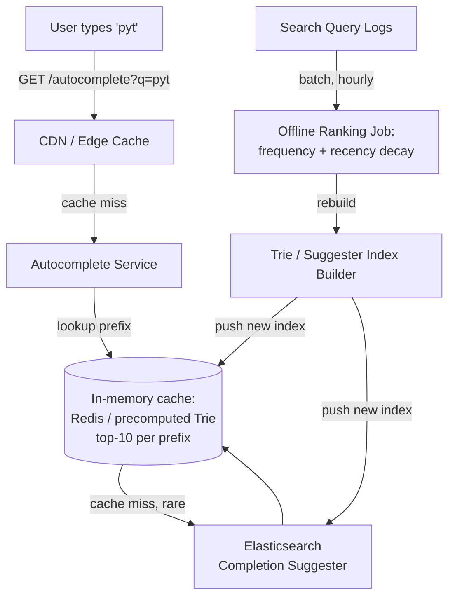

# Search Autocomplete Service Design

> **Type:** Study notes

## Requirements

**Functional**
1. As a user types into a search box, return up to 10 suggested completions after each keystroke.
2. Suggestions are ranked by relevance — popular/recent queries first, not alphabetical.
3. Support prefix matching ("pyt" -> "python", "pytorch", "python django").
4. New popular queries should surface in suggestions within a reasonable delay (minutes, not
   real-time-required).

**Out of scope**: typo tolerance/fuzzy matching (a separate, harder problem — different index
strategy), personalized-per-user suggestions, multi-language tokenization edge cases.

**Non-functional**
- **Latency is the defining constraint**: p99 < 100ms end-to-end, ideally <50ms server-side, because
  this fires on every keystroke and any lag feels broken to the user.
- Scale: assume a mid-large product — 50M searches/day, autocomplete fires ~4x per completed search
  (one call per keystroke until the user picks/finishes) -> ~200M autocomplete requests/day
  (~2,300 QPS average, ~10K QPS peak).
- High read:write ratio — suggestions are read constantly, the underlying popularity data updates
  in batches, not per-request.
- Read-heavy, latency-sensitive, eventually-consistent is fine (a suggestion list that's 10 minutes
  stale in ranking is imperceptible to the user).

## Capacity Estimation

- 200M requests/day / 86,400s ≈ 2,300 QPS average; provision for 10K QPS peak (typing bursts +
  regional peak hours).
- Vocabulary size: assume 10M unique historical queries, but only the top ~1-2M are ever worth
  serving as suggestions (long-tail queries get near-zero traffic — not worth indexing).
- Per-prefix suggestion list: top 10 completions cached, each ~50 bytes -> a fully-materialized
  cache of all prefixes up to length 6 for 1M queries is a few GB — fits comfortably in memory
  (Redis or a dedicated cache tier).
- This is a memory/latency problem, not a storage problem — the entire hot dataset fits in RAM on a
  handful of cache nodes.

## API Design

```
GET /api/v1/autocomplete?q=pyt&limit=10
  -> 200 {
       "query": "pyt",
       "suggestions": [
         {"text": "python", "score": 0.94},
         {"text": "pytorch", "score": 0.87},
         {"text": "python django", "score": 0.71}
       ]
     }
  # No auth required, aggressively cacheable (CDN/edge-cacheable per prefix), short TTL

POST /internal/v1/query-log     # fire-and-forget, called after a search completes
  Body: { "query": "python tutorial", "user_id": "...", "timestamp": "..." }
  # Feeds the offline ranking pipeline; NOT on the read hot path
```

## Data Model

Autocomplete is not modeled as relational rows on the read path — it's a **precomputed index**
served from memory. The relational/analytical side that *feeds* it:

```
QueryLog(id, query_text, user_id NULLABLE, result_clicked BOOL, searched_at)
  -- append-only, partitioned by day, feeds the offline aggregation job

QueryStats(query_text PK, total_count, count_last_7d, count_last_30d, last_searched_at)
  -- rebuilt periodically (e.g. hourly) by an aggregation job over QueryLog

TrieIndex (in-memory, not a DB table):
  each node: { char, children: {char -> node}, top_k: [(query_text, score), ...] }
  -- top_k cached AT EACH NODE so a lookup is O(prefix length), not a tree walk + sort per request
```

## High-Level Architecture



## Deep Dive

**1. Trie-based prefix matching vs. Elasticsearch completion suggester.** A trie gives O(k) lookup
for a prefix of length k, with each node precomputing its top-N children by score — this is the
fastest possible structure for pure prefix matching and is what you'd build if running your own
in-memory service. Elasticsearch's completion suggester is a purpose-built FST (finite state
transducer) structure that does the same job but comes with ES's operational machinery — sharding,
replication, and the same cluster you likely already run for full-text search
([Elasticsearch & Search Basics](../../05_backend_engineering/18_elasticsearch_and_search_basics.md)).
The trade-off in an interview: a hand-rolled trie is simpler to reason about and marginally faster,
but you now own rebuilding, distributing, and version-swapping that index yourself. In practice,
most teams reuse Elasticsearch's suggester because they already operate ES for search — reinventing
the trie is a defensible answer for a "design from scratch" prompt, but "we'd use what we already
run" is the pragmatic production answer, and saying so shows judgment.
See [Tries concept](../../02_dsa_and_coding/patterns/14_tries/concept.md) for the underlying DSA.

**2. Ranking: frequency, recency, and why a plain trie needs augmentation.** A naive trie only
tells you *which* queries share a prefix, not which to show first. Each trie node caches its
top-N children by a score computed offline: `score = w1 * log(count_30d) + w2 * recency_decay`,
where `recency_decay` down-weights queries that spiked once and went cold (avoids surfacing a dead
meme/event query forever) while `log(count)` prevents one viral query from permanently dominating
via raw count. This score is recomputed by a periodic batch job (hourly is typical), not per
request — recomputing ranking on every keystroke would blow the latency budget. The precomputed
top-N-per-node is what makes the request path O(prefix length) with zero sorting at query time.

**3. Caching hot prefixes and staleness tolerance.** Because ranking updates hourly and reads happen
thousands of times per second, the entire hot prefix set (short prefixes: 1-4 characters) should be
denormalized into a fast KV cache (Redis) keyed by prefix -> top-10 JSON, refreshed by pushing a new
version after each aggregation run. Longer, rarer prefixes fall back to a live trie/ES lookup. This
is a classic case where slightly stale data (suggestions reflect popularity as of the last hourly
job, not this second) is the correct trade for latency — nobody notices or cares that "python" was
ranked #1 ten minutes before it became #1 in the underlying stats.

## Trade-offs

| Decision | Chosen | Alternative | Why |
|---|---|---|---|
| Index structure | Precomputed trie / ES completion suggester with cached top-N per node | Naive substring search / `LIKE 'pyt%'` on a DB | O(prefix length) vs. O(n) table scan; DB can't hit <100ms at this QPS |
| Ranking freshness | Batch-recomputed hourly | Real-time score update per search | Real-time updates add write amplification for no perceptible user benefit |
| Storage location | In-memory (Redis/trie in RAM) | Query ES/DB per keystroke | Memory access is ~1000x faster than even a fast DB round-trip; this is a latency-bound problem |
| Personalization | Skipped (global ranking only) | Per-user suggestion boosting | Personalization requires per-user state on the hot path, directly fighting the <100ms budget |

## What a 3-YOE candidate is expected to cover vs. out of scope

**Expected at this level:**
- Identify that this is a latency-bound (not scale-bound) problem and reason accordingly.
- Know prefix trees (tries) conceptually and connect them to why a plain SQL `LIKE` query can't
  meet the latency bar at this QPS.
- Propose a caching layer for hot prefixes and explain why staleness is acceptable here.
- Basic frequency-based ranking, with recency as a simple decay factor.
- Mention Elasticsearch's completion suggester as the "don't reinvent it" production answer.

**Out of scope / senior-level territory:**
- Building and tuning a custom FST (finite state transducer) implementation from scratch.
- Multi-region index replication and consistency guarantees across data centers.
- Personalized ranking models (learned-rank / ML-based suggestion scoring).
- Handling right-to-left languages, complex tokenization, or CJK prefix matching nuances.
- Exact index-rebuild-without-downtime mechanics at massive vocabulary scale (billion-query
  vocabularies, incremental FST updates).

## Follow-up questions an interviewer might ask

1. "How do you prevent a single trending/viral (possibly offensive) query from dominating
   suggestions the moment it spikes?"
2. "The trie needs to be rebuilt hourly — how do you swap in the new version without dropping
   requests or serving an inconsistent half-updated tree?"
3. "How would you extend this to support typo tolerance (fuzzy prefix matching)?"
4. "What changes if this needs to support per-user personalized suggestions (e.g. recently searched
   items)?"
5. "How do you keep the CDN/edge cache from serving a suggestion for a query that was removed for
   policy reasons?"
