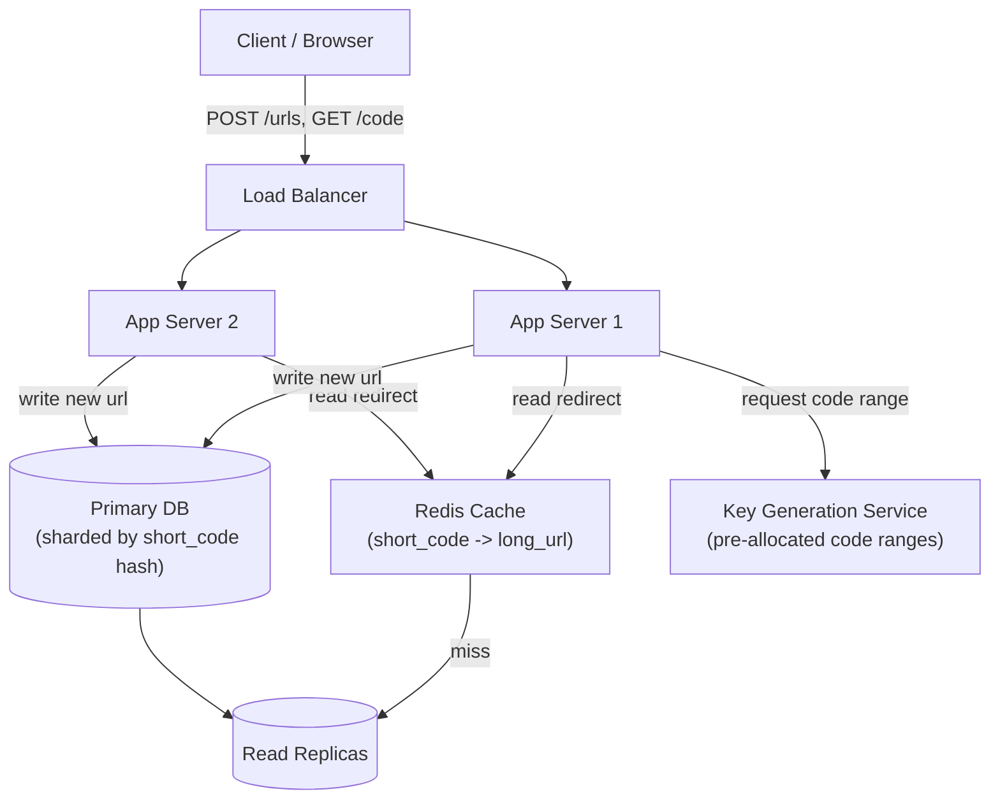

# URL Shortener Design

> **Type:** Study notes

This is the canonical first system-design problem — interviewers use it because it's small enough
to fully design in 45 minutes but touches encoding, storage estimation, caching, and read/write
skew, all of which generalize to bigger problems.

## Requirements

**Functional**
- `POST` a long URL, get back a short code (e.g. `https://sho.rt/aZ9kLp`).
- `GET /{code}` redirects to the original long URL.
- Support optional custom aliases (`sho.rt/my-brand`).
- Support optional expiration (link stops working after a date, or after N uses).
- Stretch goal: click analytics (count, referrer, timestamp, rough geo/device).

**Non-functional**
- Redirect must be **low latency** (single-digit ms at p99 from cache) — a slow redirect is a bad
  user experience and, for marketing links, directly costs the client money.
- **Read-heavy**: redirects vastly outnumber creations (typically 100:1 to 1000:1) — the whole
  design skews toward optimizing reads.
- **High availability** for redirects — a broken shortener breaks every link that was ever shared;
  slight staleness (a just-created link taking a few seconds to become globally available) is
  acceptable, an outage on reads is not.
- Short codes must be **unguessable-ish** (not necessarily cryptographically secure, but not
  trivially enumerable as sequential integers, or bots will scrape every URL in the system).
- Uniqueness: two different long URLs never resolve from the same short code.

## Capacity Estimation

Assume a mid-size product (interview-scale, not "how Bitly's real numbers work"):

- **Writes**: 10M new short URLs/day → ~115 writes/sec average, plan for 5-10x burst at peak ≈
  600-1000 writes/sec.
- **Reads**: assume 100:1 read:write ratio → 1B redirects/day → ~11,500 reads/sec average, peak
  maybe 50,000+ reads/sec. This ratio is the single most important number in the whole design — it's
  why caching and read replicas dominate the architecture, not the write path.
- **Storage**: one row per short URL. Long URL (~500 bytes avg) + short code (7 bytes) + metadata
  (owner, created_at, expires_at, click_count) ≈ 600 bytes/row. 10M/day × 365 × 5 years ≈ 18B rows
  × 600 bytes ≈ **~11 TB over 5 years**. Comfortably shardable, not a "big data" problem — say this
  out loud, it shows you can size a problem instead of assuming everything needs to be distributed.
- **Short code length**: base62 (`[a-zA-Z0-9]`) alphabet, 62 chars. `62^7 ≈ 3.5 trillion` combinations
  — enough for decades at 10M/day. 7 characters is the number to defend if asked "why 7."

## API Design

```
POST /api/v1/urls
Body: { "long_url": "https://...", "custom_alias": "my-brand" (optional), "expires_at": "2027-01-01" (optional) }
Response: { "short_code": "aZ9kLp", "short_url": "https://sho.rt/aZ9kLp", "expires_at": ... }
201 Created | 400 (invalid URL) | 409 (custom alias taken)

GET /{code}
302 Found, Location: <long_url>   (or 301 — see Deep Dive)
404 Not Found (unknown or expired code)

GET /api/v1/urls/{code}/stats     (stretch: analytics)
Response: { "clicks": 4213, "created_at": ..., "last_accessed": ... }
```

Rate-limit `POST /api/v1/urls` per user/API key (see
[rate limiter design](rate_limiter.md)) — otherwise the write path is trivially abusable to
exhaust the code space or spam links.

## Data Model

```
urls
  short_code      varchar(10)  PK
  long_url        text         NOT NULL
  owner_id        bigint       FK -> users.id, nullable (anonymous links allowed)
  created_at      timestamptz
  expires_at      timestamptz  nullable
  click_count     bigint       default 0   -- denormalized counter, see Deep Dive
  is_custom_alias boolean      default false
```

`short_code` as the primary key (not a separate auto-increment `id`) since every lookup is by code
— avoids a redundant secondary index. `long_url` doesn't need a unique constraint: the same long
URL can legitimately be shortened multiple times by different users for different campaigns.

Click analytics (stretch goal), if asked, is a **separate** append-only table/stream
(`click_events: short_code, timestamp, referrer, ip_hash`) rather than columns on `urls` — writes to
it shouldn't contend with or slow down the hot redirect path, and it's naturally suited to a
time-series store or async pipeline rather than the primary OLTP table.

## High-Level Architecture



Redirect path: app server checks Redis first (cache hit → immediate 302, no DB hit at all for the
overwhelming majority of requests given the read-heavy ratio); cache miss falls through to a read
replica, then populates the cache. Write path: app server asks the key-generation service for a
short code, writes the row to the primary DB (sharded so no single node absorbs all write traffic
as the system grows), and does *not* need to touch the cache synchronously — the entry is populated
lazily on first read, which is fine since expecting to click a link within milliseconds of creating
it is rare.

## Deep Dive

**1. How do you generate the short code — counter+base62 vs. hash?**
- *Base62-encoded auto-increment counter*: a distributed counter (or pre-allocated ranges per app
  server, e.g. server A gets IDs 1-1000, server B gets 1001-2000) is encoded to base62. Guarantees
  uniqueness with zero collision-checking, codes are dense/short, but sequential IDs are guessable
  (`aZ9kLQ` then `aZ9kLR` might be adjacent) unless you shuffle/obfuscate the counter before
  encoding.
- *Hash-based (MD5/SHA-256 of the long URL, truncate to 7 chars)*: no coordination needed between
  servers, but **collisions are real** at scale (two different long URLs truncating to the same 7
  chars) and must be handled — on collision, append a salt and re-hash, or fall back to appending a
  counter suffix. Also non-deterministic in practice once you add the collision-avoidance salt, so
  you lose the "same long URL always gives the same short code" property some products want.
- **Give the counter+base62 approach as the default answer** — it avoids collision handling
  entirely, which is the messier of the two problems to explain correctly under interview pressure.
  Mention hash-based as the alternative and why you'd reject it (collision handling complexity) —
  that contrast is what the interviewer is listening for.

**2. Cache invalidation and staleness.** Once a code is written, its long URL essentially never
changes (short URLs are immutable by design — if you need to change the target, that's a "custom
alias re-pointed" edge case, not the common path). So the cache doesn't need active invalidation:
write-through or lazy-populate-on-read with a long TTL (or no TTL, evict by LRU) works fine, unlike
caches for frequently-mutated data. Expiration is the one thing that needs handling: either check
`expires_at` on every cache hit before honoring it (cheap, always correct) or run a background job
that evicts expired codes from cache and marks them dead in the DB (avoids the check but adds lag
between actual expiry and enforcement) — say both and pick the on-read check for correctness at
this scale, since checking one timestamp field is essentially free.

**3. Hot-key problem.** A viral link (posted on the front page of a major site) can get a
disproportionate share of traffic to one cache key. A single Redis key isn't a bottleneck for reads
at this volume (Redis handles very high read QPS on one key fine), but if you're sharding Redis
itself by key hash, one viral key can overload a single shard. Mitigation: for very hot keys,
replicate the value across multiple cache nodes and route reads round-robin, or rely on the client
CDN layer to cache the 302 response entirely if the interviewer wants to go a layer further out.

## Trade-offs

| Decision | Choice | Cost |
|---|---|---|
| Code generation | Counter + base62 | Needs a coordinated ID source (or pre-allocated ranges) across app servers |
| Redirect status | 302 (see below) | Every redirect still hits your server — can't fully offload to browser/CDN cache |
| Cache invalidation | None needed (immutable data) + TTL for expiry | Slight staleness window for expiry (usually fine) |
| Custom aliases | Extra uniqueness check on write | Small write-path latency cost, write path isn't the bottleneck anyway |

**301 vs 302 for the redirect**: 301 (Moved Permanently) lets browsers and intermediate caches/CDNs
cache the redirect indefinitely — great for server load, terrible for analytics, because after the
first hit the browser stops asking your server at all, so click counts undercount badly. 302 (Found
= temporary redirect) forces the browser to hit your server every time, costing more server load but
giving accurate click analytics. **If analytics matter (they usually do for a link shortener as a
product), use 302 and say so explicitly** — this is a classic interview trap where the "obviously
more efficient" answer (301) is wrong for the product requirement.

## What a 3-YOE candidate is expected to cover vs. what's out of scope

**Expected at this level:**
- Correct read:write ratio estimation and explaining *why* it drives every downstream decision.
- Base62 encoding, counter vs. hash trade-off, picking one with a stated reason.
- Basic schema, correct choice of `short_code` as PK.
- Redis cache in front of the DB, explaining what's cached and why invalidation is a non-issue here.
- 301 vs 302 trade-off — this is a strong signal question, know it cold.
- Rough capacity math (writes/sec, reads/sec, storage over years) without needing exact precision.

**Out of scope at this level** (fine to mention exists, not expected to design in depth):
- Multi-region active-active replication and conflict resolution for the code-generation service.
- Exact consistent-hashing implementation for DB/cache sharding (naming it as the mechanism is
  enough; whiteboarding the ring algorithm is senior/staff territory).
- Real-time analytics pipeline architecture (Kafka + stream processing for click events) — naming
  "async pipeline, not synchronous with the redirect" is sufficient.
- Abuse/spam detection systems (malicious URL scanning, phishing detection) beyond mentioning it's
  a real concern.

## Follow-up questions an interviewer might ask

- "Your key-generation service just went down — what happens to new URL creation?" (expects:
  pre-allocated ranges per app server as a buffer so a brief KGS outage doesn't stop writes
  immediately; redirects are unaffected since they don't touch KGS at all).
- "How would you support letting a user see all URLs they've created?" (expects: recognizing you
  need a secondary index on `owner_id`, and that this is a different, less latency-sensitive access
  pattern than the redirect path — fine to serve from a replica.)
- "How do you stop someone from shortening a known-malicious URL?" (expects: naming a blocklist/
  URL-reputation check on write, not designing a full detection system.)
- "Traffic to one particular short code just went 1000x in the last hour — walk me through what
  happens in your system." (expects: cache absorbs it, and if pushed further, naming the hot-key
  mitigation from the Deep Dive.)
