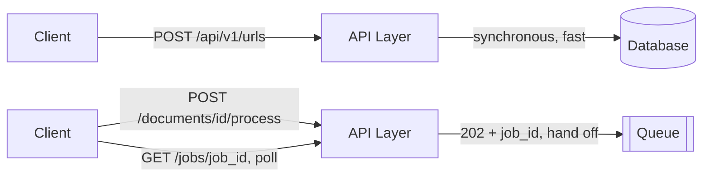

# API Design (in a System Design Interview)

> **Type:** Study notes

## Why interviewers ask this

Sketching the API surface forces you to translate fuzzy functional requirements into concrete,
checkable contracts — it's the step where "users can shorten a URL" becomes a request/response
shape that the rest of the design (data model, caching, rate limiting) has to actually support.
Interviewers also use it to gauge whether you think about the system from the *caller's*
perspective, not just the server internals — a skill DRR/Django API work builds directly.

## How much detail is expected at 3 YOE

Not a full OpenAPI spec. Not every field, every error code, every pagination edge case. What's
expected:

- **A handful of core endpoints** (typically 3-6) that map directly to the functional requirements
  you scoped in [`requirement_clarification.md`](requirement_clarification.md).
- **HTTP method + path + the key request/response fields** — enough that an interviewer could
  picture the JSON, not a formal schema.
- **The 1-2 design decisions embedded in the API** that matter for the rest of the discussion (is
  the create endpoint synchronous or does it return a job ID? is pagination cursor-based or
  offset-based, and why?).

Spending more than ~5 minutes of a 45-minute round on exhaustive API detail is a signal you're
avoiding the harder architectural discussion, not a sign of thoroughness.

## Worked example: URL shortener core API

```
POST /api/v1/urls
Request:  { "long_url": "https://example.com/very/long/path", "custom_alias": "optional", "expires_at": "optional ISO8601" }
Response: 201 { "short_code": "aZ9kLm2", "short_url": "https://sho.rt/aZ9kLm2", "long_url": "...", "expires_at": null }

GET /{short_code}
Response: 302 Redirect -> Location: <long_url>
          404 if short_code doesn't exist or has expired

GET /api/v1/urls/{short_code}/stats
Response: 200 { "short_code": "aZ9kLm2", "click_count": 4213, "created_at": "...", "last_accessed_at": "..." }

DELETE /api/v1/urls/{short_code}
Response: 204 (owner-only, requires auth)
```

Talking points worth surfacing while sketching this:
- `GET /{short_code}` is deliberately **not** under `/api/v1/` — it's the public redirect path,
  hit by browsers directly, so it needs to be short and un-prefixed.
- `POST` returns `201` with the created resource, not `200` — a small detail, but interviewers
  notice REST convention fluency.
- Redirect uses `302` (temporary) not `301` (permanent) if you want every redirect to still hit
  your analytics/click-tracking layer — a `301` gets cached by browsers and you lose visibility.
  This one-line decision is worth stating explicitly; it's a real trade-off (`301` is faster for
  the user, `302` preserves your ability to track and to change/expire the mapping).

## Sync vs. async endpoint shape

If an action is slow (video transcoding, OCR processing, bulk export), don't design it as a
blocking `POST` that holds the connection open. Design it to return immediately with a job
reference, and expose a separate status endpoint:

```
POST /api/v1/documents/{id}/process
Response: 202 Accepted { "job_id": "job_8f3a", "status": "queued" }

GET /api/v1/jobs/job_8f3a
Response: 200 { "job_id": "job_8f3a", "status": "processing" | "completed" | "failed", "result_url": "..." }
```

`202 Accepted` (not `200`/`201`) is the correct status for "I took your request but haven't
finished it" — worth using precisely, it signals REST fluency to the interviewer. This shape is
exactly what backs [`queues_and_event_driven_systems.md`](queues_and_event_driven_systems.md) —
the API layer hands off work to a queue instead of processing inline.

## Pagination and idempotency, briefly

- **Cursor-based pagination** (`?cursor=eyJpZCI6MTIzfQ&limit=20`) over offset-based
  (`?page=3&limit=20`) for any feed that's actively being written to — offset pagination skips or
  duplicates rows when new items are inserted between page fetches. Mention this trade-off if the
  system has a feed (chat history, notifications, activity log).
- Any `POST` representing a side-effecting action that a client might retry (payments, order
  creation) should accept an `Idempotency-Key` header — see
  [`../../05_backend_engineering/09_idempotency_and_retries.md`](../../05_backend_engineering/09_idempotency_and_retries.md)
  for the full mechanics; in a system design round, just naming this and why is enough.



## Interview Q&A

**Q: Should I design REST, GraphQL, or gRPC for this system?**
A: Default to REST unless the requirements clearly call for something else (GraphQL when clients
need flexible field selection across many nested resources — e.g., a mobile app avoiding
over-fetching; gRPC for low-latency internal service-to-service calls). State the default and the
one-line reason you'd deviate; don't over-engineer the transport choice for a design round.

**Q: How do you decide what goes in the URL path vs. the request body vs. query params?**
A: Path identifies the resource (`/urls/{short_code}`), query params filter/paginate a collection
(`?limit=20&cursor=...`), and body carries data for `POST`/`PUT`/`PATCH`. Getting this right in an
interview signals REST fluency without needing to state the rule explicitly.

**Q: The interviewer asks you to design the API before you've discussed the data model — is that
backwards?**
A: Not necessarily — sketching the API first is a reasonable way to nail down functional scope,
and it's fine for the data model to inform small adjustments to the API afterward. What's backwards
is designing the full schema or infrastructure before agreeing on what the API even needs to
support.

## Exercises

1. Design the core API (4-5 endpoints) for a rate limiter service exposed to other internal
   services — think about what the *check* endpoint needs to return (allowed/denied, remaining
   quota, reset time) and compare your answer against `../exercises/rate_limiter.md`.
2. Take the URL shortener `POST /api/v1/urls` endpoint above and redesign it to support bulk
   creation (100 URLs in one call) — decide whether the response should be all-or-nothing or
   partial-success-per-item, and justify your choice out loud.
