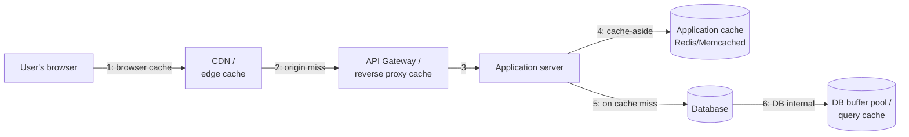

# Caching (Where in the Architecture)

> **Type:** Study notes

## Why interviewers ask this

Almost every system design answer ends up needing a cache somewhere — the interesting question is
never "should I cache," it's "where, and what happens when it's wrong." Interviewers use this to
check whether you think about caching as an *architectural placement decision* with real
consistency trade-offs, not just "add Redis." This file is about **where** in the request path
caching lives; for the mechanics of implementing a cache-aside pattern in Django with
`django-redis`, see
[`../../05_backend_engineering/06_caching_with_redis.md`](../../05_backend_engineering/06_caching_with_redis.md).

## Where to cache — every layer, in order of the request path

| Layer | Caches what | Good for | Weakness |
|---|---|---|---|
| Browser / client | Static assets, API responses via `Cache-Control` | Images, JS/CSS, rarely-changing GETs | No control once sent; can't invalidate remotely |
| CDN / edge | Static files, sometimes full HTML pages | Globally distributed read-heavy content | Not useful for personalized/authenticated data |
| API gateway / reverse proxy | Full HTTP responses keyed by URL+headers | Public, cacheable GET endpoints | Coarse — hard to do per-user caching correctly |
| Application layer | Query results, computed values, sessions | Anything you control invalidation for | Adds a network hop; another thing to keep consistent |
| Database | Query plans, buffer pool (pages in RAM) | Automatic, no app code needed | You don't control what's evicted |

The interview-relevant point: **each layer trades control for reach**. A CDN caches for millions of
users with zero app code but can't easily do per-user data. Application-layer caching gives you
precise invalidation control but only helps requests that reach your app servers at all. State
which layer you're adding and *why that layer specifically* solves the bottleneck you identified —
don't just say "add a cache."

## Cache-aside vs. read-through vs. write-through, at the architecture level

- **Cache-aside (lazy loading)** — application code checks cache, on miss reads DB and populates
  cache. Most common because the app stays in full control of what gets cached and when. Cost:
  first request after a miss/eviction is slow, and cache can silently drift from the DB if
  invalidation is missed.
- **Read-through** — the cache sits in front of the DB as a proxy; app always talks to the cache,
  and the cache itself fetches from DB on miss. Simplifies app code, but requires a cache layer
  smart enough to do that (not plain Redis — needs something like a caching proxy or ORM-level
  integration).
- **Write-through** — every write goes to the cache and the DB together, synchronously, before
  acknowledging. Cache is never stale, but every write pays the latency of both stores.
- **Write-behind (write-back)** — write goes to cache immediately, DB is updated asynchronously.
  Fast writes, but a cache-node crash before flush loses data — needs a durable queue behind it to
  be safe, which is really a queue-backed cache, not a plain cache.

At the system-design level, **cache-aside is the default answer** unless the read/write pattern
specifically calls for something else — say that, then justify a deviation if the scenario needs
one (e.g., write-through for a config service where staleness is unacceptable but writes are rare).

## Cache invalidation at system-design scale

The three real strategies, and when each is right:

1. **TTL-based expiry** — simplest, works for anything where a few seconds/minutes of staleness is
   fine (product listings, "trending" pages). No explicit invalidation code needed; just accept
   bounded staleness.
2. **Explicit invalidation on write** — the app deletes or updates the cache key the moment the
   underlying data changes. Correct-by-construction but requires *every* write path to remember to
   do it — a common source of stale-cache bugs is a second write path (an admin tool, a background
   job) that bypasses the invalidation logic.
3. **Event-driven invalidation** — a write publishes an event (via the queue layer, see
   [`queues_and_event_driven_systems.md`](queues_and_event_driven_systems.md)); cache-invalidating
   consumers subscribe and evict, decoupling "who wrote the data" from "who's responsible for
   invalidating the cache." Scales better than #2 across multiple services that all need to react
   to the same write, at the cost of eventual (not immediate) invalidation.

The line worth saying explicitly in an interview: **"there are only two hard things in computer
science: cache invalidation and naming things"** is a joke, but the underlying truth is real —
whichever strategy you pick, be explicit about the staleness window you're accepting, because
"just cache it" without an invalidation story is an incomplete answer.

## Interview Q&A

**Q: You added a cache in front of your database. A week later, users report seeing stale prices
after an admin updates them. What happened, and how do you fix it?**
A: Almost certainly a write path (the admin update) that isn't invalidating the cache key —
classic symptom of explicit invalidation with more than one write path. Fix: either route all
writes through one code path that always invalidates, or move to event-driven invalidation so the
admin service publishes a "price changed" event and any consumer with a cache subscribes to it
regardless of which service wrote the change.

**Q: When would you specifically choose write-through over cache-aside?**
A: When staleness is unacceptable for that data and writes are infrequent enough that the extra
write latency doesn't matter — e.g., feature flags or pricing config read on every request but
written rarely; you'd rather pay a small cost on the rare write than ever serve a stale read.

**Q: How do you size a cache, and what happens when it's full?**
A: Size it to the estimated "hot" working set from
[`capacity_estimation.md`](capacity_estimation.md), not the full dataset. When full, an eviction
policy (commonly LRU) removes the least-recently-used entries — mention that a bad eviction policy
mismatch (e.g., LRU on a workload with strict recency-independent hot keys) can thrash and defeat
the cache entirely.

## Exercises

1. For the URL shortener from `capacity_estimation.md`, decide which layer(s) you'd cache at
   (CDN? app-layer Redis? both?) given ~350K redirects/sec at peak, and justify with the actual
   numbers rather than a generic "add caching."
2. Design the invalidation strategy for a product catalog where price changes must be visible
   within 5 seconds but product descriptions can lag by up to a minute — should these two fields
   share one cache key or be cached separately? Justify.
