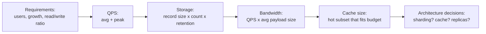

# Capacity Estimation

> **Type:** Study notes

## Why interviewers ask this

Back-of-envelope math is how you turn "design a system that scales" from a vague adjective into a
concrete number that determines real architectural decisions — whether one PostgreSQL instance is
enough, whether you need a CDN, whether an in-memory cache even fits in RAM. Interviewers use it to
check that you reason quantitatively rather than pattern-matching "big system = add Kafka and
Redis." Getting the exact number right matters far less than showing the *method* and sanity-
checking the result out loud.

## The method

1. State your assumptions explicitly (user count, growth rate, average object size) — pull from
   requirements gathered in [`requirement_clarification.md`](requirement_clarification.md).
2. Round aggressively to powers of 10 — you're estimating order of magnitude, not doing accounting.
3. Compute in this order: **traffic (QPS) -> storage -> bandwidth -> memory/cache size.**
4. Sanity-check the final number against something intuitive ("that's about the size of Wikipedia's
   text corpus" or "that's less than one modern SSD").

## Worked example: URL shortener, 5-year storage estimate

**Assumptions** (stated explicitly, as you'd do out loud in an interview):
- 100M new URLs created per day
- Read:write ratio of 100:1 → 10B redirects/day
- Each stored record: short code (7 bytes) + long URL (avg 100 bytes) + metadata (created_at, user
  id, ~20 bytes) ≈ 130 bytes; round to **150 bytes/record**
- Data retained for 5 years, no deletion

**Write QPS**:
```
100,000,000 writes/day / 86,400 s/day ≈ 1,160 writes/sec (average)
Peak (assume 3x average for daily peak traffic) ≈ 3,500 writes/sec
```

**Read QPS**:
```
10,000,000,000 reads/day / 86,400 s/day ≈ 115,000 reads/sec (average)
Peak (3x) ≈ 350,000 reads/sec
```
This read number alone tells you: a single DB instance cannot serve this — you need a cache in
front (redirects are a near-perfect cache-aside workload since a short code never changes once
created) and probably read replicas even behind the cache.

**Storage over 5 years**:
```
100M writes/day * 365 days * 5 years = 182.5B records
182.5B records * 150 bytes/record ≈ 27.4 TB
```
Add ~30% for indexes and replication overhead → **~35-40 TB total**. That's large but entirely
normal for a sharded relational or key-value store — not a "big data" problem requiring anything
exotic.

**Bandwidth**:
```
Write bandwidth: 1,160 writes/sec * 150 bytes ≈ 174 KB/s (negligible)
Read bandwidth: 115,000 reads/sec * ~500 bytes (short redirect response) ≈ 57.5 MB/s average
```
57.5 MB/s is comfortably within a single modern NIC (1 Gbps ≈ 125 MB/s) but at peak (3x ≈ 170 MB/s)
you're bandwidth-constrained on a single box — another argument for horizontal scaling behind a
load balancer.

**Cache sizing** (if caching the hottest 20% of URLs, per the 80/20 access pattern typical of
short-link traffic):
```
182.5B total records * 20% "hot" ≈ 36.5B... 
```
Wait — that's too naive; hot set should be based on *recent* creations, not all-time, since old
links go cold. A better estimate: cache the last 30 days of URLs plus anything actively trending.
```
100M/day * 30 days = 3B records * 150 bytes ≈ 450 GB
```
Still too large for one machine's RAM — this tells you the cache itself needs to be a distributed
cache (Redis Cluster) or you narrow further to "last 7 days + LRU eviction," which is the kind of
trade-off worth saying out loud rather than silently picking.

## Rough numbers every programmer should know

Memorize these — interviewers expect them recalled instantly, not derived:

| Operation | Approx. latency |
|---|---|
| L1 cache reference | ~1 ns |
| Main memory (RAM) reference | ~100 ns |
| Redis / in-memory cache GET (same datacenter) | ~0.5-1 ms |
| SSD random read | ~100 µs (0.1 ms) |
| Round trip within same datacenter | ~0.5 ms |
| PostgreSQL simple indexed query | ~1-5 ms |
| Read 1 MB sequentially from SSD | ~1 ms |
| Round trip cross-country (US) | ~40-60 ms |
| Round trip intercontinental | ~150-250 ms |
| HDD seek | ~10 ms |

Practical takeaway to state in interviews: **memory and cache hits are ~100-1000x faster than a
database round trip, and a database round trip is ~10-100x faster than a cross-region network
hop.** This ordering — not the exact numbers — is what actually drives "should this be cached,"
"should this be in the same region," and "should this be async."



## Interview Q&A

**Q: Do I need to get the exact numbers right?**
A: No — interviewers care about the method (assumptions stated, correct order of operations,
sensible rounding) far more than precision. Being off by 2x is fine; being off by 1000x because you
forgot to convert days to seconds is not.

**Q: When do you even need capacity estimation — doesn't it depend on the problem?**
A: Skip deep estimation for CRUD-shaped internal tools where scale clearly isn't the bottleneck.
Do it whenever the numbers will change the architecture — e.g., whether you need sharding, a CDN,
or an in-memory cache at all. If you can't tell which regime you're in, do a quick estimate to find
out.

**Q: How do you estimate peak QPS from average QPS if the interviewer doesn't give you a peak
factor?**
A: State an assumption: 2-3x average is a reasonable default for most consumer traffic (higher for
something like ticket-sale flash traffic, which can spike 10-50x). Say the multiplier out loud
rather than silently picking one.

## Exercises

1. Estimate storage and peak write QPS for a chat system: 50M DAU, each user sends an average of 40
   messages/day, each message averages 100 bytes of text + 50 bytes metadata. State your
   assumptions before computing.
2. For the URL shortener example above, recompute total 5-year storage if average URL length were
   500 bytes instead of 100 (e.g., URLs with long query strings) — how much does that change the
   final TB figure, and does it change any architectural decision?
