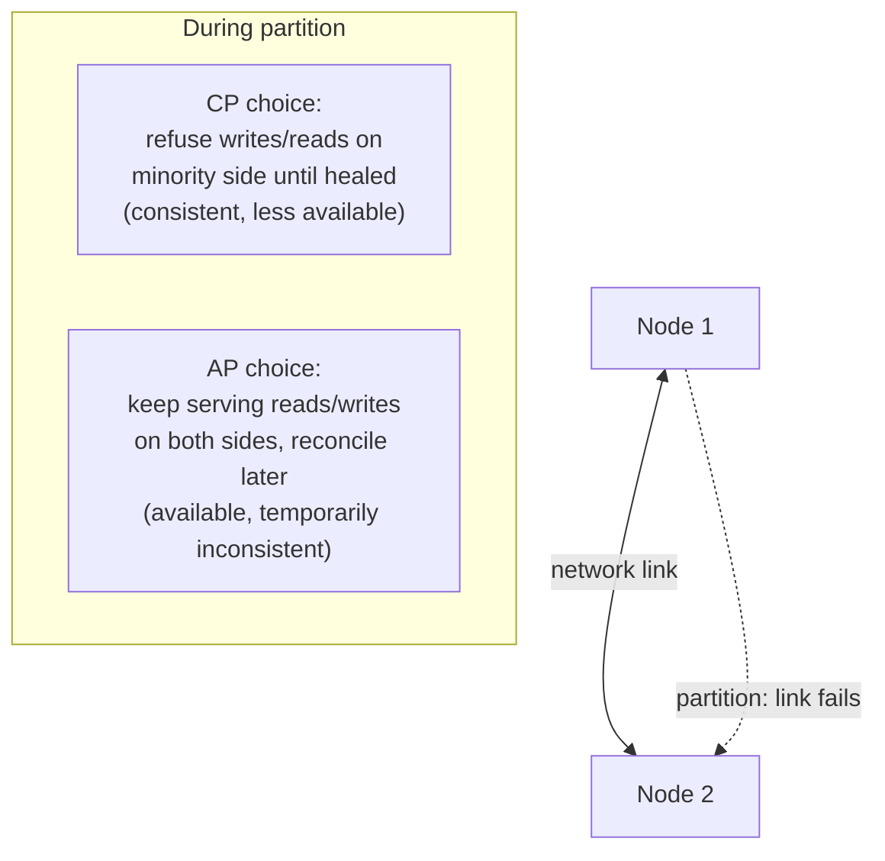

# Consistency & Availability Trade-offs (CAP, PACELC)

> **Type:** Study notes

## Why interviewers ask this

CAP theorem is one of the most frequently *misquoted* pieces of system design knowledge — "pick 2
of 3, permanently" is not what it actually says, and interviewers who know the theorem well will
notice immediately if you state it that way. This is a good opportunity for a 3-YOE candidate to
stand out: most candidates have memorized the wrong version, so stating it precisely (and following
with PACELC) is a strong, cheap signal.

## CAP theorem, stated precisely

CAP applies specifically **during a network partition** — it is not a permanent, always-in-effect
choice between three properties.

- **Consistency (C)**: every read receives the most recent write (or an error). All nodes see the
  same data at the same time.
- **Availability (A)**: every request receives a (non-error) response, without guarantee it's the
  most recent write.
- **Partition tolerance (P)**: the system continues operating despite network partitions (some
  nodes can't communicate with others).

The actual claim: **in the presence of a network partition, a distributed system must choose
between consistency and availability — it cannot have both.** If nodes can't talk to each other and
you still want every read to reflect the latest write, some nodes must refuse to respond (sacrifice
A). If you want every node to keep answering requests despite not being able to sync, some
responses will be stale (sacrifice C).

**Why "pick 2 of 3" is wrong**: partition tolerance isn't optional in a real distributed system —
networks *will* partition (a switch fails, a region loses connectivity, a process pauses long
enough to look partitioned). So P is not a design choice; it's a fact of operating over a network.
The real, always-live choice is **C vs. A, and only during an actual partition** — outside of a
partition, a well-designed system can offer both. State this precisely: "CAP says that *when a
partition happens*, you choose C or A — not that you permanently give up one of the three."

## Strong vs. eventual consistency, concretely

**Strong consistency**: after a write completes, every subsequent read (from any node) sees that
write. Requires coordination (synchronous replication, consensus) — costs latency and can cost
availability during a partition.

**Eventual consistency**: after a write, reads *will* eventually see it, but there's no bound
guaranteed on when — replicas converge over time (usually milliseconds to seconds in practice, but
not guaranteed).

Concrete user-facing example, worth having ready verbatim:
- **Strong consistency needed**: a bank transfer. You move $100 from account A to account B. Every
  subsequent balance read for either account must reflect the transfer immediately — a stale read
  showing the money in both accounts simultaneously (or neither) is a real bug with real financial
  consequences, not a UX nitpick.
- **Eventual consistency acceptable**: a "like" count on a social media post. If you like a post and
  the count takes 2 seconds to update on a friend's screen in another region, nobody's harmed and
  most users never notice. Choosing eventual consistency here buys much lower latency and higher
  availability for a feature where staleness has zero real cost.

The skill being tested isn't reciting the definitions — it's correctly classifying *which* fields in
a given system need which guarantee. A single system commonly needs both: strong consistency for
account balances, eventual consistency for activity feeds, in the same product.

## PACELC: the more complete framing

CAP only describes behavior *during a partition* — it says nothing about the normal, no-partition
case, which is most of the time. **PACELC** fills that gap:

> **If Partitioned**: choose **A**vailability or **C**onsistency (this is CAP).
> **Else** (normal operation, no partition): choose **L**atency or **C**onsistency.

Even with no partition, a system that wants strong consistency across replicas pays a latency cost
(coordination/consensus takes round trips); a system willing to accept eventual consistency can
serve reads from the nearest replica with lower latency. This is the trade-off most systems
actually live in day to day — partitions are rare events, but the consistency-vs-latency choice is
made on every single request.

| System | CAP choice (during partition) | PACELC choice (normal operation) |
|---|---|---|
| DynamoDB (default config) | AP | EL — favors low latency, eventual consistency |
| MongoDB (default) | CP-leaning (primary steps down) | EC — favors consistency over latency by default |
| Cassandra (tunable) | AP by default, tunable | Tunable per-query (`QUORUM`, `ONE`, etc.) |
| PostgreSQL (single primary, sync replicas) | CP | EC |

Naming PACELC unprompted after explaining CAP is a strong signal — it shows you know CAP's scope is
narrower than most people present it, and that the latency/consistency trade-off is the one you're
making far more often in practice.

## Interview Q&A

**Q: "Pick two of Consistency, Availability, Partition tolerance" — is that correct?**
A: No, and saying so is worth doing carefully: partition tolerance isn't optional for a real
distributed system since networks do partition, so it's not a free design choice. CAP is really
about what happens *during* a partition: you choose C or A at that moment. PACELC extends this to
describe the more common case — the consistency/latency trade-off you're making on every request
even when there's no partition at all.

**Q: Give an example where you'd choose availability over consistency.**
A: A shopping cart service — during a partition, you'd rather let users keep adding items (possibly
reconciling duplicate/conflicting cart state later) than show an error page. Losing a sale to an
error is worse than briefly inconsistent cart state that gets merged when the partition heals.

**Q: Is eventual consistency "worse" than strong consistency?**
A: Neither is universally better — it's a fit question, not a quality ranking. Eventual consistency
buys lower latency and higher availability; strong consistency buys correctness guarantees you
actually need for some data. Applying strong consistency everywhere "to be safe" needlessly pays a
latency/availability cost on data where nobody would ever notice staleness.

## Exercises

1. For a ride-sharing app, classify each of the following as needing strong or eventual consistency,
   and justify each: (a) driver's current GPS location shown to a rider, (b) fare charged to a
   rider's card, (c) a driver's star rating average.
2. Explain, in your own words, why "partition tolerance" being non-negotiable is what makes CAP a
   statement about C-vs-A specifically during a partition rather than a permanent 3-way trade-off —
   write it as you'd say it out loud in an interview, in under 90 seconds of speech.
