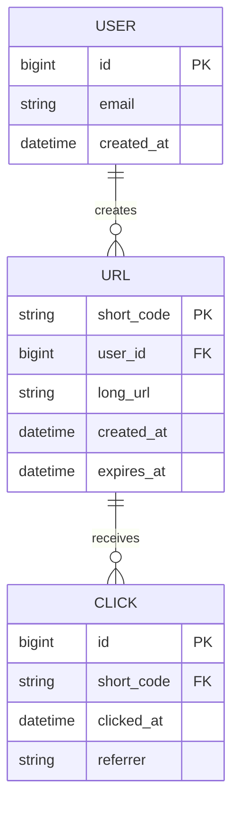

# Data Modeling

> **Type:** Study notes

## Why interviewers ask this

The data model is where a system design answer either holds together or falls apart under
follow-up questions. Interviewers push on this to see if you can translate access patterns (not
just entities) into a schema, and whether you actually know *why* you'd reach for SQL vs. NoSQL
rather than picking one by reflex. This is also where 3-YOE Django/DRF experience is a direct
asset — you've designed real schemas, so lean on that instinct rather than reciting a generic
"NoSQL is for scale" line.

## SQL vs. NoSQL: decide from access patterns, not popularity

The question is never "which is better" — it's "what does this system need to do with the data."

| Signal | Leans SQL | Leans NoSQL |
|---|---|---|
| Relationships between entities | Many, and you query across them (joins) | Few, or denormalized into one document |
| Consistency requirement | Strong (money, inventory, bookings) | Eventual is acceptable (view counts, activity feeds) |
| Schema stability | Well-understood, changes rarely | Evolving rapidly, fields vary per record |
| Query pattern | Ad-hoc, varied `WHERE`/`JOIN` clauses | Known access pattern by a fixed key (get by ID, get by partition key) |
| Write pattern | Moderate, transactional | Very high throughput, simple writes (logs, events, IoT) |
| Scale | Vertical + read replicas usually enough | Needs to shard horizontally from day one |

Concrete rule of thumb to say in an interview: **if you can name the exact query pattern and it's
always "fetch by a known key," a key-value or document store (DynamoDB, MongoDB, Redis) will
outperform and outscale a relational DB with far less operational complexity. If you need
transactions across entities or ad-hoc querying you can't fully predict up front, reach for
PostgreSQL/MySQL and don't over-engineer toward NoSQL prematurely.**

A hybrid is normal and expected, not a hedge: e.g., PostgreSQL as the source of truth for orders
and users, Redis for session/cache data, Elasticsearch for full-text search over the same orders —
each store doing the job it's actually good at.

## Designing a schema from requirements

Work top-down, out loud:
1. **List the core entities** from the functional requirements (User, URL, Click for a shortener).
2. **List the relationships** (one User has many URLs; one URL has many Clicks).
3. **List the access patterns** — this is the step people skip. "Get URL by short_code" (hot path,
   must be fast). "Get all URLs for a user" (less hot, can be a secondary index). "Get click count
   for a URL" (could be a separate aggregated counter table instead of `COUNT(*)` over Clicks at
   read time — a real denormalization decision, see below).
4. **Draw it**, and mark which columns are indexed and why.

`short_code` as the primary key on `URL` (not a separate auto-increment `id` with `short_code` as a
secondary unique index) is a real decision worth stating: the hottest read path (`GET
/{short_code}`) becomes a direct primary-key lookup instead of an index scan.

## Denormalization in a system-design context

Normalization (see
[`../../04_sql_and_databases/10_normalization_and_denormalization.md`](../../04_sql_and_databases/10_normalization_and_denormalization.md)
for the mechanics — 1NF/2NF/3NF, update anomalies) is a database-design concern. In a *system
design* interview, the question is coarser: **where does read performance at scale justify
duplicating data and accepting the write-side cost of keeping copies in sync?**

Two recurring examples worth having ready:
- **Counters**: instead of `SELECT COUNT(*) FROM clicks WHERE short_code = ?` on every stats
  request (gets slower as the table grows), maintain a `click_count` column on `URL` incremented
  atomically (or asynchronously via a queue) on each click. You've denormalized a derivable value
  into the parent row to make the hot read O(1) instead of O(n).
- **Fan-out on write** (e.g., a social feed): instead of computing "posts from people I follow" at
  read time with a join across `Follows` and `Posts` (expensive for a user with many follows),
  write a copy of each new post into every follower's precomputed feed table at post time. Read
  becomes a single indexed lookup; write becomes more expensive and eventually consistent. This is
  the textbook system-design trade-off to name explicitly: **denormalize toward whichever side
  (read or write) is actually hot**, established back in
  [`capacity_estimation.md`](capacity_estimation.md)'s read/write ratio.

The trade-off to always state out loud: denormalization buys read speed at the cost of write
complexity and eventual staleness between the copies — say which one you're accepting and why.

## Interview Q&A

**Q: Would you use MongoDB or PostgreSQL for a chat application's message history?**
A: Access pattern is "fetch the last N messages for a conversation ID, in order" — a known key,
simple query shape, high write volume. A document/wide-column store (or even PostgreSQL with a
well-indexed `(conversation_id, created_at)` composite key) both work; the deciding factor is
usually whether you need cross-conversation querying (search, moderation) — if so, keep a
relational or search-indexed copy too rather than forcing everything into one store.

**Q: When is it wrong to denormalize?**
A: When the field changes often and consistency matters — e.g., don't denormalize a user's display
name into every post row if display names change and every historical post must reflect the
*current* name; that turns one update into a mass rewrite. Denormalize derived/aggregate values and
rarely-changing data, not frequently-mutated source-of-truth fields.

**Q: How do you handle a schema migration on a table with billions of rows without downtime?**
A: Additive-first: add the new column as nullable, backfill in batches (off-peak, rate-limited),
then add constraints/make it required in a later deploy once backfill is confirmed complete — never
a single blocking `ALTER TABLE` that locks the table. Worth mentioning `django-migrations` with
`atomic=False` on the batch step for large Django-managed tables.

## Exercises

1. Design the schema (entities + relationships + which fields are indexed) for a rate limiter that
   needs to answer "has user X exceeded N requests in the last 60 seconds" in under 5ms — decide
   whether this belongs in a relational table or a different store entirely, and justify it.
2. Take the fan-out-on-write feed example above and write out, in plain steps, what happens when a
   user with 10 million followers posts — what breaks about naive fan-out at that scale, and what's
   the usual fix (hint: hybrid fan-out, treating "celebrity" accounts differently).
