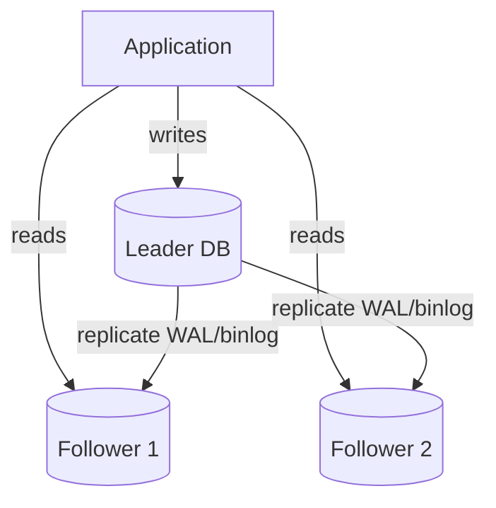
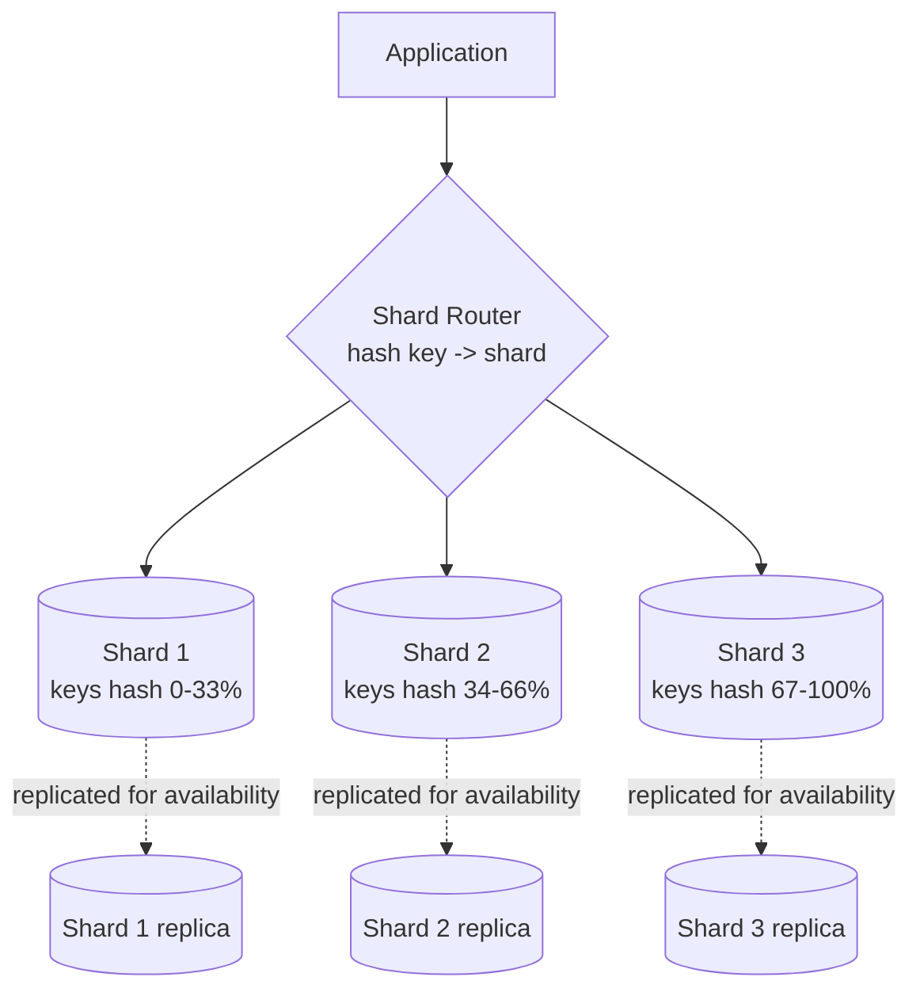

# Database Replication & Sharding

> **Type:** Study notes

## Why interviewers ask this

Every real system eventually outgrows one database server, and the two levers for that —
replication (copies of the same data for availability/read-scaling) and sharding (splitting data
across servers for write-scaling) — solve *different* problems and are often confused. Interviewers
push on this to check you know which lever fixes which bottleneck, and whether you've thought
through the consequences (replication lag, hot shards, rebalancing) rather than just naming the
technique.

## Leader-follower replication

One **leader** (primary) accepts all writes; one or more **followers** (replicas) receive a
continuous stream of the leader's changes (via a write-ahead log / binlog) and serve reads.

Why: read-heavy systems (most web apps) can scale reads horizontally by adding followers, while
writes stay simple (one leader, no write-conflict resolution needed). This is the default first
scaling move before reaching for sharding — cheaper operationally and solves the common case
(read:write ratio skewed toward reads, per
[`capacity_estimation.md`](capacity_estimation.md)).

**Replication lag and its consequences**: replication is asynchronous by default (leader doesn't
wait for followers to confirm before acknowledging a write) for performance. This creates a window
where a follower's data is stale relative to the leader. Concrete failure mode worth naming: a user
submits a form (`POST`, written to leader), the page redirects and immediately does a `GET` that's
routed to a follower that hasn't caught up yet — the user sees their own just-submitted data
missing ("read-your-writes" violation). Fixes: route a user's own immediate post-write reads to the
leader for a short window, or use **synchronous replication** for critical paths (leader waits for
at least one follower to ack before confirming the write) at the cost of higher write latency.

## Sharding

Sharding splits data **horizontally** across multiple independent database instances, each holding
a subset of rows — used when a single leader can no longer handle write throughput or the dataset
no longer fits on one machine, which replication alone doesn't fix (every follower still holds
100% of the leader's data).

### Sharding strategies

| Strategy | How | Good for | Weakness |
|---|---|---|---|
| Range-based | Shard by a range of the key (users A-M → shard 1, N-Z → shard 2) | Simple, range queries stay efficient within a shard | Hot spots if data isn't uniformly distributed (e.g., alphabetical names cluster) |
| Hash-based | `hash(key) % N` or consistent hashing across shards | Even distribution, avoids hot spots from skewed key values | Range queries now need to hit every shard (no locality) |
| Geo-based | Shard by user/data region (US shard, EU shard) | Data locality for latency + data-residency compliance (GDPR) | Uneven load if user base isn't evenly distributed globally |

Hash-based sharding should use **consistent hashing** (same mechanism as
[load balancing](load_balancing.md#load-balancing-algorithms)), not naive modulo — modulo sharding
means adding a shard remaps almost every key's owner, requiring a near-total data reshuffle.

Note the diagram: sharding and replication **compose** — each shard typically has its own
leader-follower replica set for availability, they're not alternatives to each other.

### The hot shard problem and rebalancing

Even with a good shard key, real-world traffic is rarely uniform — a single viral user, a
celebrity account, or a popular product concentrates load on one shard ("hot shard" / "hot
partition"). Symptoms: one shard's CPU/IO saturates while others sit idle.

Mitigations, roughly in order of how commonly they show up in interview answers:
1. **Choose a better shard key up front** — e.g., shard a messaging system by `conversation_id`
   hashed, not by `user_id`, if certain users (support bots, broadcast accounts) dominate traffic.
2. **Add a random suffix / salt to a hot key** to split it across multiple shards artificially (a
   celebrity's data gets split into `celeb_id_0`, `celeb_id_1`, ... and merged at read time) —
   trades read complexity for write distribution.
3. **Rebalance**: move some of the hot shard's key range to a new or underloaded shard. This is
   genuinely hard operationally — it means copying live data while writes continue, then atomically
   cutting over routing. Consistent hashing minimizes *how much* data must move, but doesn't
   eliminate the operational complexity of the migration itself.
4. **Dedicated shard for known hot keys** — if you can identify hot keys ahead of time (large
   customers in a B2B system), give them their own shard rather than trying to algorithmically
   balance around them.

Say explicitly in an interview: **sharding trades away easy cross-shard queries and transactions**
— a join or transaction across two shards either isn't possible or requires an expensive
distributed-transaction/two-phase-commit approach. This is the real cost of sharding, worth naming
before proposing it.

## Interview Q&A

**Q: Your system is slow. Do you add read replicas or shard?**
A: Depends on the bottleneck. If reads are the dominant load and writes are fine on one leader
(the common case), add read replicas — much simpler operationally. If *writes* are the bottleneck,
or the dataset no longer fits on one machine, replication alone can't fix it — every replica still
holds the full dataset — so you need to shard.

**Q: What's the practical impact of replication lag on a real product?**
A: Read-your-writes violations (described above), and stale reads for anything time-sensitive (a
comment that doesn't appear immediately, an inventory count that's briefly wrong). Mitigate by
routing writes-then-immediate-reads to the leader, or accept the staleness explicitly where the
product tolerates it (most feeds do).

**Q: How would you pick a shard key for an e-commerce orders table?**
A: `user_id` (hashed) is usually right if the dominant query is "get orders for this user" — keeps
a user's data on one shard for fast, single-shard queries. Picking `order_id` instead would
distribute writes evenly too, but every "orders for user X" query would need to fan out across all
shards, which is worse for the most common access pattern.

## Exercises

1. A messaging app shards by `hash(user_id)`. One user is a broadcast bot with 5M followers,
   causing extreme write load on their shard. Propose two different fixes and state the trade-off
   of each.
2. Sketch the replica topology (leader count, follower count per shard) for a 3-shard, read-heavy
   system that must survive the loss of any single database node without data loss.
