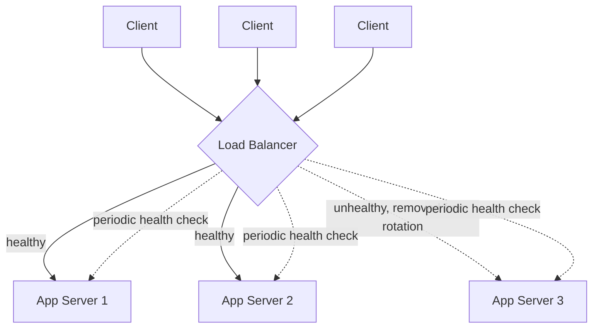

# Load Balancing

> **Type:** Study notes

## Why interviewers ask this

A load balancer is almost always the first box after the client in a system design diagram, and
interviewers use it to check whether you understand it as more than a rectangle labeled "LB" — what
layer it operates at, how it actually picks a backend, and how it knows a backend is dead. Glossing
over this is a common tell that a candidate has drawn this diagram from memory without
understanding it.

## L4 vs. L7 load balancing

**Layer 4 (transport layer)** — routes based on IP + TCP/UDP port only, without looking at the
request content. Fast (just forwarding packets/connections), protocol-agnostic, but can't make
routing decisions based on URL path, headers, or cookies.

**Layer 7 (application layer)** — terminates the connection, reads the actual HTTP request (path,
headers, cookies, even body), and routes based on that. Enables path-based routing
(`/api/*` → service A, `/static/*` → CDN), header-based routing (route by `Authorization` for
canary/A-B testing), and SSL termination at the LB. Costs more CPU (has to parse and often
decrypt/re-encrypt) and adds latency vs. L4.

| | L4 | L7 |
|---|---|---|
| Decision based on | IP + port | Full HTTP request (path, headers, cookies) |
| Speed | Faster, less CPU | Slower, more CPU (parses/terminates HTTP) |
| Use case | Raw TCP/UDP, high-throughput, protocol-agnostic | Microservice routing, path-based rules, SSL termination |
| Example | AWS NLB, raw HAProxy in TCP mode | AWS ALB, NGINX, Envoy |

Interview-relevant framing: **default to L7** for a typical web/API system since path-based routing
and SSL termination are usually needed; reach for L4 when you need raw throughput for a
non-HTTP protocol (a custom TCP service, gaming, some streaming) or when the extra latency of L7
parsing genuinely matters.

## Load balancing algorithms

| Algorithm | How it picks | When it matters |
|---|---|---|
| Round robin | Cycles through servers in order | Simple, fine when all servers are equal capacity and requests are roughly uniform cost |
| Weighted round robin | Round robin, but bigger servers get more turns | Heterogeneous server sizes (mixed instance types) |
| Least connections | Sends to the server with fewest active connections | Requests have wildly varying duration (some fast, some slow) — round robin would overload a server stuck on slow requests |
| Least response time | Combines least connections with observed latency | Similar to above, more adaptive, more overhead to track |
| Consistent hashing | Hashes a key (user ID, session ID) to consistently map to the same backend | You need **session affinity** or you're routing to a *sharded* backend (e.g., which cache node owns this key) — critical so a rehash on scale-up/down doesn't remap almost everything, only ~1/N of keys |
| IP hash | Hashes client IP to a backend | Simple session affinity without a shared session store, weaker than consistent hashing when servers scale in/out |

Consistent hashing is the one worth being able to explain precisely: without it, adding or removing
one server out of N with plain modulo hashing (`hash(key) % N`) remaps almost *every* key, because
N changed. Consistent hashing arranges servers and keys on a hash ring so adding/removing one server
only remaps the keys that were assigned to its neighboring ring segment — roughly `1/N` of keys, not
all of them. This is the same underlying idea used for
[shard key selection](database_replication_and_sharding.md#sharding-strategies) and for cache-node
selection in a distributed cache.

## Health checks

A load balancer is only as good as its knowledge of which backends are actually alive:

- **Active health checks**: LB periodically pings a dedicated endpoint (`GET /healthz`) on each
  backend and stops routing to any that fail N consecutive checks. `/healthz` should check that the
  app can actually do its job (DB connection alive, not just "process is running") — a shallow
  health check that only confirms the process is up will happily route traffic to a server that's
  up but can't reach its database.
- **Passive health checks**: LB observes real traffic — if a backend returns a run of 5xx errors or
  times out, it's marked unhealthy without a separate probe.
- **Failure handling**: unhealthy backends are removed from rotation, not killed — this is what
  enables graceful degradation and zero-downtime deploys (roll one instance out of rotation, deploy,
  health-check it back in, move to the next).

## Interview Q&A

**Q: Round robin vs. least connections — when does the choice actually matter?**
A: When request costs are roughly uniform (simple CRUD reads), round robin is fine and simpler.
When request duration varies a lot (some requests do a heavy DB join or call a slow downstream),
least connections avoids piling more work onto a server that's already stuck on slow requests,
which round robin would blindly do.

**Q: Why would you need consistent hashing instead of just round robin?**
A: Two cases: (1) session affinity — a user's requests should keep hitting the same backend
(in-memory session state, WebSocket connections) without needing a shared session store, and (2)
routing to a sharded backend where each node owns a specific subset of data/keys, so which node you
route to isn't arbitrary — it has to be the one that actually holds the data.

**Q: What happens if the load balancer itself goes down — isn't it a single point of failure?**
A: Yes if there's only one. Real deployments run LBs in an active-passive or active-active pair
behind a floating/virtual IP (or use a managed cloud LB that's inherently redundant, like AWS
ALB/NLB), and DNS or anycast routing directs traffic to a healthy LB. Worth naming this explicitly
if asked — "the LB" is not magically immune to the single-point-of-failure problem it solves for
app servers.

## Exercises

1. Given a system where 95% of requests are fast (<10ms) reads and 5% are slow (2-5s) report
   generation, design which LB algorithm you'd use and why — would you route the slow requests to a
   separate pool of servers entirely? Justify.
2. Sketch (on paper or in the Mermaid syntax above) a load-balanced architecture for a system with
   two distinct backend types — a stateless API service and a WebSocket-based chat service — where
   the chat service needs session affinity and the API service doesn't.
