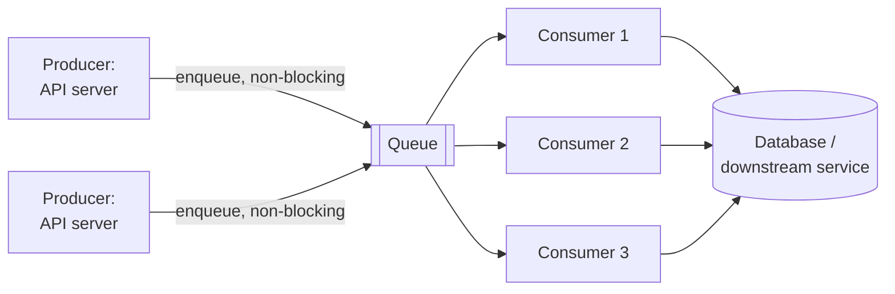

# Queues & Event-Driven Systems

> **Type:** Study notes

## Why interviewers ask this

Almost every non-trivial system design answer needs an async boundary somewhere — image
processing, notifications, order fulfillment, anything that shouldn't block the user's request.
Interviewers use this to check whether you reach for a queue for the right reason (decoupling,
smoothing load) rather than reflexively, and whether you actually understand delivery guarantees —
"exactly-once" is one of the most commonly *misstated* facts in system design interviews, and
getting it right is a strong signal.

## Why decouple with a queue

A queue sits between a producer and a consumer so they don't have to be available, fast, or scaled
at the same rate at the same moment.

**Backpressure**: without a queue, a slow consumer (a downstream service, a database under load)
directly slows down or fails the producer's request — the producer is blocked waiting on the
consumer. With a queue, the producer writes a message and returns immediately; the queue absorbs
the mismatch in speed. If the consumer falls behind, the queue simply grows (up to a limit) instead
of the producer failing.

**Smoothing traffic spikes**: a flash-sale or viral moment can produce 100x normal write volume for
a few minutes. Processing every write synchronously means provisioning app servers for the peak
(expensive, mostly idle otherwise) or falling over. A queue lets you accept requests at spike rate
and process them at a steady, provisioned rate — the queue depth absorbs the spike, and consumers
drain it over the following minutes. This is the direct system-design analog of
`@shared_task` in Celery: `POST /orders` writes to the queue and returns `202` immediately (see the
async endpoint shape in [`api_design.md`](api_design.md)); the actual charge/fulfillment happens
in a worker pulling from the queue at a sustainable rate.

## Pub/sub vs. point-to-point

| | Point-to-point (work queue) | Pub/sub |
|---|---|---|
| Delivery | Each message consumed by **exactly one** consumer in the group | Each message delivered to **every** subscriber |
| Use case | Distributing work across a pool of workers (process this image, send this email) | Broadcasting an event multiple services independently care about (order placed → notify, update inventory, log analytics — all react to the same event) |
| Example | SQS, Celery task queue, RabbitMQ work queue | Kafka topics, SNS, Redis pub/sub, RabbitMQ fanout exchange |
| Scaling model | Add more consumers to the same group to increase throughput | Add more independent subscriber services without affecting others |

The interview-relevant distinction to state precisely: point-to-point scales *throughput* for one
kind of work; pub/sub scales the *number of independent things that react* to one event. A real
system often uses both — an "order placed" event goes out via pub/sub to several services, and each
of those services internally uses a point-to-point work queue to distribute its own processing
across a worker pool.

## At-least-once vs. exactly-once: the reality

**At-least-once delivery** is what real message brokers actually provide by default (SQS, Kafka,
RabbitMQ with acks). A consumer processes a message, then acknowledges it; if the ack is lost (crash,
network blip) *after* processing but *before* the ack lands, the broker redelivers the message —
now it's processed twice. This is the same at-least-once assumption as HTTP retries, covered in
depth in
[`../../05_backend_engineering/09_idempotency_and_retries.md`](../../05_backend_engineering/09_idempotency_and_retries.md).

**"Exactly-once" is essentially a myth at the transport layer.** You cannot simultaneously
guarantee a message is delivered *and* guarantee it's delivered only once across an unreliable
network without coordination — the ack itself can always be lost, and there's no way for the
broker to distinguish "consumer never got it" from "consumer got it but the ack didn't arrive."
Some systems (Kafka's idempotent producer + transactional semantics) provide **exactly-once
*processing* within their own closed system** under specific conditions, but that guarantee
typically doesn't extend across a boundary to an external side effect (charging a card, sending an
email) — the moment your consumer does something outside the broker's transaction, you're back to
at-least-once from that side effect's point of view.

**The real answer interviewers want to hear**: design consumers to be **idempotent** — processing
the same message twice produces the same end state as processing it once (dedup by message ID,
`get_or_create` on a unique key, upserts instead of blind inserts). This is the same idempotency-key
pattern as the HTTP case; a queued message ID plays the same role an `Idempotency-Key` header does.
Stop trying to prevent duplicate delivery (you can't, reliably) and instead make duplicate
*processing* harmless.

## Interview Q&A

**Q: Your team wants "exactly-once" delivery for payment processing events. What do you tell them?**
A: That true exactly-once delivery isn't achievable across a network boundary — instead, guarantee
at-least-once delivery (the broker's job) plus an idempotent consumer (the app's job): dedupe by a
unique event/message ID before applying the charge, so a redelivered message is a no-op rather than
a double charge. Frame it as "effectively exactly-once through idempotency," not literal
exactly-once transport.

**Q: When would you choose pub/sub over a simple work queue?**
A: When more than one independent service needs to react to the same event without the producer
knowing about all of them in advance — e.g., "user signed up" needs to trigger a welcome email, an
analytics event, and a CRM sync, and you don't want the signup service coupled to (or blocked by)
all three. Point-to-point is right when you just need to parallelize one kind of work across
workers.

**Q: How does a queue help during a traffic spike if the consumer can't keep up either?**
A: It converts "system falls over / drops requests" into "system has a growing backlog it works
through at a sustainable rate" — a strictly better failure mode, as long as the backlog is
monitored and the queue has bounded depth or a dead-letter path for messages that fail repeatedly.
It doesn't increase total processing capacity by itself; it buys time and smooths the rate, and you
still need enough consumer capacity to eventually drain the backlog before it grows unbounded.

## Exercises

1. Design the queue-based flow for a notification system (email + SMS + push) triggered by a single
   "order shipped" event — decide pub/sub vs. point-to-point at each stage, and identify exactly
   where you'd need idempotency and why. Compare against `../exercises/notification_system.md`.
2. A consumer processes "increment view count" messages by reading the current count and writing
   count+1. Explain why this is *not* idempotent under at-least-once delivery, and redesign it
   (e.g., using the message ID) so redelivery is safe.
