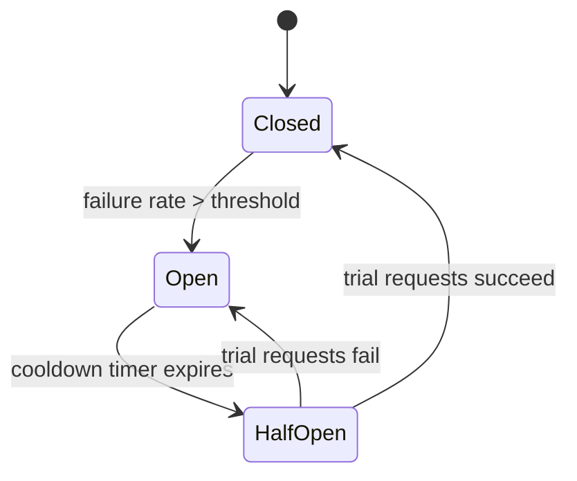

# Reliability, Fault Tolerance, Observability & Security

> **Type:** Study notes

## Why interviewers ask this

A design that only works when nothing goes wrong isn't a system design answer — it's a happy-path
sketch. In the last stretch of a design round, interviewers commonly inject a failure ("the cache
node dies," "the payment service starts timing out," "one region goes down") specifically to see
whether failure is something you designed *for* from the start or something you're improvising
about for the first time. Treating "what fails, and what happens then" as a default part of every
design — not a bonus topic if time allows — is the mindset shift this file is about.

## Redundancy and failover

**Redundancy**: no single component (server, database node, cache node, availability zone) whose
failure takes down the whole system. Every earlier fundamentals file already assumes this — read
replicas ([`database_replication_and_sharding.md`](database_replication_and_sharding.md)), multiple
app servers behind a load balancer ([`load_balancing.md`](load_balancing.md)) — redundancy is the
*reason* those patterns exist, not a separate add-on.

**Failover**: the mechanism that actually routes around a failed component.
- **Active-passive**: a standby replica is idle until the primary fails, then promoted — simpler,
  but the standby's capacity is unused most of the time, and failover itself takes time (detect
  failure, promote, redirect traffic) during which the system may be degraded or down.
- **Active-active**: multiple nodes serve traffic simultaneously; if one fails, the others simply
  absorb its share — no failover delay, but requires the nodes to handle concurrent writes safely
  (conflict resolution, or partitioning writes so nodes don't collide).

State the failover *time* explicitly when relevant — "the standby takes over within 30 seconds of
the primary being marked unhealthy" is a real, checkable claim; "it fails over automatically" is
not.

## Circuit breakers

When a downstream dependency (a service, a database, a third-party API) starts failing or timing
out, retrying every request against it makes things worse — it wastes resources on calls likely to
fail and keeps load on an already-struggling dependency, delaying its recovery.

A **circuit breaker** wraps calls to a dependency and tracks failure rate:
- **Closed** (normal): requests pass through; failures are counted.
- **Open**: after failures cross a threshold, the breaker stops calling the dependency entirely and
  fails fast (or falls back) for a cooldown period — protecting both your service (no more time
  spent waiting on doomed calls) and the struggling dependency (no more load from you).
- **Half-open**: after the cooldown, a small number of trial requests go through; if they succeed,
  the breaker closes again, if they fail, it reopens.

This is the mechanism behind libraries like `pybreaker` in Python, and conceptually related to but
distinct from the retry/backoff logic in
[`../../05_backend_engineering/09_idempotency_and_retries.md`](../../05_backend_engineering/09_idempotency_and_retries.md)
— retries handle transient single-request failures; a circuit breaker handles a *dependency being
down*, where retrying doesn't help and only adds load.

## Graceful degradation

When a non-critical dependency fails, the system should degrade — return a reduced but still-useful
response — rather than fail the whole request. Concrete examples worth having ready:
- Product page's recommendation widget service is down → show the product page without
  recommendations, don't 500 the whole page.
- Search's "did you mean" spell-check service times out → return raw search results without the
  suggestion, don't block on it.
- Cache is down → fall through to the database directly (slower, but correct) rather than failing
  every request — as long as the DB can absorb the extra load without falling over too.

The design principle to state explicitly: **classify every dependency as critical or non-critical
to the request, and make sure a non-critical dependency's failure can never fail the whole
request.** This is a concrete, checkable design decision, not just "handle errors gracefully."

## Observability: the four golden signals (recap)

Full mechanics (metrics, logging, tracing, alerting setup) live in
[`../../05_backend_engineering/16_monitoring_logging_metrics_tracing.md`](../../05_backend_engineering/16_monitoring_logging_metrics_tracing.md).
In a system design answer, name the four golden signals as the minimum you'd instrument on any
service you design:

| Signal | Question it answers |
|---|---|
| Latency | How long do requests take (and separate successful vs. failed latency — a fast error is not "good latency") |
| Traffic | How much demand is hitting the system (requests/sec) |
| Errors | What fraction of requests are failing |
| Saturation | How full is the system (CPU, memory, queue depth, connection pool) — the leading indicator of imminent trouble before errors show up |

Saying "I'd instrument latency, traffic, errors, and saturation on this service, and alert on
saturation before it turns into errors" in the last few minutes of a design round is a strong,
cheap way to show operational maturity without spending real time on it.

## Security, briefly, in a system design context

Not the focus of a system design round (that's closer to
[`../../05_backend_engineering/15_security_owasp_validation_secrets_cors_csrf.md`](../../05_backend_engineering/15_security_owasp_validation_secrets_cors_csrf.md)),
but worth a sentence when relevant: authentication/authorization at the API gateway layer (don't
make every service reimplement auth), encryption in transit (TLS) as a default not an afterthought,
and rate limiting at the edge to protect against abuse — mention these if the interviewer asks
"what else would you add given more time," don't spend core design time on them unless the prompt
is explicitly about a security-sensitive system (payments, auth service).

## Interview Q&A

**Q: The interviewer says "the cache cluster just went down — what happens to your system?" What's
a strong answer?**
A: Walk through it concretely: requests fall through to the database (cache-aside means the app
already knows how to do this on a miss); the database now takes 100% of read load it previously
shared with the cache, so state whether it can absorb that (tie back to capacity estimation) or
whether you need a circuit breaker / rate limiter to protect the DB from being overwhelmed while the
cache recovers. A vague "it would handle it" answer is exactly what interviewers are probing past.

**Q: What's the difference between a circuit breaker and a retry with backoff?**
A: Retry-with-backoff is for a single request that might succeed on a second try (transient
blip). A circuit breaker is for detecting that a *dependency itself* is unhealthy and stopping
calls to it entirely for a while — retrying against a genuinely down dependency just adds load and
delays its recovery; a circuit breaker is what decides "stop trying for now."

**Q: How do you decide what's "critical" vs. "non-critical" for graceful degradation?**
A: Ask: does the core user action (the thing the request is fundamentally for) still succeed
without this dependency? Checkout succeeding without a recommendations widget: yes, non-critical.
Checkout succeeding without the payment service: no, that's the critical path — there, you don't
degrade, you fail the request clearly and let the client retry (with idempotency protection).

## Exercises

1. For a design of your choice from `../exercises/`, list every external dependency your design
   calls out (cache, DB, queue, third-party API) and classify each as critical or non-critical to
   the primary user-facing request — then state what happens to the request when each one is down.
2. Sketch a circuit breaker's state transitions (closed → open → half-open → closed) for a service
   that calls a flaky third-party payment gateway, and decide what your fallback response is while
   the breaker is open (queue the request for later? fail visibly to the user? both?).
