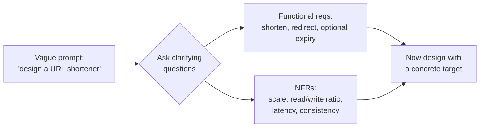

# Requirement Clarification

> **Type:** Study notes

## Why interviewers ask this

The single most common reason a 3-YOE candidate fails a system design round isn't a bad
architecture — it's designing the wrong system. Interviewers deliberately give an underspecified
prompt ("design a URL shortener," "design Twitter") because the real signal is whether you *notice*
it's underspecified. Jumping straight to boxes and arrows tells the interviewer you'll do the same
thing on the job: build the wrong thing quickly. Spending the first 5-10 minutes asking sharp
questions is not stalling — it's the part of the round that's actually being graded hardest.

## Functional vs. non-functional requirements

**Functional requirements** — what the system *does*, from the user's point of view. "Users can
shorten a URL." "Users can post a message and followers see it." Keep this list short: 3-5 core
actions. Resist the urge to cover every feature a real product has — a design round has 35-40
minutes of actual design time, and a bloated feature list eats it.

**Non-functional requirements (NFRs)** — the qualities the system must have while doing that.
These are what actually drive the architecture:

| NFR | Question it answers | Drives |
|---|---|---|
| Scale | How many users/requests? | Sharding, caching, horizontal scaling |
| Latency | How fast must a response be? | Caching layer, CDN, sync vs. async |
| Availability | Can it ever be down? | Redundancy, failover, replica count |
| Consistency | Can reads lag behind writes? | SQL vs. NoSQL, replication strategy |
| Durability | Can data ever be lost? | Replication factor, write-ahead logs |
| Read/write ratio | Read-heavy or write-heavy? | Caching strategy, index design |

A design that nails the functional requirements but ignores NFRs is a toy. A design that satisfies
NFRs the interviewer never asked for (5-nines availability for an internal admin tool) is also
wrong — it signals you can't prioritize.

## The clarifying-question checklist

Run through these out loud, even if you think you know the answer — voicing the question is part
of the signal:

1. **Who are the users, and what's the primary use case?** ("Is this a public consumer product or
   an internal tool? Mobile-heavy or API-heavy?")
2. **Scale**: how many total users, how many daily active users, how many requests/second at peak?
   If the interviewer won't give a number, propose one and state your assumption out loud.
3. **Read/write ratio**: is this read-heavy (URL shortener: ~100:1 reads to writes) or write-heavy
   (logging/analytics ingestion)? This single number decides whether you optimize for caching or
   for write throughput.
4. **Latency requirements**: is this a synchronous user-facing request (must respond in
   <200ms) or can it be async (a report generated in the background, notified later)?
5. **Consistency needs**: is stale data acceptable (a "like" count can lag a few seconds) or must
   every read reflect the latest write (an account balance cannot)?
6. **Data size and growth**: how much data per record, how many records, over what time horizon
   (this feeds directly into [`capacity_estimation.md`](capacity_estimation.md))?
7. **What's explicitly out of scope?** State what you will *not* design (e.g., "I won't design the
   admin/moderation dashboard, only the core write/read path") so the interviewer can redirect you
   early if that's wrong, instead of at minute 30.

## A worked example: "Design a URL shortener"

Bad opening: immediately drawing a client -> load balancer -> app server -> DB diagram.

Good opening (transcript-style):
> "A few questions before I design this. Who's the user — is this a public product like bit.ly, or
> internal for one company? ... Public, okay. What scale are we talking — how many URLs shortened
> per day, and roughly what's the read/write ratio, since I'd expect redirects to massively
> outnumber creations? ... 100M new URLs/day, and let's say reads are 100x that, so ~10B redirects
> a day. Do shortened URLs expire, or live forever? Does a URL need to be *guessable*-resistant
> (unpredictable), or is sequential fine? And is eventual consistency okay if I click a link 200ms
> after creating it and there's a tiny chance of a cache miss falling through to the DB?"

Notice each answer changes the design: expiring URLs need a TTL/cleanup job; unpredictability rules
out a simple auto-increment counter; the extreme read skew all but mandates a cache in front of the
database.

## Interview Q&A

**Q: Why not just start designing — isn't asking questions wasting time in a 45-minute round?**
A: The opposite — designing against the wrong assumptions wastes far more time, because you either
have to backtrack mid-round (visibly, in front of the interviewer) or you finish a design that
answers a question nobody asked. 5-10 minutes of sharp questions is the highest-leverage time in
the round.

**Q: The interviewer says "assume whatever scale you think is reasonable." What do you do?**
A: State an explicit assumption and move on — don't freeze. "I'll assume 50M daily active users and
a 10:1 read/write ratio, similar to a mainstream social app; I'll flag if that changes the design
materially." This shows you can operate with ambiguity, which is itself part of the signal.

**Q: How do you know when you've asked enough questions and should start designing?**
A: When you can state, in two sentences, the functional scope and the 2-3 NFRs that will most
shape the architecture (usually scale + read/write ratio + consistency). If you can't summarize it
that tersely, you don't have enough yet — but past that point, more questions become stalling.

## Exercises

1. For "design Instagram," write down the functional requirements you'd commit to covering (aim
   for exactly 4) and the ones you'd explicitly declare out of scope.
2. Pick any exercise in `../exercises/`, cover the requirements section with your hand, and write
   your own clarifying-question list from just the title before reading the file's version.
