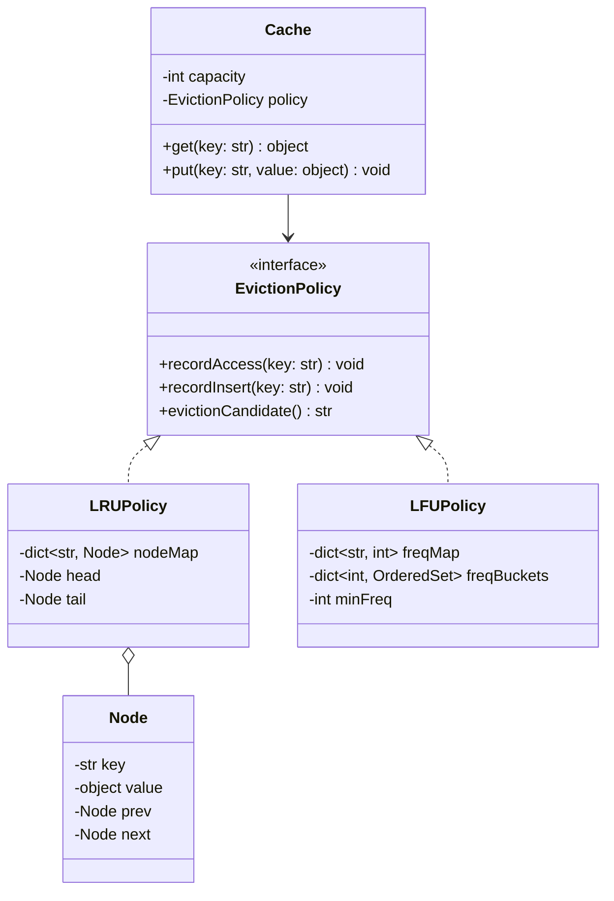

# In-Memory LRU/LFU Cache — Low-Level Design

> **Type:** Study notes

Half LLD, half DSA — the class model is trivial, the entire interview is "can you implement O(1)
get/put with the right data structure and not fumble the pointer bookkeeping." Extremely common as
a stand-alone coding-round question too (LeetCode 146 "LRU Cache"), not just an LLD round — know
this one cold.

## Requirements / Scope

**Functional**
- Fixed-capacity key-value cache: `get(key)` and `put(key, value)`.
- On capacity overflow, evict according to policy: **LRU** (least recently used) or **LFU**
  (least frequently used) — design both, they're the same interface with different internals.
- `get()` counts as a "use" (updates recency/frequency).

**Out of scope**: distributed/multi-node caching (that's
[`../../06_system_design/fundamentals/caching.md`](../../06_system_design/fundamentals/caching.md)),
TTL/expiration (a reasonable extension, mentioned below).

**Non-functional**: both `get()` and `put()` must be **O(1)** — this is the entire point of the
exercise; an O(n) solution (e.g. scanning for the least-recently-used entry) is a fail, not a
partial-credit answer.

## Key Classes & Responsibilities

| Class | Responsibility |
|---|---|
| `Cache` | Public `get()`/`put()`, holds `capacity` and delegates eviction decisions to a policy |
| `EvictionPolicy` (interface) | `LRUPolicy`, `LFUPolicy` — decides what to evict, tracks whatever bookkeeping it needs |
| `Node` | Doubly-linked-list node (LRU) holding key/value, for O(1) removal/reinsertion |

## Class Diagram



## Key Design Decisions

**1. LRU: hash map + doubly linked list, not just a list.** A plain list gives O(n) "move to
front." The map gives O(1) node lookup by key; the doubly linked list gives O(1) removal and
O(1) re-insertion at the front — combining them is the entire trick.

```python
class Node:
    __slots__ = ("key", "value", "prev", "next")
    def __init__(self, key, value):
        self.key, self.value = key, value
        self.prev = self.next = None

class LRUCache:
    def __init__(self, capacity: int):
        self.capacity = capacity
        self._map: dict[str, Node] = {}
        self._head = Node(None, None)   # sentinel, most-recently-used side
        self._tail = Node(None, None)   # sentinel, least-recently-used side
        self._head.next, self._tail.prev = self._tail, self._head

    def _remove(self, node: Node) -> None:
        node.prev.next, node.next.prev = node.next, node.prev

    def _insert_front(self, node: Node) -> None:
        node.next = self._head.next
        node.prev = self._head
        self._head.next.prev = node
        self._head.next = node

    def get(self, key: str):
        if key not in self._map:
            return None
        node = self._map[key]
        self._remove(node)
        self._insert_front(node)        # touched => most recently used
        return node.value

    def put(self, key: str, value) -> None:
        if key in self._map:
            self._remove(self._map[key])
        node = Node(key, value)
        self._map[key] = node
        self._insert_front(node)
        if len(self._map) > self.capacity:
            lru = self._tail.prev        # least-recently-used is right before the tail sentinel
            self._remove(lru)
            del self._map[lru.key]
```
Using **sentinel head/tail nodes** (instead of `None` checks scattered everywhere) is the detail
that separates a clean implementation from a buggy one under interview time pressure — it removes
every edge case around "is this the first/last real node."

**2. LFU is the harder follow-up — O(1) needs frequency *buckets*, not a heap.** A heap gives
O(log n) per operation, not O(1). The O(1) trick: a `dict[freq -> OrderedSet of keys with that
freq]` plus `min_freq` tracking, so eviction is "pop any key from the bucket at `min_freq`."

```python
from collections import OrderedDict, defaultdict

class LFUCache:
    def __init__(self, capacity: int):
        self.capacity = capacity
        self._value: dict[str, object] = {}
        self._freq: dict[str, int] = {}
        self._buckets: dict[int, OrderedDict] = defaultdict(OrderedDict)
        self._min_freq = 0

    def _bump_freq(self, key: str) -> None:
        freq = self._freq[key]
        del self._buckets[freq][key]
        if not self._buckets[freq] and freq == self._min_freq:
            self._min_freq += 1
        self._freq[key] = freq + 1
        self._buckets[freq + 1][key] = True

    def get(self, key: str):
        if key not in self._value:
            return None
        self._bump_freq(key)
        return self._value[key]

    def put(self, key: str, value) -> None:
        if self.capacity == 0:
            return
        if key in self._value:
            self._value[key] = value
            self._bump_freq(key)
            return
        if len(self._value) >= self.capacity:
            evict_key, _ = self._buckets[self._min_freq].popitem(last=False)  # oldest in min-freq bucket
            del self._value[evict_key], self._freq[evict_key]
        self._value[key] = value
        self._freq[key] = 1
        self._buckets[1][key] = True
        self._min_freq = 1
```
`OrderedDict` per bucket breaks ties within the same frequency by recency (oldest-inserted-at-that-
frequency evicted first) — say this explicitly, it's the detail that makes LFU well-defined instead
of ambiguous when multiple keys tie on frequency.

**3. Eviction policy behind an interface, not a boolean flag on `Cache`.** `if self.policy_type ==
"LRU"` branching inside `Cache.get()`/`put()` is exactly the OCP violation pattern from
[`solid_principles.md`](../fundamentals/solid_principles.md) — the policy owns its own bookkeeping
structures entirely, `Cache` just delegates.

## Extensibility

- **TTL/expiration**: add an `expires_at` on each entry, checked lazily on `get()` (return `None`
  and evict if expired) and/or an active background sweep — doesn't change the eviction policy
  interface.
- **Thread safety** (near-certain follow-up): wrap `get`/`put` in a lock, or use per-shard locking
  for higher throughput — see
  [`../fundamentals/thread_safety_and_concurrency.md`](../fundamentals/thread_safety_and_concurrency.md#3-per-key-locking-for-structures-like-a-cache).
- **Size-based (not count-based) capacity**: track cumulative byte size instead of entry count,
  evict until under budget — changes the capacity check, not the eviction data structures.

## Follow-up Questions

- "Why can't a plain heap give O(1) LFU?" — a heap's pop/push is O(log n); the bucket-of-`OrderedDict`
  approach achieves true O(1) because it never reorders more than one key's bucket membership per
  operation.
- "How would you make this thread-safe without serializing every `get()`?" — see the sharded/per-key
  locking approach in the thread-safety fundamentals file; note that LRU's linked-list pointer
  updates are especially prone to corruption under concurrent access without a lock around the
  whole structure — sharding is harder here than for a simple counter.
- "What's the actual real-world equivalent of this?" — this is a simplified single-process version
  of what Redis or an application-level `functools.lru_cache`-style cache does; mentioning that
  `functools.lru_cache` exists and uses this exact map + doubly-linked-list approach internally is
  a good way to connect the exercise to production experience.
