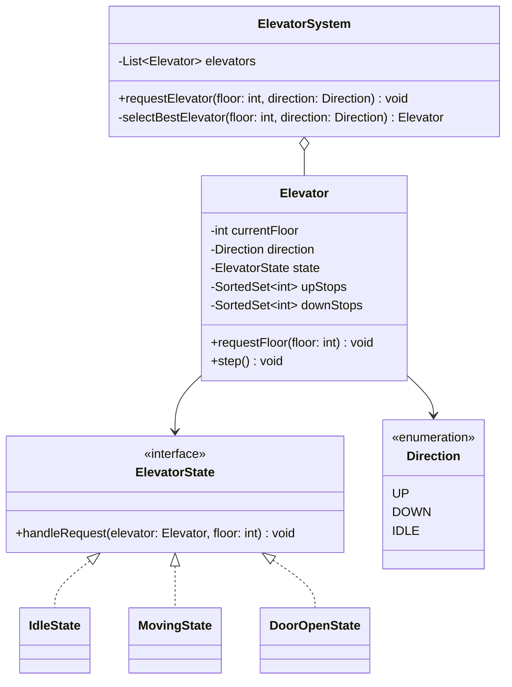

# Elevator System — Low-Level Design

> **Type:** Study notes

The canonical State-pattern exercise: an elevator's behavior (accept a request? open doors?)
depends entirely on what it's currently doing, and the interviewer's follow-ups ("now handle two
elevators," "now prioritize by direction") are really testing whether your state model and
dispatch logic are separable.

## Requirements / Scope

**Functional**
- A building has `N` floors and `M` elevators (start with `M = 1`, generalize after).
- A user can request an elevator from a floor (`up`/`down` hall call) or, once inside, request a
  destination floor (car call).
- The elevator moves toward and stops at requested floors in a sensible order (doesn't ping-pong).
- Doors open/close at each stop; the elevator reports its current floor and direction.

**Out of scope**: physical door-sensor logic, weight limits, emergency/fire-service mode — mention
these exist, don't design them unless asked.

**Non-functional**: request handling should be O(log n) or better per operation, not a full re-sort
of all pending requests on every stop — this drives the data structure choice below.

## Key Classes & Responsibilities

| Class | Responsibility |
|---|---|
| `ElevatorSystem` | Owns all `Elevator`s, receives hall calls, decides *which* elevator to dispatch (the scheduling problem) |
| `Elevator` | Owns its current floor, direction, state, and pending stops; exposes `request_floor()` |
| `ElevatorState` (interface) | `IdleState`, `MovingState`, `DoorOpenState` — governs what happens when a new request arrives |
| `Direction` | Enum: `UP`, `DOWN`, `IDLE` |
| `Request` | A floor + origin (hall call with direction, or car call) |

## Class Diagram



## Key Design Decisions

**1. State pattern for elevator behavior.** `IdleState` accepts any request and starts moving;
`MovingState` queues new requests without interrupting the current run unless the new stop is
"on the way"; `DoorOpenState` ignores new floor requests briefly but still accepts hall calls.
Full pattern shape in
[`../fundamentals/design_patterns.md#state--lifecycle-driven-behavior`](../fundamentals/design_patterns.md#state--lifecycle-driven-behavior).
Say explicitly: the elevator's `state` field is reassigned *by the state objects themselves*, not
by `ElevatorSystem` — that's what makes it State rather than Strategy.

**2. Two sorted sets, not one queue, for pending stops.** Store `upStops` and `downStops` as
sorted sets (or heaps: min-heap for `upStops`, max-heap for `downStops`). While moving up, the
elevator services `upStops` in ascending order without re-sorting; when it exhausts them, it
switches direction and starts servicing `downStops` in descending order. This is the **LOOK
algorithm** (disk-scheduling-style) — it prevents the elevator from ping-ponging to the nearest
requested floor regardless of direction, which would be both inefficient and what most
interviewers explicitly want you to avoid. Say the algorithm name — it signals you've thought
about this class of problem before.

```python
import heapq

class Elevator:
    def __init__(self, elevator_id: str):
        self.id = elevator_id
        self.current_floor = 0
        self.direction = "IDLE"
        self._up_stops: list[int] = []      # min-heap
        self._down_stops: list[int] = []    # max-heap (store negated)

    def request_floor(self, floor: int) -> None:
        if floor > self.current_floor:
            heapq.heappush(self._up_stops, floor)
            if self.direction == "IDLE":
                self.direction = "UP"
        elif floor < self.current_floor:
            heapq.heappush(self._down_stops, -floor)
            if self.direction == "IDLE":
                self.direction = "DOWN"

    def step(self) -> None:
        """Advance one floor toward the next stop, servicing it if reached."""
        if self.direction == "UP" and self._up_stops:
            if self.current_floor == self._up_stops[0]:
                heapq.heappop(self._up_stops)
                return
            self.current_floor += 1
        elif self.direction == "DOWN" and self._down_stops:
            if self.current_floor == -self._down_stops[0]:
                heapq.heappop(self._down_stops)
                return
            self.current_floor -= 1
        elif self._down_stops:
            self.direction = "DOWN"
        elif self._up_stops:
            self.direction = "UP"
        else:
            self.direction = "IDLE"
```

**3. Elevator selection for `ElevatorSystem` (M elevators).** Score each elevator by: is it idle
(strongly prefer), is it already moving *toward* the requested floor in the same direction
(prefer — it can pick up the call "on the way" with zero extra travel), else use distance as a
tiebreaker. This is the piece most candidates skip when they only design for `M = 1`, and the
piece interviewers explicitly probe with "now there are 3 elevators" — have an answer ready rather
than deriving it live.

## Extensibility

- **Capacity/weight limits**: add a `max_load` and a check in `request_floor` — doesn't touch the
  State classes.
- **Priority/VIP floors or express elevators**: a new `Elevator` subtype or a scoring-function
  parameter in `selectBestElevator` — the scheduling policy is itself a natural
  [Strategy](../fundamentals/design_patterns.md#strategy--interchangeable-algorithms) seam if the
  interviewer says "now make dispatch policy configurable."
- **Emergency mode (go to ground floor, ignore all other calls)**: a new `ElevatorState` —
  `EmergencyState` — that overrides `handleRequest` to reject everything but the emergency stop.

## Follow-up Questions

- "How would you avoid starvation — a request on floor 1 waiting forever if the elevator keeps
  getting closer requests?" — LOOK naturally avoids this since the elevator fully drains stops in
  one direction before reversing, unlike a naive "always go to nearest" heuristic, which can
  genuinely starve a far request.
- "How do you generalize `selectBestElevator` to `M` elevators without checking every elevator on
  every request?" — acceptable to say "linear scan over M elevators is fine unless M is huge (real
  buildings have single-digit-to-low-double-digit elevator banks)," don't over-engineer this part.
- "What if the elevator system needs to persist state across a restart (elevator was mid-trip)?" —
  out of scope for LLD proper, but a reasonable one-line answer: persist `current_floor`,
  `direction`, and pending stops to durable storage on each `step()`, replay on startup.
