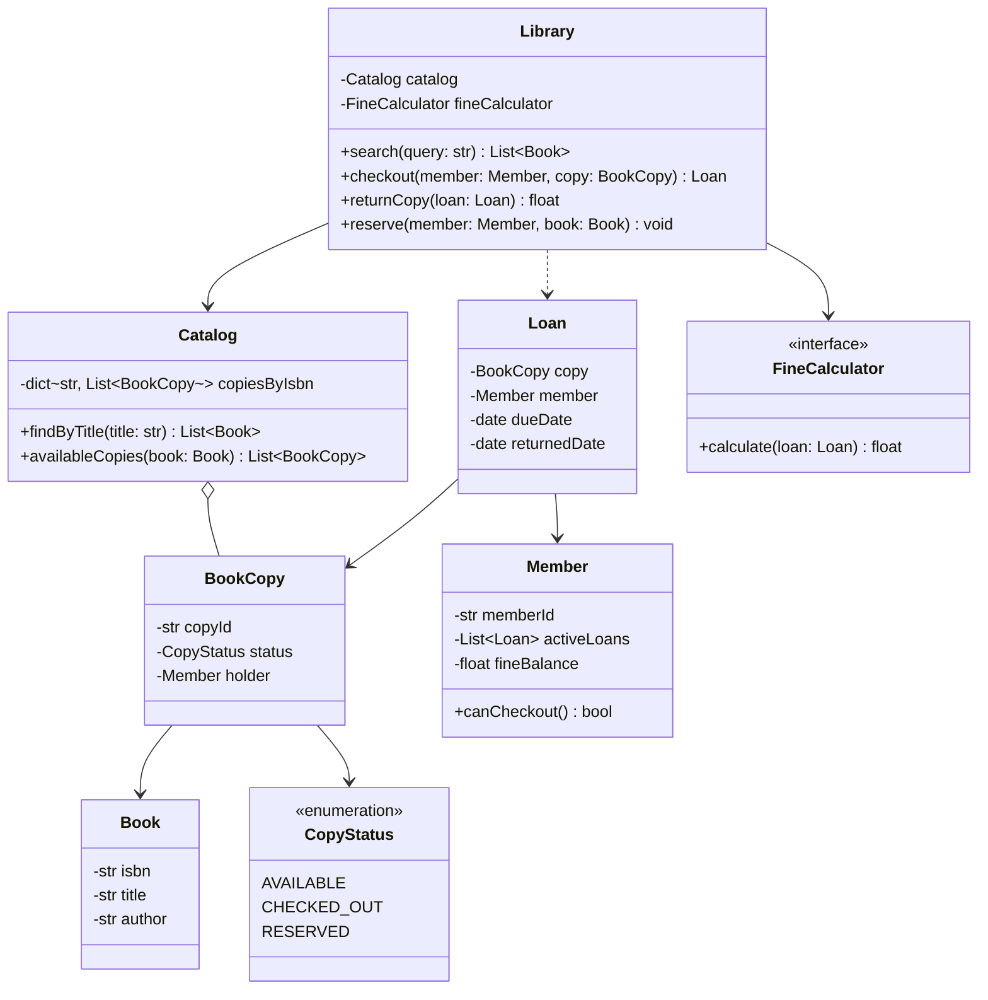

# Library Management System — Low-Level Design

> **Type:** Study notes

A breadth exercise more than a depth one: it touches inventory (multiple copies of a book),
membership rules (borrow limits, fines), and notifications (a book becomes available) — the
interviewer is grading whether you can keep three sub-domains cleanly separated rather than
letting `Library` become a god class that does everything.

## Requirements / Scope

**Functional**
- The catalog has `Book` titles, each with multiple physical `BookCopy` instances.
- A `Member` can search the catalog, check out a copy (if available), return it, and reserve a
  title that's fully checked out (gets notified when a copy frees up).
- Overdue copies accrue a fine; a member with unpaid fines above a threshold can't check out more
  books.
- Librarians can add/remove books and copies.

**Out of scope**: physical barcode/RFID scanning hardware integration, payment processing for
fines (mention it hands off to a `PaymentProcessor`, don't design it — see
[`payment_workflow.md`](payment_workflow.md) for that).

**Non-functional**: catalog search by title/author should not require scanning every book.

## Key Classes & Responsibilities

| Class | Responsibility |
|---|---|
| `Library` | Top-level façade: `search()`, `checkout()`, `returnCopy()`, `reserve()` — coordinates the others, owns none of the detailed logic itself |
| `Catalog` | Indexes `Book`s by title/author for fast search; owns the `BookCopy` inventory |
| `Book` | Title, author, ISBN — metadata shared by all copies |
| `BookCopy` | One physical copy: status (available/checked-out/reserved), which `Member` holds it if any |
| `Member` | Borrowing history, current checkouts, fine balance |
| `Loan` | A checkout record: copy, member, due date, returned date |
| `FineCalculator` (interface) | Computes fine from an overdue `Loan` — swappable rule |
| `ReservationNotifier` (Observer subject) | Notifies waiting members when a reserved title's copy becomes available |

## Class Diagram



## Key Design Decisions

**1. `Book` vs. `BookCopy` — don't collapse them.** A common first-draft mistake is one `Book`
class that also tracks "is it checked out," which breaks the moment there's more than one physical
copy of the same title. Separating them is the single most important modeling decision here — say
it explicitly even if the prompt doesn't mention multiple copies, since a real library always has
them.

**2. `canCheckout()` centralizes the borrowing-eligibility rule.** Borrow limit and fine threshold
checks belong on `Member` (or a small `BorrowingPolicy` if the interviewer wants it swappable), not
scattered as `if` checks inside `Library.checkout()` — keeps the rule in one place and testable in
isolation.

```python
class Member:
    MAX_ACTIVE_LOANS = 5
    MAX_FINE_BEFORE_BLOCK = 10.0

    def __init__(self, member_id: str):
        self.member_id = member_id
        self.active_loans: list["Loan"] = []
        self.fine_balance = 0.0

    def can_checkout(self) -> bool:
        return (
            len(self.active_loans) < self.MAX_ACTIVE_LOANS
            and self.fine_balance < self.MAX_FINE_BEFORE_BLOCK
        )
```

**3. Fine calculation as a Strategy**, same shape as `parking_lot.md`'s `FeeStrategy` — different
libraries/tiers might charge per-day flat, per-day with a cap, or waive the first N days:

```python
from typing import Protocol
from datetime import date

class FineCalculator(Protocol):
    def calculate(self, due_date: date, returned_date: date) -> float: ...

class PerDayFineCalculator:
    RATE_PER_DAY = 0.50
    GRACE_DAYS = 1

    def calculate(self, due_date: date, returned_date: date) -> float:
        overdue_days = max(0, (returned_date - due_date).days - self.GRACE_DAYS)
        return overdue_days * self.RATE_PER_DAY
```

**4. Reservations as Observer.** When a member reserves a fully-checked-out title, register them
as an observer on that `Book`; `returnCopy()` notifies the first waiting member instead of the
copy silently going back to `AVAILABLE`. See
[`../fundamentals/design_patterns.md#observer--event-notification`](../fundamentals/design_patterns.md#observer--event-notification).
This is also the natural seam to reuse [`notification_service.md`](notification_service.md)'s
`Notifier` if the interviewer asks how the member is actually notified (email/SMS/push).

## Extensibility

- **E-books / digital copies with no physical scarcity**: a `DigitalCopy` subtype of `BookCopy`
  where `status` is always effectively `AVAILABLE` (or capped by concurrent-license count) — the
  `Loan`/`Catalog` flow doesn't change.
- **Multiple branches with inter-branch transfers**: `BookCopy` gains a `branchId`; `Catalog`
  becomes per-branch or filters by branch — `Library` façade methods gain an optional branch
  parameter.
- **Different fine schemes per member tier**: swap in a different `FineCalculator` per `Member`
  tier rather than branching inside one calculator.

## Follow-up Questions

- "Two members try to check out the last copy of a book at the same time — walk me through what
  breaks and how you'd fix it." — see
  [`../fundamentals/thread_safety_and_concurrency.md`](../fundamentals/thread_safety_and_concurrency.md):
  `findAvailableCopy()` + `assign()` is a classic split read-then-write race, fix with a lock (or
  DB-level `SELECT ... FOR UPDATE`) around the check-and-claim.
- "How would you support renewing a loan?" — a `Loan.renew()` that extends `dueDate` if no one has
  reserved the title and the member is under their renewal limit; note it needs to check the
  reservation queue, tying back into the Observer design.
- "What if fines need to escalate (a flat fee becomes a percentage after 30 days)?" — a
  `TieredFineCalculator` composing multiple rules by day range, still swappable via the same
  interface — no change to `Library` or `Loan`.
