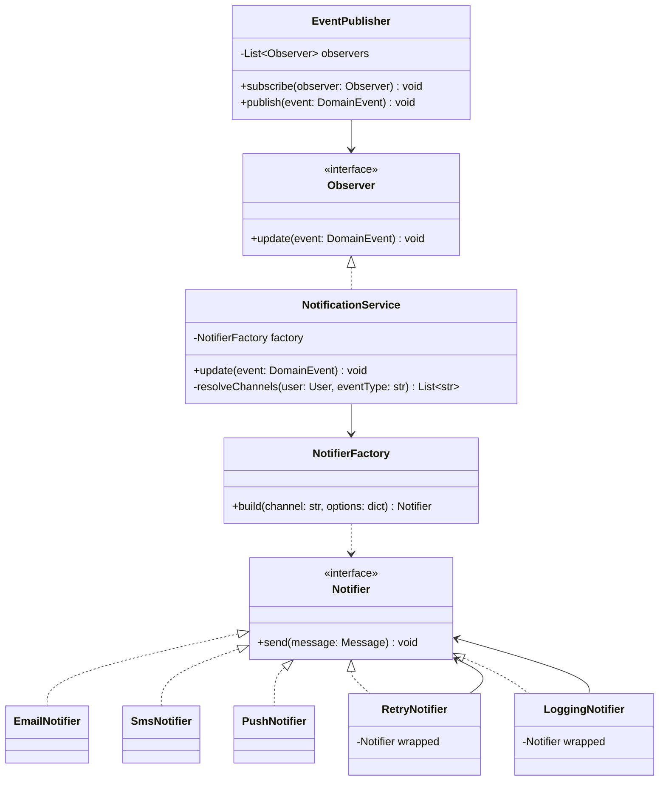

# Notification Service — Low-Level Design

> **Type:** Study notes

The clearest showcase for Observer + Factory + Decorator together: multiple channels (Observer),
picking a channel implementation (Factory), and stacking optional behaviors like retry/logging
(Decorator) without a subclass explosion. If an interviewer wants to see you use three patterns
correctly in one design, this is the prompt.

## Requirements / Scope

**Functional**
- Send a notification to a user across one or more channels: email, SMS, push.
- A user has channel preferences (opted in/out per channel, per notification type).
- Some notifications need retry-on-failure; some need delivery logging/audit; both should be
  combinable per channel without duplicating channel logic.
- Multiple parts of the system (order placed, password reset, promo) can trigger notifications
  without each needing to know delivery details.

**Out of scope**: actual email/SMS provider integration code (mention "wraps a provider SDK like
SendGrid/Twilio behind the interface," don't design the provider client), template rendering
engine internals.

**Non-functional**: adding a new channel or a new optional behavior (e.g. rate-limiting outbound
SMS) should not require editing existing channel classes.

## Key Classes & Responsibilities

| Class | Responsibility |
|---|---|
| `NotificationService` | Public entry point: `notify(user, event)` — looks up preferences, builds and sends via each enabled channel |
| `Notifier` (interface) | `send(message)` — implemented by `EmailNotifier`, `SmsNotifier`, `PushNotifier` |
| `NotifierFactory` | Builds the right concrete `Notifier` (possibly wrapped in decorators) for a channel + notification type |
| `RetryNotifier`, `LoggingNotifier` (Decorators) | Wrap any `Notifier` to add retry/audit behavior |
| `EventPublisher` (Observer subject) | Domain code publishes events; `NotificationService` subscribes, decoupling triggering code from delivery |
| `NotificationPreference` | Per-user, per-channel, per-event-type opt-in/opt-out |

## Class Diagram



## Key Design Decisions

**1. Observer decouples "something happened" from "send a notification."** Order placement,
password reset, and promo code logic each call `EventPublisher.publish(event)` and know nothing
about email/SMS/push — `NotificationService` is just one subscriber among potentially several
(analytics, audit logging could subscribe too). See
[`../fundamentals/design_patterns.md#observer--event-notification`](../fundamentals/design_patterns.md#observer--event-notification).

```python
from typing import Protocol
from dataclasses import dataclass

@dataclass
class DomainEvent:
    event_type: str
    user_id: str
    payload: dict

class Observer(Protocol):
    def update(self, event: DomainEvent) -> None: ...

class EventPublisher:
    def __init__(self):
        self._observers: list[Observer] = []

    def subscribe(self, observer: Observer) -> None:
        self._observers.append(observer)

    def publish(self, event: DomainEvent) -> None:
        for obs in self._observers:
            obs.update(event)
```

**2. Decorator stacks optional behavior per channel, combinatorially, without new subclasses.**
Retry and logging apply independently to any channel — subclassing (`RetryableEmailNotifier`,
`LoggedEmailNotifier`, `RetryableLoggedEmailNotifier`, ...) would need 2^N classes for N optional
behaviors; decorators need N classes total, composed by nesting order. See
[`../fundamentals/extensible_code_design.md#composition-over-inheritance-applied-to-extensibility-specifically`](../fundamentals/extensible_code_design.md#composition-over-inheritance-applied-to-extensibility-specifically).

```python
import time

class EmailNotifier:
    def send(self, message: str) -> None:
        print(f"[email] {message}")   # would call an SDK client in production

class RetryNotifier:
    def __init__(self, wrapped: "Notifier", max_attempts: int = 3):
        self.wrapped = wrapped
        self.max_attempts = max_attempts

    def send(self, message: str) -> None:
        for attempt in range(1, self.max_attempts + 1):
            try:
                self.wrapped.send(message)
                return
            except Exception:
                if attempt == self.max_attempts:
                    raise
                time.sleep(2 ** attempt)   # exponential backoff

class LoggingNotifier:
    def __init__(self, wrapped: "Notifier"):
        self.wrapped = wrapped

    def send(self, message: str) -> None:
        print(f"[audit] sending: {message}")
        self.wrapped.send(message)
        print("[audit] sent")

# critical (e.g. password reset) gets both; low-priority (e.g. promo) gets neither
critical_email = LoggingNotifier(RetryNotifier(EmailNotifier()))
promo_email = EmailNotifier()
```

**3. Factory centralizes *which* decorators wrap *which* channel for *which* event type**, so this
policy lives in one place instead of scattered `if event_type == "password_reset"` checks at every
call site.

```python
class NotifierFactory:
    CRITICAL_EVENTS = {"password_reset", "payment_failed"}

    def build(self, channel: str, event_type: str) -> "Notifier":
        base: Notifier = {"email": EmailNotifier(), "sms": SmsNotifier(), "push": PushNotifier()}[channel]
        if event_type in self.CRITICAL_EVENTS:
            return LoggingNotifier(RetryNotifier(base))
        return base
```

**4. Preferences resolved once, per user, before fan-out** — `NotificationService.update()` reads
`NotificationPreference` to get the enabled channel list for this user + event type, then calls the
factory per channel. Keeps the opt-in/opt-out rule in one place, testable independent of any
channel's send logic.

## Extensibility

- **New channel (e.g. WhatsApp)**: one new `Notifier` implementation, register it in the factory's
  channel map — `EventPublisher`, `NotificationService`, and existing decorators untouched.
- **New optional behavior (e.g. rate-limiting outbound SMS to avoid provider throttling)**: one new
  decorator, composed the same way as `RetryNotifier`/`LoggingNotifier`.
- **User-configurable "quiet hours"**: a decision made in `NotificationService.resolveChannels()`
  (e.g. suppress push, queue for later) — doesn't touch `Notifier` implementations at all, since
  it's about *whether* to send, not *how*.

## Follow-up Questions

- "How would you test `RetryNotifier` without actually retrying 3 times with real delays?" — inject
  a fake/mock `Notifier` that raises on the first N calls, and either mock `time.sleep` or make the
  backoff function injectable — a natural DIP application (see
  [`solid_principles.md`](../fundamentals/solid_principles.md#dip-the-interviewer-asks-how-youd-test-or-swap-a-piece)).
- "What if two decorators need to run in a specific order (e.g. rate-limit check must happen before
  retry, not after)?" — the composition order at construction time (`RateLimitNotifier(RetryNotifier(base))`
  vs. the reverse) *is* the answer — decorators execute outside-in, so say explicitly which order
  you're choosing and why.
- "How do you avoid sending the same notification twice if `publish()` is called twice for the same
  event (e.g. a retried API call)?" — idempotency key on the event (see
  [`../../05_backend_engineering/09_idempotency_and_retries.md`](../../05_backend_engineering/09_idempotency_and_retries.md)),
  checked before dispatch — out of the LLD class model itself but a fair follow-up.
