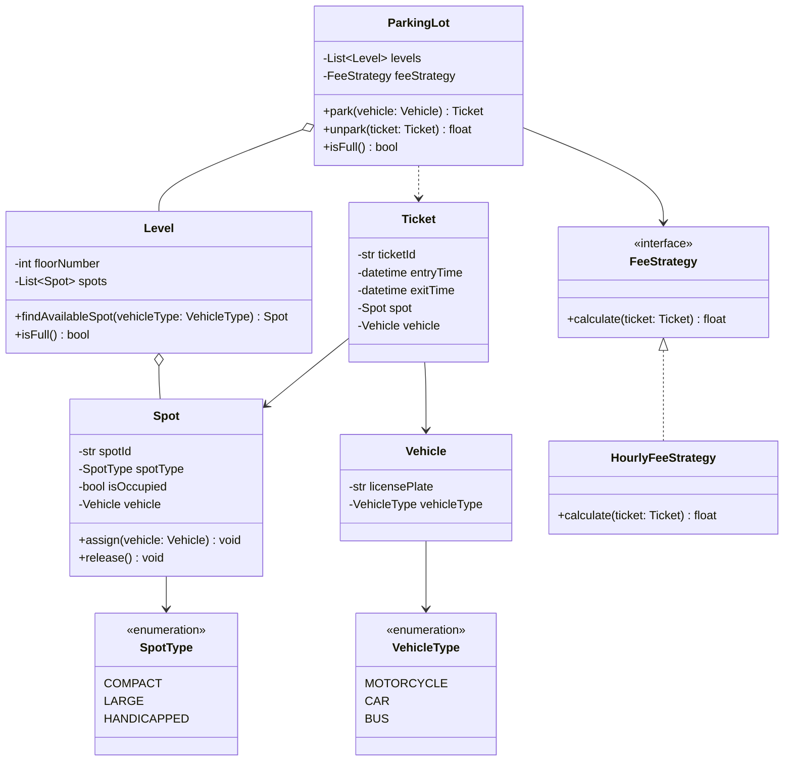

# Parking Lot — Low-Level Design

> **Type:** Study notes

Classic LLD warm-up: it's small enough to finish in 30-40 minutes but touches object modeling,
an assignment algorithm, and a pluggable pricing rule — exactly the three things interviewers are
grading. Treat it as a vehicle for demonstrating clean class boundaries, not a puzzle with one
correct answer.

## Requirements / Scope

**Functional**
- A `ParkingLot` has multiple `Level`s, each with a fixed number of `Spot`s of different
  `SpotType` (compact, large, handicapped).
- A `Vehicle` (motorcycle, car, bus — with a matching `VehicleType`) can park if a suitable spot
  exists, and gets a `Ticket` with entry time and assigned spot.
- On exit, the system computes a fee from the ticket's duration and issues a receipt.
- The lot can report whether it's full, and how many free spots remain per type/level.

**Out of scope**: payment gateway integration, multiple entry/exit gates with concurrency, license
plate recognition — mention these exist but don't design them here unless asked.

**Non-functional**: spot lookup and assignment should be fast (interviewer wants O(1)/O(log n), not
a linear scan of every spot on every park call) — this drives the design decision below.

## Key Classes & Responsibilities

| Class | Responsibility |
|---|---|
| `ParkingLot` | Owns `Level`s, entry point for `park(vehicle)` / `unpark(ticket)`, tracks overall availability |
| `Level` | Owns a fixed set of `Spot`s, finds/reserves an available spot for a vehicle type |
| `Spot` | A single space with a `SpotType` and occupied/free state; knows which `Vehicle` (if any) occupies it |
| `Vehicle` | Has a `VehicleType` and license plate; `VehicleType` determines which `SpotType`s it fits |
| `Ticket` | Issued at entry — vehicle, spot, entry timestamp; closed at exit with exit timestamp and fee |
| `FeeStrategy` (interface) | Computes fee from a `Ticket`'s duration — swappable pricing rule |

## Class Diagram



## Key Design Decisions

**1. Spot assignment: nearest-available vs. strict type-matching.**
Two reasonable strategies: (a) assign the nearest free spot of *any* compatible type (a car can
squeeze into a large spot if no compact is free) or (b) strict type-matching (a car only takes
compact/large, never handicapped unless the vehicle has a permit). Say out loud which you're
picking and why — (b) is usually the right default because handicapped spots are a compliance
requirement, not just an optimization, so they should never be given to a non-permitted vehicle
even when the lot is otherwise full. Implement spot lookup per level as a `dict[SpotType,
set[Spot]]` so `findAvailableSpot` is O(1) average instead of scanning every spot — this is the
detail that shows you thought about the non-functional requirement, not just the class model.

**2. Handling a full lot.** `park()` should return `None`/raise a `NoAvailableSpotError` rather than
silently failing, and `ParkingLot.isFull()` should be O(1) — maintain a running free-spot counter
per type instead of recomputing by scanning levels on every call. This is a place interviewers
probe: "what if I ask you to display available spots on a sign at the entrance?" — the counter you
already maintain answers that for free.

**3. Fee calculation — Strategy pattern.** Pricing rules change often (flat rate, hourly, first-hour-free,
weekend rate) and shouldn't require touching `ParkingLot`. See
[design_patterns.md](../fundamentals/design_patterns.md#strategy--interchangeable-algorithms) —
`ParkingLot` holds a `FeeStrategy` reference and delegates; swapping pricing models is a new class,
not an `if/elif` chain inside `unpark()`.

## Python Code Excerpt

```python
from typing import Protocol
from datetime import datetime, timedelta


class FeeStrategy(Protocol):
    def calculate(self, entry_time: datetime, exit_time: datetime) -> float: ...


class HourlyFeeStrategy:
    """$2/hour, any partial hour rounds up."""

    RATE_PER_HOUR = 2.0

    def calculate(self, entry_time: datetime, exit_time: datetime) -> float:
        duration_seconds = (exit_time - entry_time).total_seconds()
        hours = max(1, -(-int(duration_seconds) // 3600))  # ceil division, min 1 hour
        return hours * self.RATE_PER_HOUR


class FirstHourFreeFeeStrategy:
    """Wraps another strategy: first 60 minutes free, remainder billed normally."""

    def __init__(self, base_strategy: FeeStrategy):
        self.base_strategy = base_strategy

    def calculate(self, entry_time: datetime, exit_time: datetime) -> float:
        duration_seconds = (exit_time - entry_time).total_seconds()
        if duration_seconds <= 3600:
            return 0.0
        billed_entry_time = entry_time + timedelta(hours=1)  # skip the free first hour
        return self.base_strategy.calculate(billed_entry_time, exit_time)
```

## Extensibility

- **Multiple entry/exit gates**: each gate becomes a thin wrapper that calls the same
  `ParkingLot.park()`/`unpark()` — the concurrency concern (two gates racing to assign the last
  spot) pushes `Spot.assign()` toward needing a per-spot lock or a compare-and-swap on the free-spot
  set. See [thread_safety_and_concurrency.md](../fundamentals/thread_safety_and_concurrency.md).
- **Reserved/monthly-pass spots**: add a `SpotType.RESERVED` and a `reservedFor: Member` field on
  `Spot` — `findAvailableSpot` filters those out for walk-in vehicles without touching other classes.
- **Dynamic/surge pricing**: another `FeeStrategy` implementation reading current occupancy —
  nothing outside `FeeStrategy` changes.

## Follow-up Questions

- "How would you handle two vehicles trying to grab the same spot simultaneously?" — per-spot lock
  or an atomic `compare_and_swap` on the free-spot set; discuss why a lock at the `Level` scope
  would be correct but needlessly serializes unrelated spots.
- "How do you find a specific vehicle's spot without scanning the whole lot?" — keep a
  `dict[licensePlate, Ticket]` index in `ParkingLot`, not just per-level spot sets.
- "What changes if the lot has multiple pricing zones (e.g. premium spots near the entrance cost
  more)?" — `FeeStrategy` becomes a property of `Spot` or `SpotType`, not a single lot-wide strategy.
