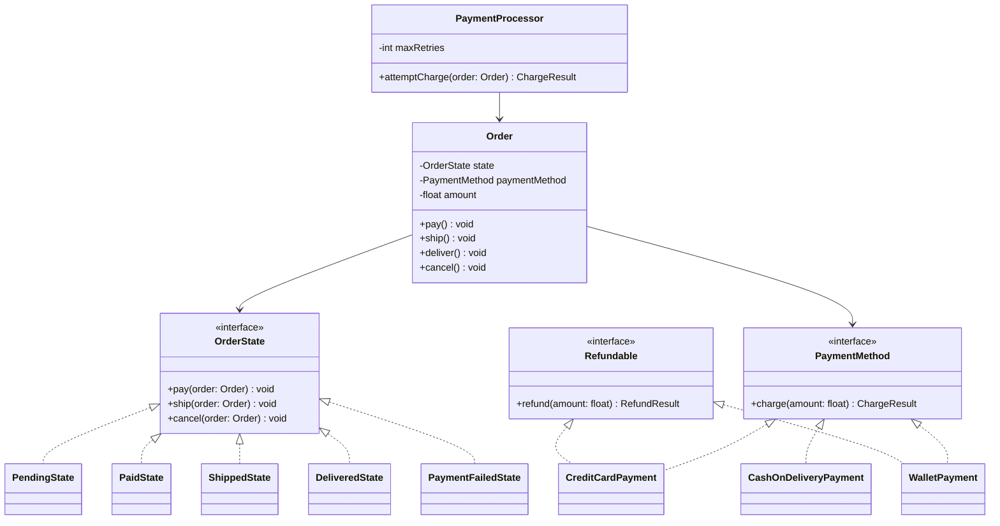

# Payment Workflow — Low-Level Design

> **Type:** Study notes

State (order/payment lifecycle) plus Strategy (multiple payment methods) plus ISP (not every
payment method supports every operation) — the exercise that most directly tests whether you can
combine multiple patterns cleanly instead of reaching for just one. A near-guaranteed "now add
partial refunds" or "now add a new payment method" follow-up.

## Requirements / Scope

**Functional**
- An `Order` moves through a lifecycle: `PENDING` → `PAID` → `SHIPPED` → `DELIVERED`, with
  `CANCELLED` and `REFUNDED` as branch states.
- Charging supports multiple payment methods: credit card, PayPal-style wallet, cash on delivery
  (COD).
- Refunds (full or partial) are supported for chargeable methods, not for COD.
- Failed charges retry with backoff up to a limit, then the order moves to a `PAYMENT_FAILED`
  state.

**Out of scope**: actual PCI-compliant card data handling, real gateway integration (mention it
sits behind the `PaymentMethod` interface — "in production this calls Stripe/Braintree, not raw
card data").

**Non-functional**: an order's state transitions must be valid only in specific sequences (e.g. you
can't ship a `PENDING` order) — invalid transitions should fail loudly, not silently corrupt state.

## Key Classes & Responsibilities

| Class | Responsibility |
|---|---|
| `Order` | Owns current `OrderState`, delegates transition requests to it |
| `OrderState` (interface) | `PendingState`, `PaidState`, `ShippedState`, `DeliveredState`, `CancelledState`, `PaymentFailedState` — governs which transitions are legal |
| `PaymentMethod` (interface) | `charge()`, composed with optional `Refundable` |
| `CreditCardPayment`, `WalletPayment` | Implement `PaymentMethod` + `Refundable` |
| `CashOnDeliveryPayment` | Implements `PaymentMethod` only — no refund capability |
| `Refundable` (interface) | `refund(amount)` — separate from `PaymentMethod` on purpose (ISP) |
| `PaymentProcessor` | Orchestrates charge attempts, retry policy, and order-state transitions together |

## Class Diagram



## Key Design Decisions

**1. State pattern for the order lifecycle — illegal transitions fail loudly.**

```python
from typing import Protocol

class OrderState(Protocol):
    def pay(self, order: "Order") -> None: ...
    def ship(self, order: "Order") -> None: ...
    def cancel(self, order: "Order") -> None: ...

class InvalidTransitionError(Exception):
    pass

class PendingState:
    def pay(self, order: "Order") -> None:
        result = order.payment_method.charge(order.amount)
        order.state = PaidState() if result.success else PaymentFailedState()

    def ship(self, order: "Order") -> None:
        raise InvalidTransitionError("cannot ship an unpaid order")

    def cancel(self, order: "Order") -> None:
        order.state = CancelledState()

class PaidState:
    def pay(self, order: "Order") -> None:
        raise InvalidTransitionError("order already paid")

    def ship(self, order: "Order") -> None:
        order.state = ShippedState()

    def cancel(self, order: "Order") -> None:
        # cancelling a paid-but-unshipped order triggers a refund, not a silent state change
        if isinstance(order.payment_method, Refundable):
            order.payment_method.refund(order.amount)
        order.state = CancelledState()
```
Raising `InvalidTransitionError` rather than silently ignoring `order.ship()` on a `PendingState`
is a deliberate choice — say why: a silent no-op hides a caller bug (something tried to ship an
unpaid order), where a loud failure surfaces it immediately.

**2. `Refundable` split from `PaymentMethod` — the direct ISP application.** COD implements
`PaymentMethod` only; forcing it to implement `refund()` would mean either raising
`NotImplementedError` (the code smell named in
[`solid_principles.md`](../fundamentals/solid_principles.md#isp-the-interviewer-adds-a-capability-only-some-implementers-need))
or silently no-op-ing, both worse than just not implementing the interface.

```python
class Refundable(Protocol):
    def refund(self, amount: float) -> "RefundResult": ...

class CreditCardPayment:
    def charge(self, amount: float) -> "ChargeResult":
        ...  # calls gateway SDK
    def refund(self, amount: float) -> "RefundResult":
        ...  # calls gateway SDK

class CashOnDeliveryPayment:
    def charge(self, amount: float) -> "ChargeResult":
        return ChargeResult(success=True)   # "charge" = confirming the COD order
    # deliberately no refund() — caller must isinstance-check before calling
```
Calling code checks `isinstance(order.payment_method, Refundable)` before attempting a refund (as
shown in `PaidState.cancel` above) — this is the pattern's payoff: the type system (or at least a
clear runtime check) prevents "refund a COD order" from being attempted at all, rather than failing
inside `refund()`.

**3. Retry with backoff lives in `PaymentProcessor`, not inside `PaymentMethod` implementations.**
Retry policy is orthogonal to *how* a specific method charges — mixing them would mean every new
`PaymentMethod` re-implements retry logic. `PaymentProcessor` wraps the charge attempt:

```python
import time

class PaymentProcessor:
    def __init__(self, max_retries: int = 3):
        self.max_retries = max_retries

    def attempt_charge(self, order: "Order") -> "ChargeResult":
        for attempt in range(1, self.max_retries + 1):
            result = order.payment_method.charge(order.amount)
            if result.success:
                return result
            if attempt < self.max_retries:
                time.sleep(2 ** attempt)
        return result   # last failed result, order.pay() will move to PaymentFailedState
```
This mirrors the `RetryNotifier` decorator idea from
[`notification_service.md`](notification_service.md) but as a plain wrapper class rather than a
decorator implementing the same interface — worth naming that distinction if asked why you didn't
use Decorator here: `PaymentProcessor` also owns order-state transitions, which is a different
responsibility than "wrap and re-expose the same interface."

## Extensibility

- **New payment method (e.g. Apple Pay)**: implement `PaymentMethod` (+ `Refundable` if
  applicable) — no other class changes, this is exactly the seam
  [`extensible_code_design.md`](../fundamentals/extensible_code_design.md) argues for building
  before being asked.
- **Partial refunds**: `Refundable.refund(amount)` already takes an amount rather than being a bare
  "refund everything" call — a deliberate choice, worth pointing out unprompted, since it means
  partial refunds need zero interface changes, just a smaller `amount` argument and a new
  `PartiallyRefundedState` if the lifecycle needs to distinguish it from full refund.
- **Split payments (part card, part wallet)**: a `CompositePaymentMethod` implementing
  `PaymentMethod` by delegating to a list of sub-methods proportionally — same interface, no change
  to `Order` or `OrderState`.

## Follow-up Questions

- "How do you prevent double-charging if the retry logic and the payment gateway both think the
  first attempt might have succeeded (network timeout, ambiguous outcome)?" — idempotency keys per
  charge attempt, passed to the gateway so a retried request with the same key is a no-op on their
  side if the first one actually succeeded — see
  [`../../05_backend_engineering/09_idempotency_and_retries.md`](../../05_backend_engineering/09_idempotency_and_retries.md).
- "What if `ship()` needs to be async (calls a shipping provider that takes seconds)?" — the State
  pattern itself doesn't need to change; `ShippedState` triggering an async call is an
  implementation detail inside the state's `ship()` method, though the interviewer may want you to
  discuss how the eventual async result (webhook callback) transitions the order forward — see
  [`../../05_backend_engineering/10_webhooks.md`](../../05_backend_engineering/10_webhooks.md).
- "Why is retry logic in `PaymentProcessor` and not in each `PaymentMethod`?" — Single Responsibility:
  a payment method's job is knowing *how* to charge a specific provider; retry/backoff policy is a
  cross-cutting concern that should be uniform across all methods and configurable in one place,
  not duplicated N times.
