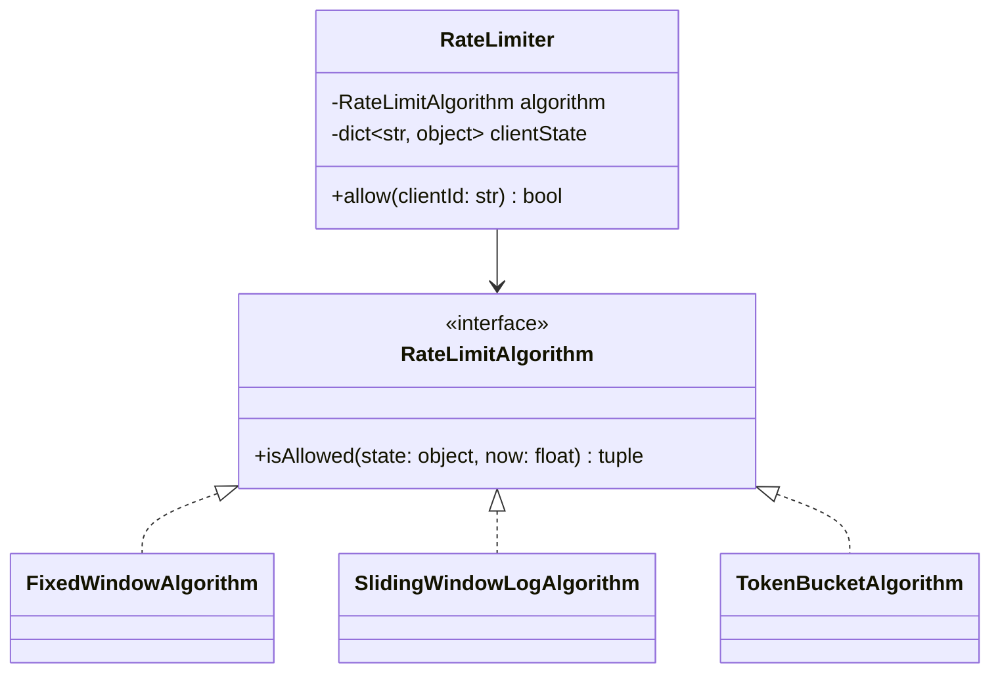

# Rate Limiter (Class-Level Design) — Low-Level Design

> **Type:** Study notes

This is the LLD version of rate limiting — a single class with a pluggable algorithm, evaluated on
correctness and API cleanliness. The distributed version (shared state across app servers, Redis-
backed, at scale) is a separate exercise:
[`../../06_system_design/exercises/rate_limiter.md`](../../06_system_design/exercises/rate_limiter.md).
Interviewers sometimes run both in the same conversation — start here, then be ready to say "now
make this work across 5 app server instances" and point at the system-design file's answer.

## Requirements / Scope

**Functional**
- `allow(client_id) -> bool`: returns whether the current request from `client_id` is permitted.
- Configurable limit (N requests per time window).
- Support at least two algorithms: fixed window and sliding window (token bucket as a stretch).

**Out of scope**: distributed coordination, persistence across restarts — single-process, in-memory
only, unless the interviewer explicitly widens scope.

**Non-functional**: `allow()` must be O(1) amortized per call regardless of how long the client has
been making requests — this rules out naively storing every timestamp forever.

## Key Classes & Responsibilities

| Class | Responsibility |
|---|---|
| `RateLimiter` | Public `allow(client_id)`, holds a `RateLimitAlgorithm` and per-client state |
| `RateLimitAlgorithm` (interface) | `FixedWindowAlgorithm`, `SlidingWindowLogAlgorithm`, `TokenBucketAlgorithm` — decides allow/deny given a client's history |

## Class Diagram



## Key Design Decisions

**1. Algorithm behind an interface — this is the whole exercise.** `RateLimiter` owns per-client
state and delegates the allow/deny decision; swapping fixed-window for sliding-window is a new
class, not a rewrite. See
[`../fundamentals/design_patterns.md#strategy--interchangeable-algorithms`](../fundamentals/design_patterns.md#strategy--interchangeable-algorithms).

**2. Fixed window — simplest, has a real correctness flaw to name unprompted.**

```python
import time

class FixedWindowAlgorithm:
    def __init__(self, limit: int, window_seconds: int):
        self.limit = limit
        self.window_seconds = window_seconds

    def is_allowed(self, state: dict, now: float) -> bool:
        window_id = int(now // self.window_seconds)
        if state.get("window_id") != window_id:
            state["window_id"] = window_id
            state["count"] = 0
        if state["count"] >= self.limit:
            return False
        state["count"] += 1
        return True
```
**The flaw to say out loud:** a client can send `limit` requests in the last second of one window
and `limit` more in the first second of the next — 2x the intended rate in a short burst straddling
the boundary. This is *the* fact that separates a candidate who's implemented rate limiting before
from one who hasn't.

**3. Sliding window log — fixes the boundary problem, costs more memory.**

```python
from collections import deque

class SlidingWindowLogAlgorithm:
    def __init__(self, limit: int, window_seconds: int):
        self.limit = limit
        self.window_seconds = window_seconds

    def is_allowed(self, state: dict, now: float) -> bool:
        timestamps: deque = state.setdefault("timestamps", deque())
        cutoff = now - self.window_seconds
        while timestamps and timestamps[0] <= cutoff:
            timestamps.popleft()               # amortized O(1): each timestamp popped once ever
        if len(timestamps) >= self.limit:
            return False
        timestamps.append(now)
        return True
```
Trade-off to name: O(limit) memory per client (every timestamp in the current window), vs. O(1)
for fixed window — for a high-limit, high-client-count service this matters and is a real reason to
prefer an approximation like sliding-window *counter* (weighted average of current and previous
fixed windows) instead of the full log, if the interviewer pushes on memory.

**4. Token bucket — allows controlled bursts, the one most real systems actually use.**

```python
class TokenBucketAlgorithm:
    def __init__(self, capacity: int, refill_rate_per_sec: float):
        self.capacity = capacity
        self.refill_rate = refill_rate_per_sec

    def is_allowed(self, state: dict, now: float) -> bool:
        tokens = state.get("tokens", self.capacity)
        last_refill = state.get("last_refill", now)
        tokens = min(self.capacity, tokens + (now - last_refill) * self.refill_rate)
        if tokens < 1:
            state["tokens"], state["last_refill"] = tokens, now
            return False
        state["tokens"], state["last_refill"] = tokens - 1, now
        return True
```
Why interviewers like token bucket: it explicitly allows a burst up to `capacity` while enforcing a
long-run average rate — a real product requirement ("allow occasional spikes, not just a hard
per-second cap") that fixed/sliding window don't naturally express.

## Extensibility

- **Per-endpoint limits, not just per-client**: key state by `(client_id, endpoint)` instead of
  `client_id` alone — no change to any `RateLimitAlgorithm`.
- **Different limits per client tier** (free vs. paid): inject a different `limit`/`capacity` per
  client at `RateLimiter` construction or lookup time, not a branch inside the algorithm.
- **Distributed enforcement**: this is the jump to
  [`../../06_system_design/exercises/rate_limiter.md`](../../06_system_design/exercises/rate_limiter.md)
  — replace in-process `dict` state with Redis, and note that token bucket's refill math maps
  cleanly onto a Redis Lua script for atomicity across app servers.

## Follow-up Questions

- "What's wrong with fixed window, precisely, and which algorithm fixes it?" — boundary burst
  allowing ~2x the intended rate; sliding window log or sliding window counter fixes it by
  considering a rolling interval instead of a hard reset.
- "Why would you ever pick fixed window given the flaw?" — its O(1) memory per client and dead-
  simple implementation; for coarse, generous limits (1000 req/min) the boundary burst is often an
  acceptable trade for the simplicity and memory savings, and this is a legitimate answer if you
  name the trade-off rather than presenting fixed-window as strictly worse.
- "How do you extend this to work across multiple app server processes?" — in-memory `dict` state
  doesn't survive that; state needs to move to a shared store (Redis `INCR`+`EXPIRE` for fixed
  window, a Lua script for atomic token-bucket refill+decrement) — see the system-design version of
  this exercise.
