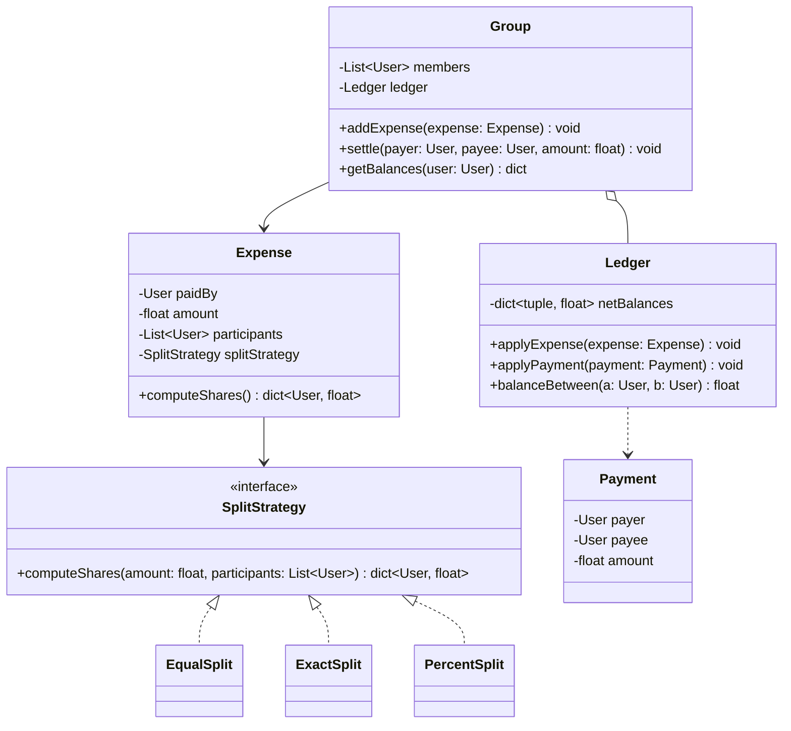

# Splitwise (Expense-Sharing) — Low-Level Design

> **Type:** Study notes

The graph/ledger exercise: the interesting design decision isn't the class model (it's simple),
it's the **debt-simplification algorithm** — how you reduce a tangle of pairwise debts to the
minimum number of settling transactions. This is where most of the interview time should go.

## Requirements / Scope

**Functional**
- A `Group` has `User`s. Any user can add an `Expense` paid by one user and split among a subset of
  the group, in one of several ways (equal, exact amounts, percentage).
- The system tracks each pair's net balance (who owes whom, how much).
- A user can view their overall balance and settle up with another user (records a `Payment`,
  zeroes or reduces that pairwise balance).
- Optionally: "simplify debts" — minimize the number of transactions needed to settle the whole
  group.

**Out of scope**: actual money movement/payment gateway integration (mention it hands off to
[`payment_workflow.md`](payment_workflow.md)), multi-currency conversion.

**Non-functional**: computing a user's total balance should be O(1) amortized (maintained
incrementally), not recomputed by summing every expense on every query.

## Key Classes & Responsibilities

| Class | Responsibility |
|---|---|
| `Group` | Owns members and expenses, exposes `addExpense()`, `getBalances()` |
| `Expense` | Amount, payer, participants, `SplitStrategy` used |
| `SplitStrategy` (interface) | Computes each participant's owed share — `EqualSplit`, `ExactSplit`, `PercentSplit` |
| `Ledger` | Maintains the pairwise net-balance matrix (`user_a → user_b → amount`), updated incrementally on every expense/payment |
| `Payment` | A settlement record between two users |
| `DebtSimplifier` | Reduces the full pairwise balance graph to a minimal set of settling transactions |

## Class Diagram



## Key Design Decisions

**1. Split logic as Strategy — one interface, three implementations.**

```python
from typing import Protocol

class SplitStrategy(Protocol):
    def compute_shares(self, amount: float, participants: list[str]) -> dict[str, float]: ...

class EqualSplit:
    def compute_shares(self, amount: float, participants: list[str]) -> dict[str, float]:
        share = round(amount / len(participants), 2)
        shares = {p: share for p in participants}
        # remainder from rounding goes to the first participant, so shares always sum to `amount`
        shares[participants[0]] += round(amount - share * len(participants), 2)
        return shares

class ExactSplit:
    def __init__(self, amounts: dict[str, float]):
        self._amounts = amounts

    def compute_shares(self, amount: float, participants: list[str]) -> dict[str, float]:
        assert abs(sum(self._amounts.values()) - amount) < 0.01, "exact splits must sum to total"
        return dict(self._amounts)
```
The rounding-remainder line in `EqualSplit` is worth saying out loud unprompted — `100 / 3` split
three ways is a real bug in a naive implementation (shares sum to $99.99, not $100.00), and
interviewers notice whether you caught it yourself.

**2. Store net pairwise balances, not raw transaction history, as the source of truth for
"who owes whom."** Keep the transaction log (`Expense`s, `Payment`s) for audit/history, but
maintain a separate `Ledger` that's updated incrementally — this is what makes `getBalances()`
O(1) instead of replaying every expense on every query.

```python
from collections import defaultdict

class Ledger:
    def __init__(self):
        # net[a][b] = amount b owes a (positive) or a owes b (negative net[b][a])
        self._net: dict[str, dict[str, float]] = defaultdict(lambda: defaultdict(float))

    def apply_expense(self, paid_by: str, shares: dict[str, float]) -> None:
        for participant, owed_amount in shares.items():
            if participant == paid_by:
                continue
            self._net[paid_by][participant] += owed_amount
            self._net[participant][paid_by] -= owed_amount

    def balance_between(self, a: str, b: str) -> float:
        return self._net[a][b]   # positive: b owes a
```

**3. Debt simplification — the core algorithmic piece.** Given the net-balance graph, compute each
user's total net position (positive = net creditor, negative = net debtor), then greedily match
the largest creditor with the largest debtor repeatedly. This is a variant of a classic
greedy/heap problem (see
[`../../02_dsa_and_coding/patterns/12_greedy/concept.md`](../../02_dsa_and_coding/patterns/12_greedy/concept.md))
— minimizing transaction count is NP-hard in general (it's a partition-into-zero-sum-subsets
problem), but the greedy largest-creditor/largest-debtor pairing is the standard accepted
interview answer and is optimal for the common case:

```python
import heapq

def simplify_debts(net_positions: dict[str, float]) -> list[tuple[str, str, float]]:
    creditors = [(-amt, user) for user, amt in net_positions.items() if amt > 0.01]
    debtors = [(amt, user) for user, amt in net_positions.items() if amt < -0.01]
    heapq.heapify(creditors)   # max-heap via negation
    heapq.heapify(debtors)     # min-heap (most negative first)

    transactions = []
    while creditors and debtors:
        neg_credit, creditor = heapq.heappop(creditors)
        debt, debtor = heapq.heappop(debtors)
        settle_amount = min(-neg_credit, -debt)
        transactions.append((debtor, creditor, round(settle_amount, 2)))

        remaining_credit = -neg_credit - settle_amount
        remaining_debt = debt + settle_amount
        if remaining_credit > 0.01:
            heapq.heappush(creditors, (-remaining_credit, creditor))
        if remaining_debt < -0.01:
            heapq.heappush(debtors, (remaining_debt, debtor))
    return transactions
```
Say the complexity out loud: O(n log n) for n users, versus O(n²) pairwise settlements without
simplification — this is exactly the kind of number an interviewer wants to hear unprompted.

## Extensibility

- **Group-level "expense categories" or spending reports**: additive metadata on `Expense`,
  doesn't touch `Ledger` or `DebtSimplifier`.
- **Recurring expenses (rent, subscriptions)**: a `RecurringExpense` that generates `Expense`
  instances on a schedule — the schedule is a new concern, expense creation/splitting is unchanged.
- **Partial settlements**: `Payment` already reduces a pairwise balance incrementally rather than
  zeroing it, so this falls out of the `Ledger` design for free — worth pointing out that you
  designed for it without being asked.

## Follow-up Questions

- "Why not just store every expense and sum on read?" — O(1) balance queries vs. O(n) replay per
  query; the incremental `Ledger` trades a small amount of write-time bookkeeping for much cheaper
  reads, which is the right trade-off since balance lookups vastly outnumber expense writes in a
  real app.
- "Is minimal-transaction debt simplification always achievable by the greedy algorithm?" — no,
  true minimum-transaction-count is NP-hard in general (equivalent to finding a minimum set of
  zero-sum subsets); the greedy largest-creditor/largest-debtor approach is a good, standard
  approximation and is optimal in most practical group-size cases — say this precisely rather than
  claiming greedy is provably optimal.
- "What happens to `Ledger` if a user is removed from the group with a nonzero balance?" — reject
  the removal until settled, or transfer the residual balance to an explicit "settled externally"
  record; don't silently drop it.
