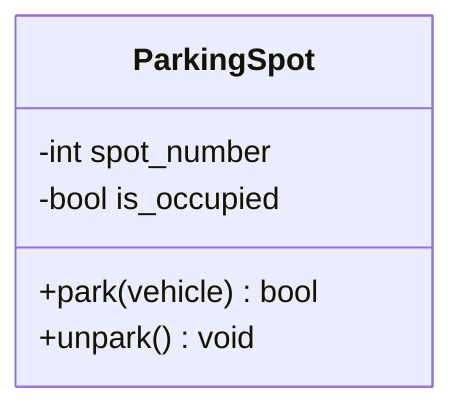
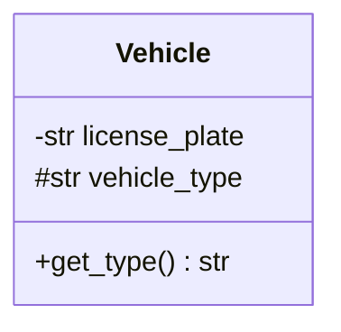
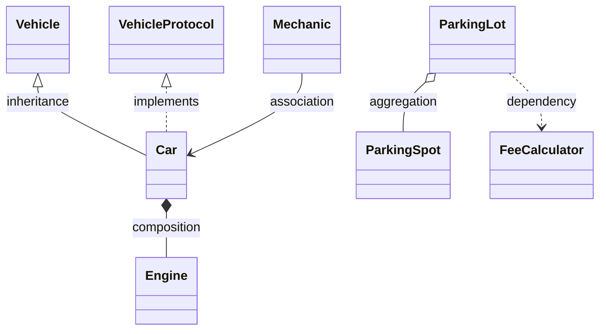
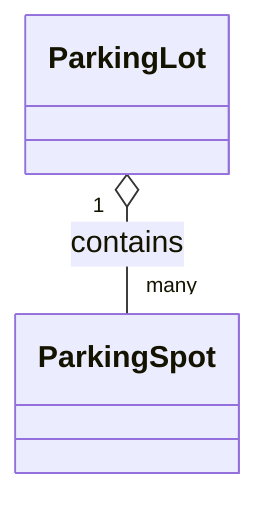
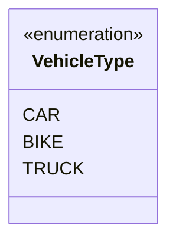
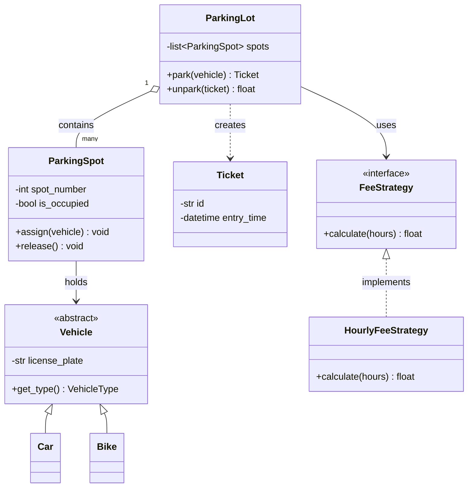

# UML Class Diagrams with Mermaid

> **Type:** Study notes

## Why interviewers ask this

Most LLD interviews expect you to sketch a class diagram — on a whiteboard, in a shared doc, or (in
remote/take-home settings) as text — before or alongside code. It's the fastest way to communicate
"here are my classes and how they relate" without writing full method bodies, and it's what lets an
interviewer spot a design problem (a missing relationship, a class doing too much) in seconds
instead of reading 200 lines of Python. This file is a reference: every exercise in
[`../exercises/`](../exercises/) includes a Mermaid `classDiagram`, and the syntax here is what
those diagrams use.

## The basics: `classDiagram`



- `classDiagram` starts the block (fenced with ` ```mermaid `).
- `class Name { ... }` defines a class with attributes and methods inside braces.
- Attributes/methods can also be added outside the braces: `ParkingSpot : +park(vehicle) bool`.

## Visibility markers

| Symbol | Meaning | Python equivalent |
|---|---|---|
| `+` | public | plain name (`self.name`) |
| `-` | private | name-mangled (`self.__name`) |
| `#` | protected | single underscore convention (`self._name`) |
| `~` | package-private | no real Python equivalent — rarely used, safe to skip |



## Relationship arrows — the part people get wrong

| Relationship | Arrow (Parent/Whole first) | Meaning | Python maps to |
|---|---|---|---|
| Inheritance (is-a) | `<\|--` | subtype extends supertype: `Vehicle <\|-- Car` | `class Car(Vehicle):` |
| Interface implementation | `<\|..` | class implements a protocol/interface (dashed line): `VehicleProtocol <\|.. Car` | `class Car(VehicleProtocol):` |
| Composition (has-a, owned) | `*--` | part's lifetime tied to whole: `Car *-- Engine` | `self.engine = Engine()` created inside owner |
| Aggregation (has-a, shared) | `o--` | part can outlive/exist independently of whole: `ParkingLot o-- ParkingSpot` | `self.spots = spots` passed in, not created |
| Association (uses-a, general) | `-->` | one class references/uses another: `Mechanic --> Car` | a method parameter or a loosely-held reference |
| Dependency (uses-a, transient) | `..>` | uses another class briefly, doesn't store it: `ParkingLot ..> FeeCalculator` | a type only appearing as a method parameter |

Mermaid also accepts the mirrored form (`Car --|> Vehicle`, symbol on the child's side) — both mean
the same thing. Pick one direction and stay consistent within a diagram so it reads left-to-right
the way you're narrating it. The filled diamond (`*`) is composition — think "the engine dies when
the car is scrapped." The open diamond (`o`) is aggregation — think "a `Spot` could exist in a
design even if this specific `ParkingLot` didn't." This maps directly onto
[has-a vs uses-a in oop_design.md](oop_design.md#has-a-vs-is-a-vs-uses-a) — reach for the arrow that
matches which relationship you actually mean, not whichever arrow looks better on the diagram.



Cardinality (how many of each side) goes in quotes near the arrow ends:



## Enums



## A worked example: parking lot



Reading this diagram top to bottom is exactly how you'd narrate it out loud in an interview: "a
`ParkingLot` aggregates many `ParkingSpot`s, each spot holds a `Vehicle` when occupied, `Vehicle` is
abstract with `Car`/`Bike` subtypes, and fee calculation is pulled out into a `FeeStrategy` interface
so pricing rules can vary independently of everything else."

## Practical tips for drawing these live

- **Don't fill in every attribute/method** — 2-3 representative ones per class is enough to
  communicate intent; a fully-specified diagram takes too long and isn't what's being graded.
- **Draw relationships before you draw method bodies.** The arrows are the design; the method
  signatures are implementation detail you can talk through verbally.
- **Composition vs. aggregation is a judgment call, not a strict rule** — if you're not sure, pick
  one, say your reasoning out loud ("I'll treat `Spot` as owned by `ParkingLot` since spots don't
  make sense outside a lot"), and move on. Interviewers care more that you understand the
  distinction than which one you picked for an ambiguous case.

## Interview questions

**Q: What's the practical difference between composition and aggregation in a diagram, and does it
matter if you get it "wrong"?**
A: Composition means the part's lifetime is owned by the whole (deleting the whole deletes the
part); aggregation means the part can exist independently. Getting the "correct" answer matters less
than being able to justify your choice — interviewers are checking you understand the concept, not
grading against one right diamond shape for every ambiguous case.

**Q: When would you use `..>` (dependency) instead of `-->` (association)?**
A: When the relationship is transient — a class only touches another as a method parameter or local
variable and doesn't hold a reference to it as an attribute. If it's stored on `self`, use
association or aggregation/composition instead.

**Q: Why sketch a class diagram before writing code in an LLD interview instead of just coding
directly?**
A: It's faster to iterate on and cheaper to redraw when the interviewer changes a requirement — redoing
an arrow takes seconds, redoing a class hierarchy in code takes minutes; it also gives the
interviewer an early checkpoint to redirect you before you've invested in code that models the wrong
relationships.

## Exercises

1. Draw a `classDiagram` for a library management system: `Library`, `Book`, `Member`, `Loan` — get
   the aggregation/composition and cardinality right (does a `Book` outlive the `Library`? does a
   `Loan` reference an existing `Member` or own one?).
2. Take the parking lot diagram above and extend it for "electric vehicles need a `ChargingSpot`
   subtype of `ParkingSpot` with an extra `charge_vehicle()` method" — add the new class and
   relationship without redrawing the whole diagram from scratch.
