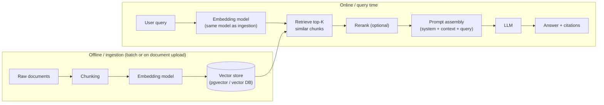

# RAG System Architecture

> **Type:** Study notes

## Why interviewers ask this

RAG (Retrieval-Augmented Generation) is the single most common production LLM architecture, and
"design a RAG system for X" is close to a default system-design prompt at AI-adjacent companies now.
Interviewers use it to see whether you understand RAG as an **engineering pipeline with multiple
independently-failing stages**, not a single black-box call to an LLM — most weak answers stop at
"embed the docs, embed the query, retrieve, stuff into the prompt."

## The pipeline, end to end



Two halves that fail independently: **offline ingestion** (garbage in, garbage out — bad chunking
or a broken embedding job silently degrades every future query) and **online retrieval + generation**
(a query that doesn't retrieve the right chunks gets a confidently wrong answer no matter how good
the LLM is). When debugging "the answers are wrong," the first question is always **which half**:
retrieval returned the wrong context, or generation ignored/misused correct context.

## Stage-by-stage, what each one is actually for

1. **Chunking** — split documents into retrievable units. Get this wrong and nothing downstream can
   fix it (retrieve a chunk that cuts a table in half, and the LLM gets half a table). See
   [Chunking Strategies](10_chunking_strategies.md).
2. **Embedding** — same model, same normalization, at both ingestion and query time (see
   [Embedding Pipelines](09_embedding_pipelines.md)) — a version mismatch here silently tanks recall
   with no error thrown anywhere.
3. **Retrieval** — vector similarity, often combined with keyword/BM25 (hybrid search) and metadata
   filters (`WHERE tenant_id = X`). See [Vector Databases](01_vector_databases_and_similarity_search.md)
   and [Retrieval & Reranking](11_retrieval_and_reranking.md).
4. **Reranking (optional but high-leverage)** — a cheaper, coarser retrieval step over-fetches
   (e.g. top-50), then a more expensive cross-encoder reranks to the true top-K (e.g. top-5) that
   actually goes in the prompt — because vector similarity alone is a decent but imperfect proxy for
   "actually answers this query."
5. **Prompt assembly** — system instructions + retrieved context + conversation history + user
   query, packed to fit the model's context window with the highest-relevance chunks placed where
   the model attends best (see the "lost in the middle" note below).
6. **Generation** — the LLM call itself, ideally instructed to answer only from provided context and
   cite which chunk(s) it used (see [Hallucination Mitigation](07_hallucination_mitigation.md)).

## A minimal Django-flavored implementation sketch

```python
# services/rag.py
from dataclasses import dataclass
from django.conf import settings
from .embeddings import embed_text          # wraps the embedding API call
from .llm_client import LLMClient            # see 04_llm_api_integration.md
from documents.models import DocumentChunk

@dataclass
class RetrievedChunk:
    text: str
    source: str
    score: float

def retrieve(query: str, tenant_id: int, k: int = 5) -> list[RetrievedChunk]:
    query_embedding = embed_text(query)
    # pgvector: <=> is cosine distance; lower is more similar
    chunks = (
        DocumentChunk.objects
        .filter(tenant_id=tenant_id)
        .annotate(distance=CosineDistance("embedding", query_embedding))
        .order_by("distance")[:k]
    )
    return [RetrievedChunk(c.text, c.source_document.title, 1 - c.distance) for c in chunks]

def answer(query: str, tenant_id: int, llm: LLMClient) -> dict:
    chunks = retrieve(query, tenant_id)
    context = "\n\n".join(f"[{i+1}] {c.text}" for i, c in enumerate(chunks))
    system = (
        "Answer only using the numbered context below. If the context doesn't "
        "contain the answer, say so explicitly. Cite sources like [1], [2]."
    )
    response = llm.complete(system=system, user=f"Context:\n{context}\n\nQuestion: {query}")
    return {"answer": response, "sources": [c.source for c in chunks]}
```

The important design choices visible here: retrieval is **tenant-scoped** (multi-tenant filtering
happens in the same query as the vector search, not as a post-filter), the prompt explicitly
instructs the model to refuse rather than guess, and citations are structural (numbered context) not
something the model has to invent unprompted.

## "Lost in the middle" — where you place context matters

LLMs are empirically better at using information placed at the **start or end** of a long context
window than information buried in the middle — a well-known, widely-replicated finding, not a
fabricated specific. Practical implication: order retrieved chunks by relevance with the most
relevant near the top (and if using very long contexts, consider also repeating the most critical
instruction at the end, right before the question) rather than just concatenating retrieval results
in arbitrary order.

## When RAG is the wrong tool

- **The question doesn't need external knowledge** — general reasoning/writing tasks don't benefit
  from irrelevant retrieved context; it can actively hurt by diluting the prompt.
- **You need exact, structured answers over relational data** — "how many orders did user 42 place
  last month" is a SQL query, not a retrieval problem; don't embed your orders table and hope.
- **The corpus is small enough to fit in context** — if your entire knowledge base is a few thousand
  tokens, put it directly in the system prompt and skip the retrieval infrastructure entirely.
- **You need the model to *behave* differently (tone, format, domain jargon), not know more facts** —
  that's a fine-tuning problem, not a retrieval problem. See
  [Fine-Tuning vs. RAG](16_fine_tuning_vs_rag_tradeoffs.md).

## Interview questions

**Q: A user reports the RAG bot gave a wrong answer. How do you debug it?**
First isolate retrieval vs. generation: log the retrieved chunks for that query (you should already
be doing this — see [LLM Observability](12_llm_observability.md)) and check if the correct
information was even retrieved. If retrieval missed it: check embedding model consistency, chunking
(did it split the answer across chunk boundaries), and query phrasing (does the query embed close to
the relevant chunks at all — sometimes it's a genuine semantic-gap problem needing hybrid search).
If retrieval was correct but generation ignored it: check prompt structure, context length (was it
truncated), and "lost in the middle" placement.

**Q: How would you handle a RAG system where the underlying documents change frequently?**
Re-embedding is not free (API cost + latency), so re-embed only changed documents, not the whole
corpus — trigger a re-embed job on document save (async, via Celery) and mark stale chunks for
replacement rather than rebuilding the index from scratch. If deletions matter, actively delete the
old chunk's vector rather than leaving orphaned entries that can still be retrieved.

**Q: How do you keep RAG answers from leaking one tenant's documents to another in a multi-tenant
SaaS product?**
Tenant ID as a mandatory filter in the retrieval query itself (as in the code above), not as a
post-retrieval filter on the LLM's output — filtering after retrieval means the wrong tenant's data
already left your database and, worse, may have already been sent to a third-party LLM API.

## Exercise

Build a minimal RAG loop end to end against 5-10 short text documents: chunk them naively (fixed
500-char chunks), embed with any embedding API, store in a Python list (no DB needed for this
exercise), implement brute-force cosine retrieval, and assemble a prompt that cites sources. Then
break it on purpose — ask a question the documents don't answer, and verify your prompt makes the
model say "I don't know" instead of hallucinating.
