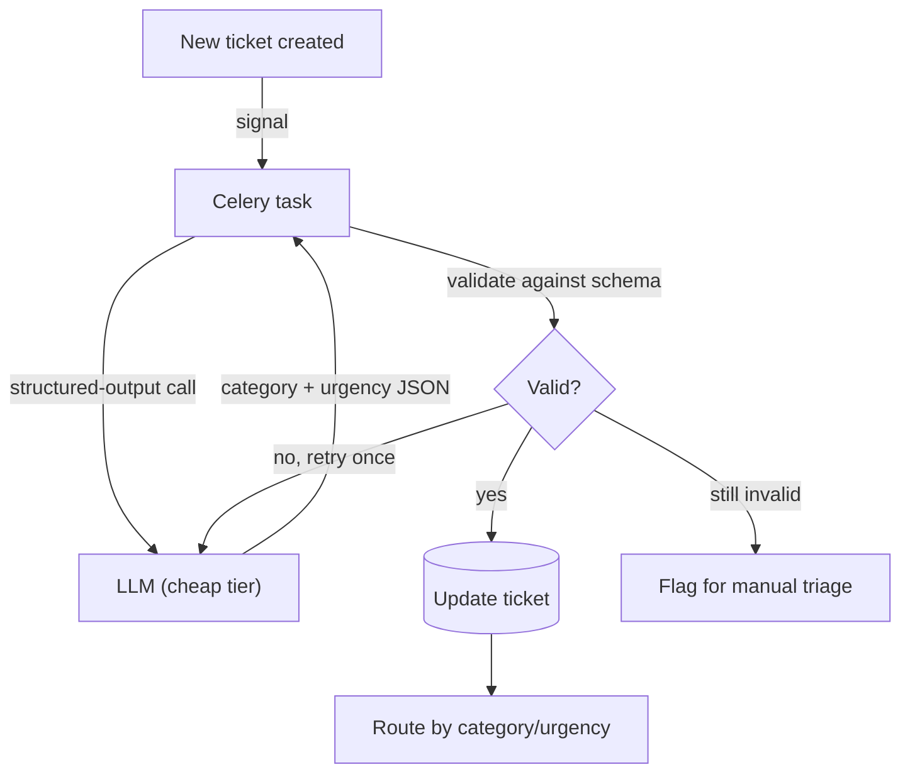

# Mini Project: AI Support Ticket Classification

> **Type:** Study notes

## Problem statement

Build a pipeline that classifies incoming support tickets by category and urgency, and routes them
accordingly — a project focused on the *structured-output, evaluation, and cost-tiering* side of
this module rather than retrieval, making it a good complement to the RAG-focused projects.

## Suggested stack

- **Django + DRF** — ticket ingestion endpoint (or a Celery task triggered by an existing ticket
  model's `post_save`, if integrating into a larger app).
- **Celery** — classification should never block ticket creation; runs async immediately after.
- **A cheap/fast model tier** (see [Cost, Latency, Throughput](../13_cost_latency_throughput_batching_caching.md))
  — this is a bounded classification task, not open-ended generation, so it's the textbook case for
  routing to the cheapest model tier that clears your accuracy bar.
- **PostgreSQL** — no vector store needed for the baseline version (add pgvector only for the
  stretch goal below).

## Rough architecture



## Core implementation

```python
CLASSIFY_PROMPT = """Classify this support ticket.
Categories: billing, shipping, technical, account, other
Urgency: low, medium, high
Respond with only JSON: {"category": str, "urgency": str}"""

VALID_CATEGORIES = {"billing", "shipping", "technical", "account", "other"}
VALID_URGENCY = {"low", "medium", "high"}

@shared_task(bind=True, max_retries=2)
def classify_ticket(self, ticket_id):
    ticket = Ticket.objects.get(id=ticket_id)
    result = get_structured_response(llm_client, CLASSIFY_PROMPT + f"\n\nTicket: {ticket.body}")
    if result["category"] not in VALID_CATEGORIES or result["urgency"] not in VALID_URGENCY:
        raise self.retry(countdown=1)  # validation failure, not a provider error — see below
    ticket.category = result["category"]
    ticket.urgency = result["urgency"]
    ticket.save(update_fields=["category", "urgency"])
```

This is a direct application of the structured-output pattern from
[Prompt Engineering Fundamentals](../03_prompt_engineering_fundamentals.md) — validate against the
known-good enum rather than trusting the model's output to always match, since routing logic
downstream depends on it being one of exactly these values.

## Build order

1. Baseline classifier: prompt + structured-output parsing + validation, wired to a Celery task
   triggered on ticket creation.
2. Build a 30-50 example eval set (real or realistic synthetic tickets, spanning all categories and
   including deliberately ambiguous ones) and measure baseline accuracy per
   [Model Evaluation](../06_model_evaluation.md).
3. Try the same eval set against two model tiers (cheap vs. mid-tier) and compare accuracy — this is
   the concrete artifact that lets you talk about cost/quality tiering with real numbers instead of
   theory.
4. Add routing logic (assign to a team/queue based on category+urgency) and a fallback path for
   low-confidence or repeatedly-invalid classifications (flag for human triage rather than silently
   guessing).
5. **Stretch**: add a RAG-style "similar past tickets" lookup (embed tickets, retrieve similar
   resolved ones) to show the classifier's suggested resolution alongside the category, connecting
   this project back to the retrieval side of the module.

## What this demonstrates to an interviewer

The evaluation-and-cost-tiering discipline this module emphasizes, with a real before/after accuracy
comparison across model tiers as evidence — a strong, concrete answer to "how do you decide which
model to use for a task" and "how do you know your classifier is actually accurate enough to trust,"
both very likely interview questions at an AI-adjacent company.
