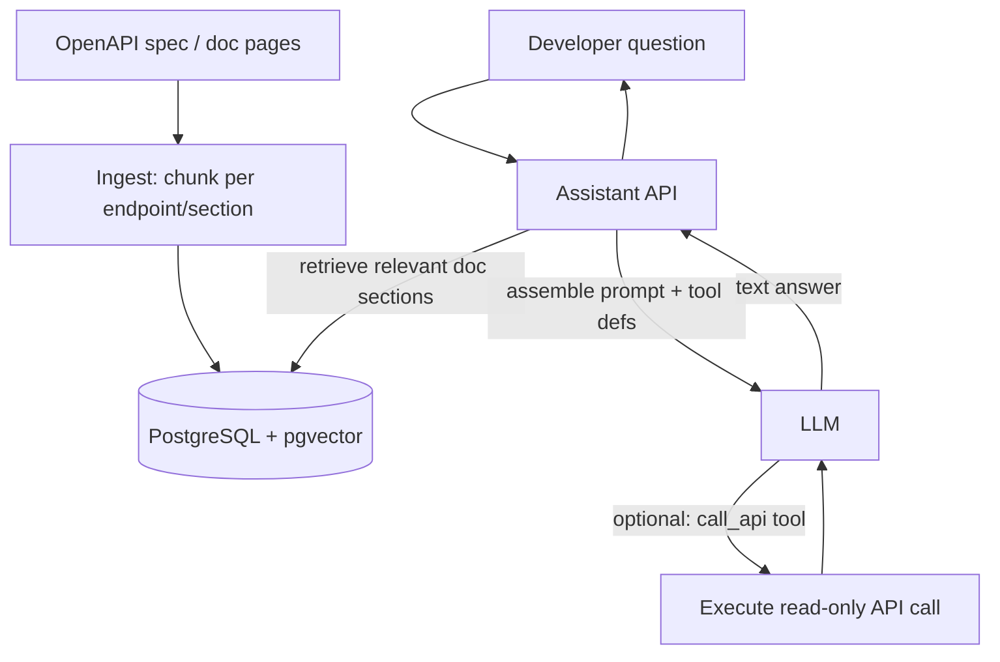

# Mini Project: LLM-Powered API Doc Assistant

> **Type:** Study notes

## Problem statement

Build an assistant that answers developer questions about a REST API (e.g. "how do I paginate the
`/orders` endpoint" or "what does a 409 mean on `/checkout`") by retrieving from real API
documentation/OpenAPI specs, and — as the differentiating stretch feature — can optionally call the
live API (read-only) to demonstrate an answer. This project combines RAG with tool calling, making it
a good capstone after the other mini-projects.

## Suggested stack

- **Django + DRF**, ideally against your own existing API's OpenAPI schema (or a public one, e.g.
  Stripe's or GitHub's docs, if you don't have a suitable app-of-your-own to point it at).
- **PostgreSQL + pgvector** for embedded doc sections.
- **Tool calling** (see [Agent & Workflow Basics](../17_agent_and_workflow_basics.md)) for the
  optional live-API-call stretch feature.

## Rough architecture



## Ingestion — chunk by endpoint, not by arbitrary size

Unlike generic document chunking, API documentation has natural, semantically meaningful units: one
chunk per endpoint (path + method), containing its description, parameters, and example
request/response. This is a good concrete case to point to when discussing document-type-specific
chunking (see [Chunking Strategies](../10_chunking_strategies.md)) — parsing an OpenAPI spec directly
gives you exact chunk boundaries for free, rather than needing heuristic splitting at all:

```python
def chunk_openapi_spec(spec: dict) -> list[dict]:
    chunks = []
    for path, methods in spec["paths"].items():
        for method, details in methods.items():
            text = (
                f"{method.upper()} {path}\n"
                f"{details.get('summary', '')}\n"
                f"{details.get('description', '')}\n"
                f"Parameters: {details.get('parameters', [])}"
            )
            chunks.append({"text": text, "path": path, "method": method})
    return chunks
```

## The tool-calling stretch feature — with a hard safety boundary

Letting the assistant actually *call* the API to demonstrate a real response is a strong
differentiator, but only ever wire up **read-only, safe** endpoints as callable tools, and enforce
that at the tool-execution layer, not by trusting the model to only call safe ones:

```python
READ_ONLY_TOOLS = {"get_order_status", "list_recent_orders"}  # explicit allowlist

def execute_tool(tool_name: str, tool_input: dict, requesting_user) -> dict:
    if tool_name not in READ_ONLY_TOOLS:
        raise ValueError(f"Tool {tool_name} is not permitted for the doc assistant")
    # ... normal authorization + execution, per Agent & Workflow Basics
```

This is a direct, concrete application of the "never let the LLM's output be sole authorization"
principle from [Guardrails & Content Safety](../08_guardrails_and_content_safety.md) — worth
building deliberately so you can describe the exact allowlist mechanism in an interview, not just
assert you'd do it.

## Build order

1. Parse a real OpenAPI spec (yours or a public one), chunk per endpoint, embed and store.
2. RAG Q&A over the docs only — no tool calling yet; verify it correctly answers "how do I..."
   questions with citations to the right endpoint doc.
3. Add 1-2 read-only tools behind an explicit allowlist, and the agent loop from
   [Agent & Workflow Basics](../17_agent_and_workflow_basics.md) so the assistant can choose to call
   them when a question implies "show me a real example."
4. **Stretch**: add response caching (see
   [Cost, Latency, Throughput](../13_cost_latency_throughput_batching_caching.md)) for common
   repeated developer questions, and measure the cache-hit rate over a week of your own usage.

## What this demonstrates to an interviewer

A RAG system extended with tool calling and an explicit, enforced safety boundary around what the
model is allowed to actually do — this is the project to reach for when an interviewer asks
specifically about agents/tool calling, since it lets you describe both the mechanism and, more
importantly, the authorization boundary around it from firsthand build experience.
