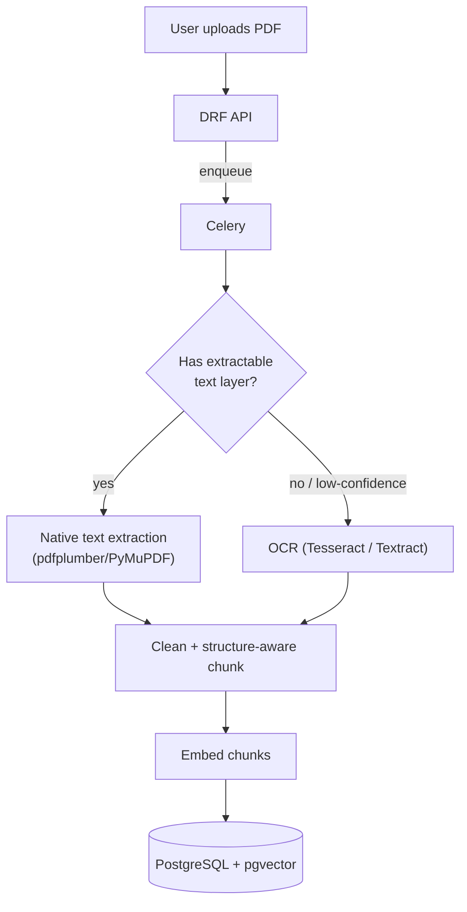

# Mini Project: PDF Extraction → OCR → RAG Pipeline

> **Type:** Study notes

## Problem statement

Extend [RAG Document Q&A API](rag_document_qa_api.md) to handle real-world PDFs, including scanned
(image-based) PDFs with no embedded text layer — the messiest and most realistic version of document
ingestion, and a strong project for this candidate specifically given their existing OCR/PDF
background. This project's value is in handling the failure modes real documents actually have, not
just the happy path of a clean, text-native PDF.

## Suggested stack

- **Django + Celery** for the async ingestion pipeline (extraction is slow and must never block the
  upload request).
- **`pdfplumber` or `PyMuPDF`** for text-native PDF extraction (tries this first — much faster and
  more accurate than OCR when the PDF already has a text layer).
- **Tesseract or a cloud OCR API** (AWS Textract, Google Document AI) as the fallback for
  scanned/image-only PDFs.
- **PostgreSQL + pgvector**, same as the base RAG project.

## Rough architecture



## The core engineering problem: detecting which path a PDF needs

```python
def extract_text(pdf_path: str) -> tuple[str, str]:
    """Returns (text, method) where method is 'native' or 'ocr'."""
    native_text = extract_native_text(pdf_path)
    # A PDF with a real text layer yields substantial extractable text per page;
    # a scanned PDF yields near-empty or garbage output from native extraction.
    if len(native_text.strip()) > 100 * count_pages(pdf_path):  # rough per-page threshold
        return native_text, "native"
    return run_ocr(pdf_path), "ocr"
```

This threshold-based routing (rather than assuming every PDF is one type or the other) is the
realistic production pattern — real document sets are a mix, and a pipeline that only handles one
path silently fails on the other half of real uploads.

## Handling OCR-specific failure modes

- **Layout loss** — OCR output is often a flat stream of text with paragraph/heading structure lost,
  which directly degrades structure-aware chunking (see
  [Chunking Strategies](../10_chunking_strategies.md)) — mitigate by using an OCR engine/API that
  preserves layout metadata (bounding boxes, detected headings) where available, rather than plain
  OCR text dump, and fall back to fixed-size chunking with generous overlap when layout info isn't
  available.
- **Low-confidence regions** — most OCR engines return per-word/per-region confidence scores; flag
  chunks built from low-confidence OCR output (e.g. average confidence below a threshold) with a
  metadata flag, and surface that uncertainty in the eventual Q&A answer ("this information was
  extracted from a low-quality scan and may be inaccurate") rather than presenting OCR'd content with
  the same confidence as clean native text.
- **Tables in scanned documents** — the hardest real case; a naive OCR text dump destroys table
  structure entirely (columns interleave into nonsense). A dedicated table-extraction step (Textract
  and Document AI both offer this) is worth calling out as the production-grade answer versus generic
  OCR for any document set known to contain tables.

## Build order

1. Native PDF text extraction + the existing RAG pipeline from
   [RAG Document Q&A API](rag_document_qa_api.md), tested against clean, text-native PDFs.
2. Detection logic (native vs. needs-OCR) and OCR fallback via Tesseract on a few scanned test PDFs.
3. Confidence-score tracking and flagging low-confidence chunks.
4. **Stretch**: layout-aware extraction (headings/tables preserved) via a cloud OCR API, and a
   before/after comparison of Q&A answer quality on a table-heavy scanned document with vs. without
   layout-aware extraction.

## What this demonstrates to an interviewer

Handling the unglamorous, high-value-in-practice part of a RAG system — real documents aren't clean
markdown, and a pipeline that silently produces garbage chunks from a scanned PDF (with no visibility
into it) is a genuine, common production failure mode. Being able to describe the native-vs-OCR
routing decision, confidence tracking, and table-handling trade-offs concretely (with your own
before/after evidence) is a strong signal given this candidate's stated OCR/PDF background.
