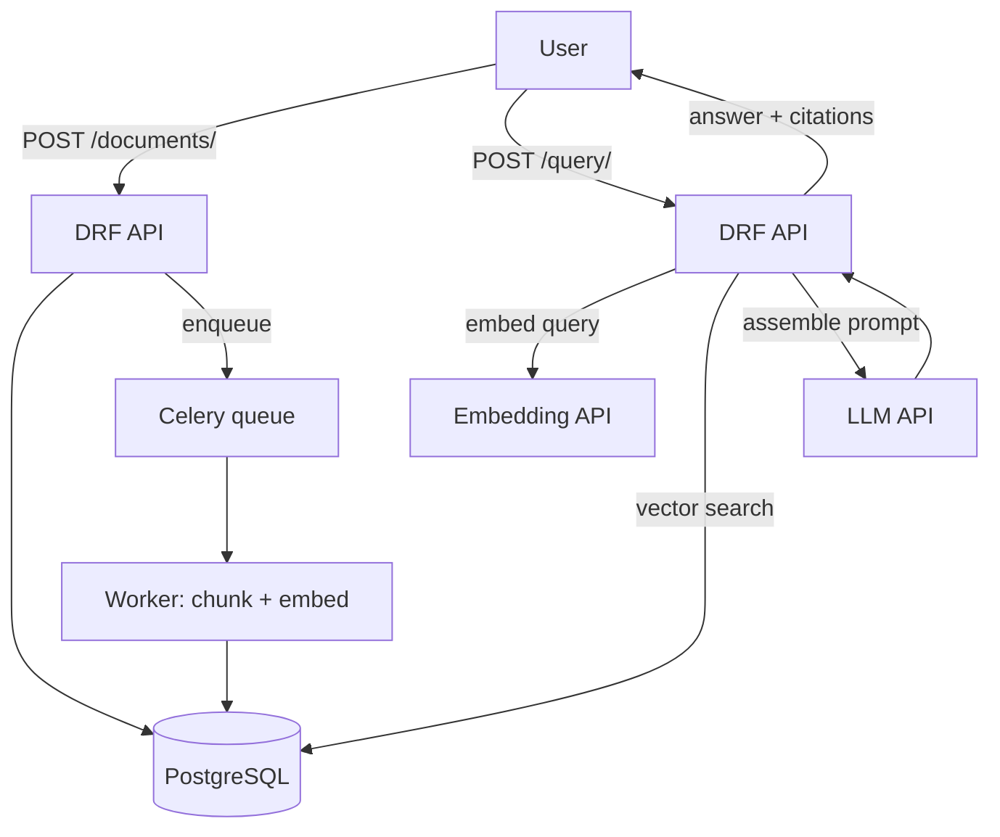

# Mini Project: RAG Document Q&A API

> **Type:** Study notes

## Problem statement

Build an API where a user uploads documents (PDFs, markdown, or plain text) and can then ask
natural-language questions answered from those documents, with citations back to the source. This is
the canonical RAG project — build this one first among the mini-projects, since the others in this
folder either extend it (PDF/OCR pipeline) or apply the same core pattern to a narrower domain
(resume search, support tickets).

## Suggested stack

- **Django + DRF** for the API layer — endpoints for document upload, status polling, and query.
- **PostgreSQL + pgvector** for storing documents, chunks, and embeddings in one transactionally
  consistent store (see [Vector Databases](../01_vector_databases_and_similarity_search.md) for why
  this beats a separate vector DB at this scale).
- **Celery + Redis** for async chunking/embedding after upload (never block the upload request on
  embedding latency).
- **An LLM API** (Anthropic/OpenAI) for the generation step, wrapped per
  [LLM API Integration](../04_llm_api_integration.md).

## Rough architecture



## Core endpoints

```
POST /api/documents/          -- upload a document; returns 202, embedding happens async
GET  /api/documents/{id}/     -- check embedding_status: pending | done | failed
POST /api/query/              -- {"question": "..."} -> {"answer": "...", "sources": [...]}
```

## Build order

1. Document model + upload endpoint, storing raw text (skip PDF parsing initially — plain text/
   markdown first).
2. Chunking (start with structure-aware, see [Chunking Strategies](../10_chunking_strategies.md)) +
   Celery task to embed and store chunks, with `embedding_status` tracked per
   [Embedding Pipelines](../09_embedding_pipelines.md).
3. Query endpoint: embed the question, retrieve top-K chunks via pgvector cosine distance, assemble
   a prompt instructing citation-only answers, call the LLM.
4. Add explicit refusal behavior for out-of-scope questions (see
   [Hallucination Mitigation](../07_hallucination_mitigation.md)) and verify it works with a few
   deliberately unanswerable questions.
5. **Stretch**: add hybrid search (vector + Postgres full-text) per
   [Retrieval & Reranking](../11_retrieval_and_reranking.md), and per-call logging per
   [LLM Observability](../12_llm_observability.md).

## What this demonstrates to an interviewer

A complete, correctly-architected RAG system built on production-realistic infrastructure (not a
notebook) — async processing that doesn't block requests, a data model that keeps embeddings and
source data transactionally consistent, explicit grounding/citation behavior, and (if you build the
stretch goals) retrieval quality tuning and observability. This is the single strongest project to
walk through in a system-design-style portion of an interview, since it touches nearly every topic
in this module. See
[Project Deep Dive Template](../../10_projects_and_resume/project_deep_dive_template.md) for how to
structure the story around it.
