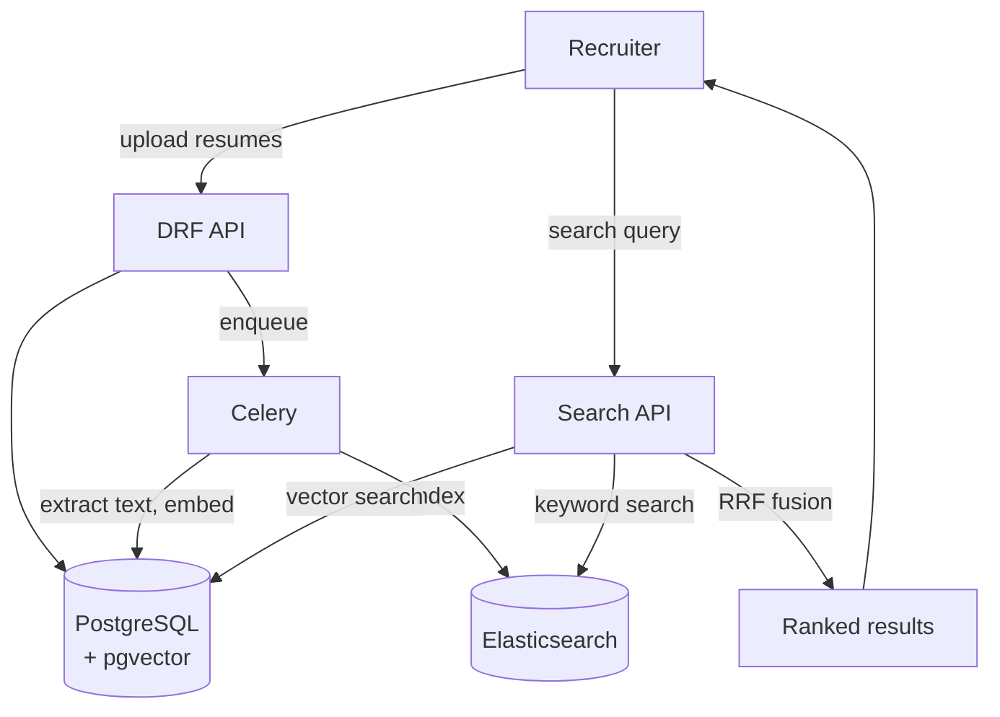

# Mini Project: Resume Search Using Embeddings

> **Type:** Study notes

## Problem statement

Build a small ATS-style tool: recruiters upload resumes (PDF/text), and can search them with
natural-language queries like "backend engineers with 3+ years of Django and AWS experience" instead
of exact keyword matching. This project is a good second build after
[RAG Document Q&A API](rag_document_qa_api.md) because it applies the same embedding/retrieval core
to a *ranking* problem rather than a *question-answering* problem — no generation step is strictly
required, which lets you focus depth on retrieval quality specifically.

## Suggested stack

- **Django + DRF** for upload/search endpoints.
- **PostgreSQL + pgvector** — one embedding per resume (or per resume section, for finer-grained
  matching — see the stretch goal below).
- **Elasticsearch** as the keyword-search half of a hybrid search implementation (this candidate's
  existing ES experience makes this a natural fit, and it's a good excuse to practice hybrid search
  end to end — see [Retrieval & Reranking](../11_retrieval_and_reranking.md)).
- **Celery** for async embedding on upload.

## Rough architecture

## Build order

1. Resume upload + text extraction (start with plain-text/DOCX-as-text; add PDF extraction as a
   stretch, see [PDF/OCR pipeline](pdf_extraction_ocr_rag_pipeline.md) for that piece in depth).
2. Embed each resume as a whole document; implement pure vector search first and validate it returns
   sensible results for a handful of test queries.
3. Add Elasticsearch full-text indexing of the same resumes; implement hybrid search with
   Reciprocal Rank Fusion combining both result sets.
4. Add structured filters (years of experience parsed from resume text or entered manually,
   location, current title) applied *before* ranking — as with tenant filtering in
   [RAG System Architecture](../02_rag_system_architecture.md), hard filters belong in the query, not
   as a post-filter on ranked results.
5. **Stretch**: chunk each resume by section (experience, education, skills) and embed per-section
   instead of whole-document, so a query about a specific skill can match the relevant section
   directly rather than diluting into a single whole-resume vector; compare result quality against
   the whole-document baseline.

## What this demonstrates to an interviewer

Retrieval-quality engineering specifically (hybrid search, structured filtering, chunking
granularity trade-offs) without the added surface area of a generation step — useful for
demonstrating deep understanding of [Vector Databases](../01_vector_databases_and_similarity_search.md)
and [Retrieval & Reranking](../11_retrieval_and_reranking.md) in an interview, and a natural
opportunity to talk concretely about why whole-document vs. per-section embedding changes result
quality, with your own before/after comparison as evidence.
