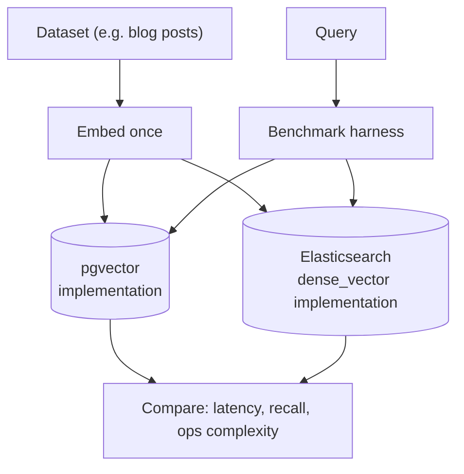

# Mini Project: Semantic Search (pgvector or Elasticsearch)

> **Type:** Study notes

## Problem statement

Build a semantic search feature over a real dataset you already have or can easily get (product
catalog, blog posts, this curriculum's own markdown files) and **implement it twice** — once on
pgvector, once on Elasticsearch — specifically to build first-hand intuition for the trade-offs
discussed in [Vector Databases](../01_vector_databases_and_similarity_search.md), rather than to ship
two production paths. This is the shortest of the mini-projects and a good one to build early, since
its output (a working comparison) directly informs how confidently you can answer the pgvector-vs-
dedicated-store question in an interview.

## Suggested stack

- **Django** for a minimal search endpoint (one view, no need for full DRF machinery here).
- **PostgreSQL + pgvector** for one implementation.
- **Elasticsearch with a `dense_vector` field** (ES supports vector search natively alongside its
  traditional full-text capabilities) for the other — a natural fit given this candidate's existing
  ES experience, and it doubles as hands-on practice for hybrid search in one engine.

## Rough architecture



## What to actually measure

The point of building both is a real, numbers-backed comparison — not "pgvector is fine" as an
assertion:

```python
import time

def benchmark_search(search_fn, queries: list[str], k: int = 10) -> dict:
    latencies = []
    for q in queries:
        start = time.monotonic()
        search_fn(q, k)
        latencies.append((time.monotonic() - start) * 1000)
    latencies.sort()
    return {
        "p50_ms": latencies[len(latencies) // 2],
        "p95_ms": latencies[int(len(latencies) * 0.95)],
        "n_queries": len(queries),
    }
```

Run this against both implementations with the same query set and dataset size, and separately at a
couple of different corpus sizes (e.g. 10K vs. 200K rows) to see how each scales — pgvector's HNSW
index and Elasticsearch's vector search have different scaling characteristics worth observing
directly rather than taking on faith.

## Build order

1. Pick a dataset (aim for at least 5-10K documents — trivially small corpora won't show meaningful
   latency differences) and embed it once, storing the vectors for reuse in both implementations.
2. Implement pgvector search with an HNSW index; benchmark.
3. Implement Elasticsearch `dense_vector` search (`knn` query); benchmark on the same dataset and
   query set.
4. Add hybrid search (vector + keyword) on the Elasticsearch side specifically — this is where ES's
   native strength (it was a full-text engine first) shows most clearly, and worth comparing against
   a pgvector + Postgres-full-text hybrid implementation if you have time (see
   [Retrieval & Reranking](../11_retrieval_and_reranking.md) for the RRF fusion logic either way).
5. **Stretch**: scale the corpus up (100K+ documents) and re-run the benchmark to see where, if
   anywhere, one implementation's latency curve diverges from the other's.

## What this demonstrates to an interviewer

A firsthand, numbers-backed answer to "pgvector vs. a dedicated vector database" instead of a
recited trade-off table — being able to say "I benchmarked both on a real dataset and saw X" is
noticeably stronger than reciting the general trade-offs from
[Vector Databases](../01_vector_databases_and_similarity_search.md), and shows the instinct to
verify an architectural opinion with data before defending it in a design discussion.
